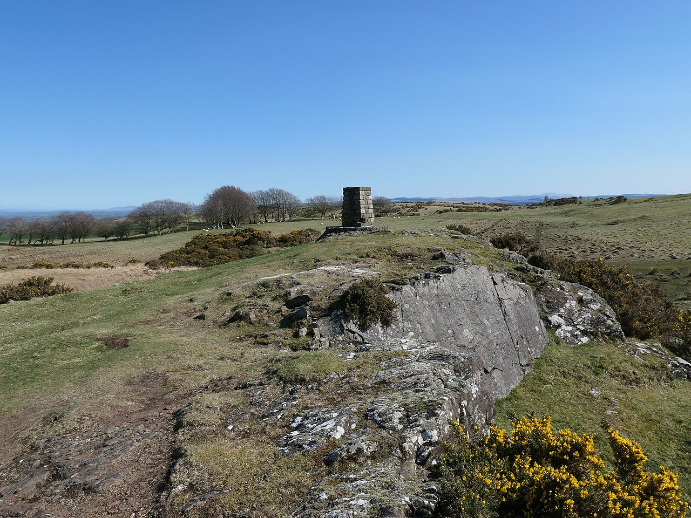
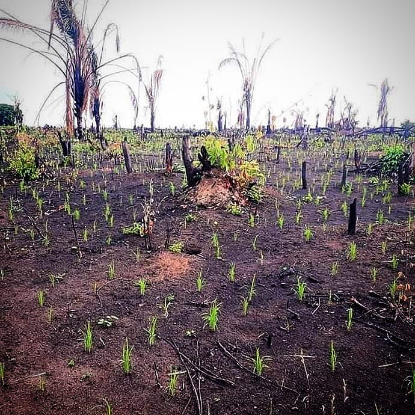
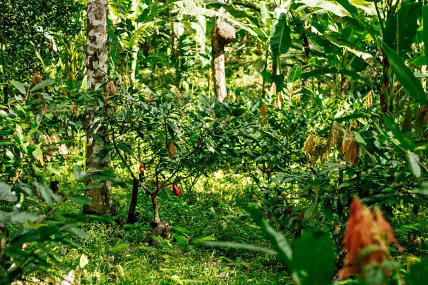
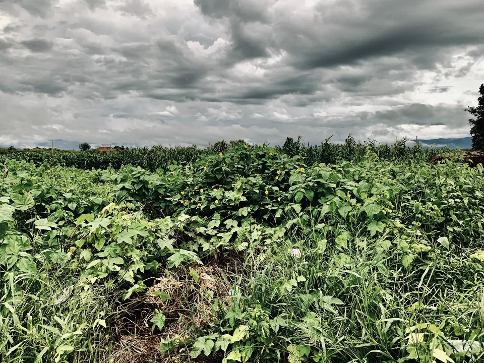
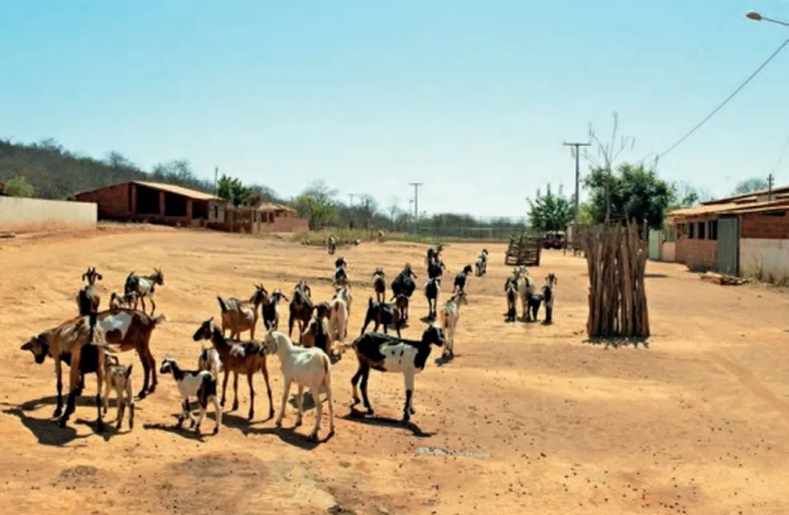
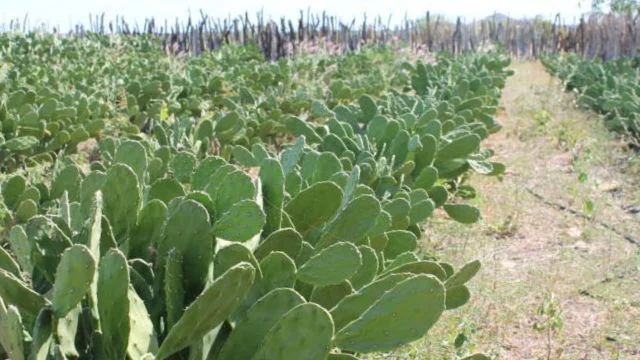
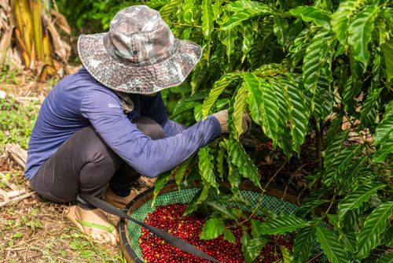
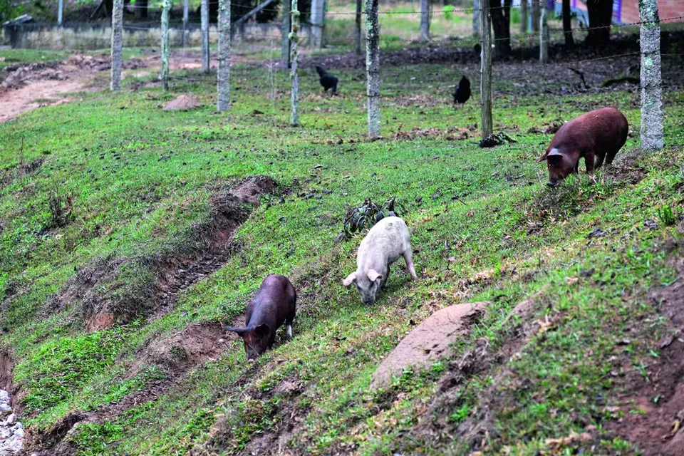
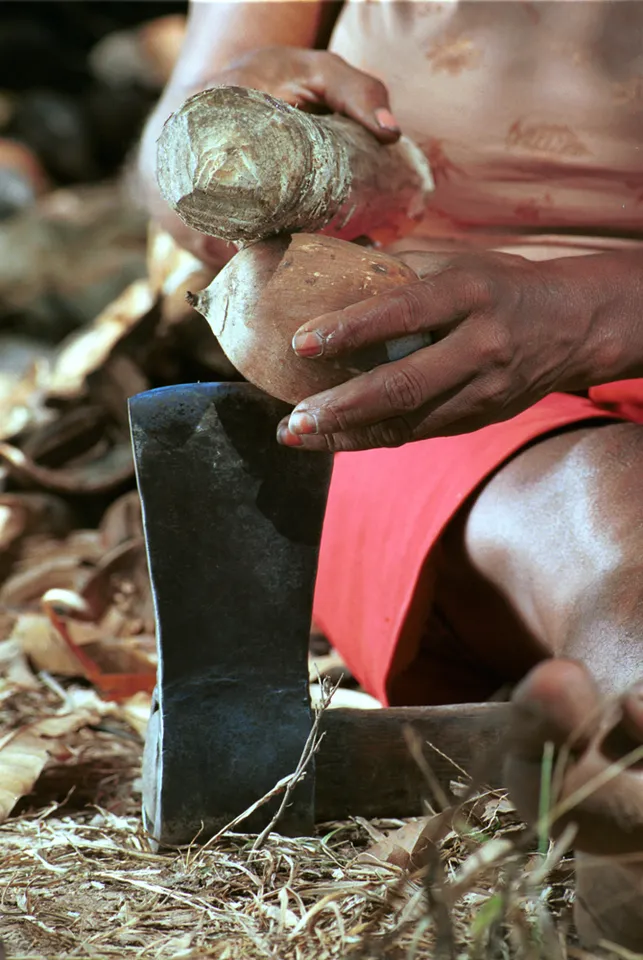

## Visão Geral da Aula {.smaller-text}

::: {.columns}
::: {.column width="50%"}
### Tópicos

- [1]{.circle} De quem é a paisagem? Percepção e subjetividade
- [2]{.circle} Yi-Fu Tuan e a Topofilia (1974)
- [3]{.circle} Augustin Berque: paisagem-marca e paisagem-matriz
- [4]{.circle} Denis Cosgrove: paisagem e poder simbólico
- [5]{.circle} Paisagem cultural na prática: IPHAN, UNESCO e Convenção Europeia
- [6]{.circle} Exercício: leitura perceptiva da paisagem local
:::

::: {.column width="50%"}
::: {.info-box}
**Objetivo da Aula**

Compreender a **dimensão socioespacial e perceptiva** da paisagem, articulando as contribuições de Tuan, Berque e Cosgrove com as abordagens quantitativas da ecologia da paisagem.
:::
:::
:::

# [1  -  PERCEPÇÃO E SUBJETIVIDADE]{.section-header}

## Paisagem: objeto ou experiência? {.smaller-text}

{width="85%" fig-align="center"}

::: {.columns}
::: {.column width="60%"}
A paisagem que analisamos com métricas, SIG e sensoriamento remoto é a **paisagem objetivada**, um mosaico de manchas, corredores e matriz quantificável por índices.

Mas a paisagem também é **experiência vivida**:

- O agricultor que lê o céu e sabe onde plantar
- O quilombola que identifica marcos territoriais invisíveis ao mapa
- O turista que busca a "paisagem bonita" sem saber defini-la

::: {.callout-important}
## Percepção importa
A análise da paisagem que ignora a **percepção** perde metade do fenômeno. Essa tensão entre objetividade e subjetividade atravessa toda a história da Geografia da Paisagem.
:::
:::

::: {.column width="40%"}
```{mermaid}
%%| fig-cap: "Duas leituras da mesma paisagem."
flowchart TB
    P["PAISAGEM"] --> O["Leitura Objetiva<br>Métricas, mapas, índices"]
    P --> S["Leitura Subjetiva<br>Percepção, valores, afeto"]
    O --> I["Análise Integrada<br>Diagnóstico + Valoração"]
    S --> I
    style P fill:#2E7D32,color:#fff,stroke:#1B5E20,stroke-width:2px
    style O fill:#BBDEFB,stroke:#1565C0
    style S fill:#FFE0B2,stroke:#E65100
    style I fill:#C8E6C9,stroke:#2E7D32
```
:::
:::

# [2  -  YI-FU TUAN: TOPOFILIA]{.section-header}

## O conceito de Topofilia {.smaller-text}

::: {.columns}
::: {.column width="60%"}
**Yi-Fu Tuan** (1974) cunhou o termo **topofilia** para descrever o **elo afetivo entre pessoa e lugar**:

> *"Topophilia is the affective bond between people and place or setting."*
>
> Tuan (1974, p. 4)

Tuan argumenta que a percepção ambiental é mediada por:

- **Sentidos**, visão, olfato, tato, audição
- **Cultura**, valores, crenças, tradições
- **Experiência**, história pessoal, memória
- **Atitude**, postura para com o ambiente (medo, admiração, indiferença)

A **mesma paisagem** pode gerar topofilia (vínculo positivo) ou **topofobia** (aversão) conforme o sujeito.
:::

::: {.column width="40%"}
::: {.callout-tip}
## Referência
**TUAN, Y.-F.** (1974). *Topophilia: A Study of Environmental Perception, Attitudes, and Values*. Englewood Cliffs: Prentice-Hall.

Edição brasileira: *Topofilia*. São Paulo: Difel, 1980.
:::
:::
:::

## Roça de Toco / Coivara {.smaller-text}

**Sistemas Agrícolas Tradicionais do Brasil.** Esses sistemas são **paisagens culturais vivas** que expressam a topofilia de comunidades com seus territórios: saberes acumulados, vínculos afetivos e adaptação ao meio.

::: {.columns}
::: {.column width="45%"}
{width="100%" fig-align="center"}
:::
::: {.column width="55%"}
**Agricultura itinerante**

Sistema milenar indígena de **corte e queima**, seguido de plantio por 2-3 safras e pousio de 10-20 anos para regeneração da fertilidade.

Praticado por povos tradicionais da **Amazônia**, **Mata Atlântica** e **Cerrado**. A paisagem resultante é um mosaico de roças ativas, capoeiras jovens e floresta madura. Satélites classificam como "degradação", mas comunidades reconhecem como **ciclo agrícola sustentável**.

> *"A terra descansa para depois dar de novo."*
:::
:::

## Vídeo: Roça de Toco / Coivara {.smaller-text}



::: {style="text-align:center; font-size:0.8em; color:#555;"}
Agricultura itinerante de corte e queima - sistema milenar dos povos tradicionais.
:::

## Cabruca {.smaller-text}

::: {.columns}
::: {.column width="45%"}
{width="100%" fig-align="center"}
:::
::: {.column width="55%"}
**Cacau sob sombra da Mata Atlântica**

No **sul da Bahia** (Ilhéus, Itabuna, Una), o cacau é cultivado sob o **dossel da Mata Atlântica**, onde as árvores maiores são mantidas e o sub-bosque é substituído por cacaueiros.

Um dos poucos sistemas agrícolas que **conserva a estrutura florestal** enquanto produz.

- **Paisagem-marca** (Berque): a floresta transformada pelo agricultor
- **Paisagem-matriz**: a floresta que condiciona o microclima ideal para o cacau

Para a comunidade, os cacaueiros antigos são *"herança dos avós"*, sinônimo de **memória e identidade** territorial.
:::
:::

## Vídeo: Sistema Cabruca {.smaller-text}



::: {style="text-align:center; font-size:0.8em; color:#555;"}
O sistema cabruca no sul da Bahia: cacau cultivado sob a sombra da Mata Atlântica.
:::

## Agricultura de Sequeiro na Caatinga {.smaller-text}

::: {.columns}
::: {.column width="45%"}
{width="100%" fig-align="center"}
:::
::: {.column width="55%"}
**Convivência com a seca**

No **Semiárido nordestino**, comunidades praticam agricultura de sequeiro adaptada ao regime pluviométrico irregular: mandioca, feijão, milho e palma forrageira.

O agricultor "lê" sinais da paisagem (floração da catingueira, comportamento das abelhas) para definir o **momento de plantar**, um inventário perceptivo que nenhum SIG registra.

- **Baixios** (terras baixas mais úmidas) → topofilia forte
- **Encostas pedregosas** → topofobia

A paisagem reflete saberes seculares de convivência com a seca.
:::
:::

## Fundo de Pasto {.smaller-text}

::: {.columns}
::: {.column width="45%"}
{width="100%" fig-align="center"}
:::
::: {.column width="55%"}
**Pastoreio comunitário na Caatinga**

No **norte da Bahia**, comunidades tradicionais criam caprinos e ovinos em **áreas coletivas de Caatinga** não cercadas, os chamados "fundos de pasto".

Os animais circulam livremente pela vegetação nativa. A paisagem é gerida coletivamente por **acordos comunitários** seculares.

> *"A terra é de todos, o gado é que é de cada um."*

Topofilia coletiva: o território não "pertence" a indivíduos, mas à comunidade inteira.
:::
:::

## Vídeo: Fundo de Pasto {.smaller-text}



::: {style="text-align:center; font-size:0.8em; color:#555;"}
Comunidades tradicionais de Fundo de Pasto na Caatinga baiana.
:::

## Palma Forrageira {.smaller-text}

::: {.columns}
::: {.column width="45%"}
{width="100%" fig-align="center"}
:::
::: {.column width="55%"}
**Cultura adaptada ao Semiárido**

A **palma forrageira** (*Opuntia* e *Nopalea*) é cultivada em todo o Semiárido como alimento para o gado e reserva hídrica (90% de água nos cladódios).

Paisagem icônica do **Agreste e Sertão**, os "palmais" são marcos visuais de identidade regional. O manejo tradicional envolve poda seletiva e consórcio com outras culturas.

> *"Se a palma aguenta, a gente também aguenta"*, expressão concreta de topofilia em ambiente hostil.
:::
:::

## Agrofloresta Quilombola {.smaller-text}

::: {.columns}
::: {.column width="45%"}
{width="100%" fig-align="center"}
:::
::: {.column width="55%"}
**Saberes africanos e indígenas integrados**

Comunidades **quilombolas** desenvolveram sistemas agroflorestais complexos: **frutíferas, medicinais, madeireiras e culturas anuais** em arranjos multiestrato.

A paisagem quilombola é simultaneamente **roça, farmácia e floresta**, expressão material de identidade, resistência e memória territorial.

- **Paisagem-marca** (Berque): registro de diáspora e resistência
- **Paisagem-matriz**: a floresta manejada que sustenta a comunidade
:::
:::

## Faxinal {.smaller-text}

::: {.columns}
::: {.column width="45%"}
{width="100%" fig-align="center"}
:::
::: {.column width="55%"}
**Sistema agrossilvopastoril do Paraná**

Os **faxinais** do sul do Brasil (PR, SC) são sistemas de **uso comum da terra**: o "criadouro comunitário" (floresta com araucária) abriga animais soltos sob o dossel, enquanto as "terras de plantar" ficam nas bordas, cercadas individualmente.

Paisagem marcada pela **Floresta Ombrófila Mista** manejada há gerações, com pinhão, erva-mate e criação animal integrados. Exemplo raro de **commons** no Brasil meridional.

> A topofilia se manifesta no *"pinheiro do avô"*, árvores centenárias que marcam limites e histórias familiares.
:::
:::

## Vídeo: O Sistema Faxinal no Paraná {.smaller-text}



::: {style="text-align:center; font-size:0.8em; color:#555;"}
O sistema faxinal no Paraná, uso comum da terra sob a Floresta com Araucária.
:::

## Quebradeiras de Coco Babaçu {.smaller-text}

::: {.columns}
::: {.column width="45%"}
{width="100%" fig-align="center"}
:::
::: {.column width="55%"}
**Extrativismo tradicional**

No **Maranhão, Tocantins, Piauí e Pará**, cerca de 300 mil mulheres, as **quebradeiras de coco babaçu**, praticam o extrativismo da palmeira babaçu (*Attalea speciosa*), quebrando os cocos para extrair amêndoas (óleo, farinha, carvão).

Os babaçuais formam uma **paisagem de transição** entre Cerrado e Amazônia. O acesso livre às palmeiras é garantido por "leis do babaçu livre" em vários municípios.

Topofilia expressa no gesto cotidiano de quebrar o coco e no canto de trabalho que ecoa nos palmeirais.
:::
:::

## Implicações para a Análise da Paisagem {.smaller-text}

| Dimensão de Tuan | Implicação prática |
|:------------------|:-------------------|
| **Percepção sensorial** | Inventários de campo devem registrar sons, cheiros, texturas, não apenas coordenadas |
| **Valores culturais** | Comunidades atribuem significados a feições que o mapa não revela (sítios sagrados, marcos) |
| **Memória e identidade** | Paisagens históricas têm valor mesmo quando "degradadas" por critérios ecológicos |
| **Topofobia** | Áreas de risco (encostas instáveis, áreas inundáveis) geram rejeição que condiciona o uso |

: Como a topofilia de Tuan amplia o diagnóstico da paisagem. {.striped .hover}

::: {.callout-note}
## Para a prática
No trabalho de campo, pergunte aos moradores: *"O que você mais gosta nesta paisagem? O que mais teme?"*, essas respostas revelam valores que mapas e métricas não captam.
:::

# [3  -  AUGUSTIN BERQUE: PAISAGEM-MARCA E PAISAGEM-MATRIZ]{.section-header}

## A contribuição de Berque {.smaller-text}

::: {.columns}
::: {.column width="55%"}
**Augustin Berque** (1984) propôs uma dupla leitura da paisagem:

**Paisagem-marca (O resultado)** (*paysage-empreinte*)

- A paisagem como **registro** da ação humana sobre o território: cicatrizes de desmatamento, terraços agrícolas, padrões urbanos
- É o ambiente funcionando como uma "tela" onde a sociedade deixa suas impressões digitais

**Paisagem-matriz (O molde)** (*paysage-matrice*)

- A paisagem como **condicionante** da ação futura: o relevo que impõe limites, o clima que define possibilidades, a forma urbana que orienta comportamentos
- Funciona como um molde (uma matriz) que condiciona, inspira e influencia a cultura, a identidade, os hábitos e as futuras ações da sociedade

::: {.callout-note}
## Dupla natureza
A paisagem é ao mesmo tempo **produto** e **produtora** de relações sociais. Na perspectiva ecológica, funciona como suporte biofísico (matriz), enquanto na geografia cultural constitui expressão social (marca).
:::
:::

::: {.column width="45%"}
```{mermaid}
%%| fig-cap: "Paisagem-marca e paisagem-matriz (Berque, 1984)."
flowchart LR
    S["Sociedade<br>Cultura, Economia"] -->|"marca<br>(transforma)"| P["PAISAGEM"]
    P -->|"matriz<br>(condiciona)"| S
    style S fill:#FFE0B2,stroke:#E65100
    style P fill:#2E7D32,color:#fff,stroke:#1B5E20,stroke-width:2px
```

::: {.callout-tip}
## Referência
**BERQUE, A.** (1984). Paysage-empreinte, paysage-matrice. *L'Espace Géographique*, 13(1), 33-34.
:::
:::
:::

# [4  -  DENIS COSGROVE: PAISAGEM E PODER]{.section-header}

## Paisagem como ideologia {.smaller-text}

::: {.columns}
::: {.column width="55%"}
**Denis Cosgrove** (1984) argumentou que a paisagem é uma **forma de ver** (*way of seeing*) historicamente construída:

- A paisagem foi inventada como conceito estético pela **aristocracia mercantil** do Renascimento italiano (séc. XV-XVI)
- Ver a paisagem pressupõe um **observador externo** com posição privilegiada, o olhar do proprietário, do viajante, do cartógrafo
- Mapas e representações paisagísticas são **instrumentos de poder**: quem mapeia, controla

> *"Landscape is a way of seeing that has its own history, but a history that can be understood only as part of a wider history of economy and society."*
>
> Cosgrove (1984, p. 1)
:::

::: {.column width="45%"}
::: {.callout-important}
## Reflexão para a disciplina
Quando fazemos um mapa de uso do solo, **escolhemos** o que representar e o que omitir. Essa escolha não é neutra:

- Mapeamos "vegetação nativa" e "pastagem", categorias da ecologia
- Não mapeamos "terra do avô" ou "caminho da festa", categorias da comunidade

A análise da paisagem ganha robustez quando reconhece seus **limites representacionais**.
:::
:::
:::

## Paisagem Cultural: marcos institucionais {.smaller-text}

{width="85%" fig-align="center"}

| Instrumento | Ano | Definição de paisagem cultural |
|:------------|:---:|:-------------------------------|
| **IPHAN** (Chancela da Paisagem Cultural) | 2009 | "Porção peculiar do território nacional, representativa do processo de interação do homem com o meio natural" |
| **UNESCO** (Patrimônio Mundial) | 1992 | "Combined works of nature and humankind that express a long and intimate relationship between peoples and their natural environment" |
| **Convenção Europeia da Paisagem** | 2000 | "An area, as perceived by people, whose character is the result of the action and interaction of natural and/or human factors" |

: Marcos institucionais da paisagem cultural. {.striped .hover}

::: {.callout-note}
No Brasil, a primeira paisagem cultural chancelada pelo IPHAN foi o **conjunto de feiras livres** do Vale do Jiquiriçá (BA), paisagem cultural baiana!
:::

# [5  -  EXERCÍCIO PRÁTICO]{.section-header}

## Leitura Perceptiva da Paisagem Local {.smaller-text}

::: {.columns}
::: {.column width="50%"}
### Roteiro

1. **Escolha um ponto de observação** na sua área de estudo (mirante, topo de elevação, margem de rio)
2. **Registre** (foto panorâmica + anotações):
   - O que a visão alcança? Quais feições dominam?
   - Que sons, cheiros e texturas caracterizam o lugar?
   - Que sinais de ação humana são visíveis? (marca)
   - Que condicionantes naturais são evidentes? (matriz)
3. **Entreviste** ao menos 2 moradores:
   - O que mais gosta nessa paisagem?
   - O que mudou nos últimos 20 anos?
   - O que gostaria que fosse diferente?
:::

::: {.column width="50%"}
### Produto esperado

| Componente | Método |
|:-----------|:-------|
| Descrição visual | Fotopanorama + croqui anotado |
| Percepção local | Trechos de entrevista organizados por tema |
| Valores | Tabela: topofilia × topofobia |
| Marcas | Lista de feições antrópicas identificáveis |
| Matrizes | Lista de condicionantes naturais |
| Síntese | Parágrafo integrando leitura objetiva e subjetiva |

: Componentes da leitura perceptiva. {.striped .hover}
:::
:::

# [6  -  SÍNTESE]{.section-header}

## Conexão com a Disciplina {.smaller-text}

| Autor / Conceito | Aulas conectadas |
|:------------------|:-----------------|
| Tuan, Topofilia | → Trabalho de Campo (Aula 11.1), Diagnóstico Integrado (Aula 9.4) |
| Berque, Marca/Matriz | → Geossistema (Aula 2.3), Planejamento Territorial (Aula 10.1) |
| Cosgrove, Paisagem e poder | → Matriz de Evidências (Aula 6.1), Zoneamentos (Aula 10.3) |
| Paisagem cultural (IPHAN) | → Legislação Ambiental e Paisagística |

## Leituras Recomendadas

- **TUAN, Y.-F.** (1974). *Topophilia*. Englewood Cliffs: Prentice-Hall.
- **BERQUE, A.** (1984). Paysage-empreinte, paysage-matrice. *L'Espace Géographique*, 13(1), 33-34.
- **COSGROVE, D.** (1984). *Social Formation and Symbolic Landscape*. London: Croom Helm.
- **IPHAN.** (2009). Portaria nº 127: Chancela da Paisagem Cultural Brasileira.
- **Convenção Europeia da Paisagem.** (2000). Florença: Conselho da Europa.