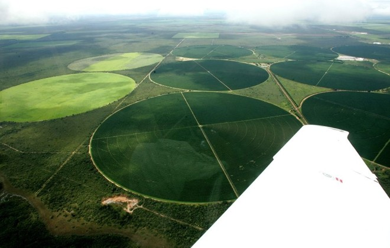

## Visão Geral da Aula {.smaller-text .lesson-slide}

::: {.columns}
::: {.column width="50%"}
### Tópicos

- [1]{.circle} Formação histórica da questão ambiental
- [2]{.circle} Natureza como construção social
- [3]{.circle} Apropriação dos recursos naturais
- [4]{.circle} Conflitos socioambientais
- [5]{.circle} Produção do espaço
- [6]{.circle} Entrega do Estudo Orientado nº 1
:::

::: {.column width="50%"}
::: {.info-box}
**Objetivo da Aula**

Compreender a constituição moderna da questão ambiental e a forma como a Geografia tematiza as relações sociedade-natureza, situando a apropriação dos recursos e os conflitos territoriais.
:::
:::
:::

# [1  -  MODERNIDADE E QUESTÃO AMBIENTAL]{.section-header}

## Formação histórica da questão ambiental {.smaller-text .lesson-slide}

::: {.columns}
::: {.column width="50%"}
### Marcos da emergência

| Período | Marco | Significado |
|---------|-------|-------------|
| Séc. XVII–XVIII | Revolução científica e iluminismo | Natureza como objeto a ser conhecido e dominado |
| Séc. XIX | Revolução industrial | Aceleração do consumo de recursos e da poluição |
| 1962 | *Silent Spring* (Carson) | Crítica aos agrotóxicos e à química industrial |
| 1972 | Conferência de Estocolmo + *Limits to Growth* | Internacionalização da agenda ambiental |

: {.striped .hover}
:::

::: {.column width="50%"}
::: {.highlight-box}
**A modernidade e o dualismo natureza-sociedade**

- A modernidade ocidental fixou uma **separação cartesiana** entre natureza (res extensa) e sociedade (res cogitans).
- A natureza foi convertida em **recurso** quantificável, apropriável e mensurável.
- O **espaço** foi reduzido a substrato passivo; o **tempo**, a sequência linear de progresso.

> Para Porto-Gonçalves (2004), a questão ambiental questiona essa **matriz moderno-colonial** de relação com o mundo.
:::
:::
:::

---

## Da agenda global aos desafios territoriais {.smaller-text .lesson-slide}

::: {.columns}
::: {.column width="55%"}
| Marco | Contribuição |
|-------|--------------|
| 1987 — *Our Common Future* | Formulação do desenvolvimento sustentável |
| 1992 - Rio-92 | Agenda 21, CDB e Convenção do Clima |
| 2015 — Acordo de Paris + ODS | Metas globais territorializadas |

: {.striped .hover}
:::

::: {.column width="45%"}
::: {.info-box}
**Como ler esta trajetória?**

Os acordos globais definem compromissos amplos. A análise ambiental pergunta como eles se traduzem  ou não, em usos da terra, políticas públicas e conflitos concretos.
:::
:::
:::

---

## Natureza como construção social {.smaller-text .lesson-slide}

::: {.columns}
::: {.column width="50%"}
### O que significa "construção social" da natureza?

- A **natureza** que conhecemos é mediada por **categorias culturais, científicas e políticas** historicamente construídas.
- Não há acesso "puro" à natureza: o que tematizamos como floresta, recurso, paisagem ou risco depende de regimes de saber e de poder.
- Isso **não nega** a materialidade dos processos físicos - afirma que sua **leitura** é sempre situada.

:::

::: {.column width="50%"}
::: {.info-box}
**Três regimes históricos da natureza** (Latour, Descola - adaptado)

| Regime | Princípio | Exemplo |
|--------|-----------|---------|
| **Naturalista** | Natureza separada da sociedade | Modernidade ocidental |
| **Animista** | Natureza povoada de sujeitos | Cosmovisões indígenas |
| **Analógico** | Correspondências entre seres | Tradições orientais clássicas |

: {.striped .hover}

A crise ambiental obriga a problematizar o regime naturalista hegemônico - abrindo espaço para conhecimentos tradicionais e abordagens integradoras.
:::
:::
:::

---

## Implicações para a Geografia {.smaller-text .lesson-slide}

::: {.columns}
::: {.column width="55%"}
- A apropriação dos recursos é uma **prática espacial**.
- Os conflitos ambientais são também conflitos de **representação** sobre o que conta como natureza.
:::

::: {.column width="45%"}
::: {.highlight-box}
**Pergunta de análise**

Quando grupos diferentes nomeiam um lugar como “recurso”, “morada”, “área protegida” ou “risco”, que usos do território passam a ser legitimados?
:::
:::
:::

# [2  -  APROPRIAÇÃO E CONFLITOS]{.section-header}

## Apropriação dos recursos naturais {.smaller-text .lesson-slide}

::: {.columns}
::: {.column width="50%"}
### Modalidades de apropriação

| Modalidade | Lógica | Exemplo |
|------------|--------|---------|
| **Mercantil** | Recurso como mercadoria | Mineração, agronegócio |
| **Estatal** | Bem público regulado | Unidades de conservação |
| **Comunitária** | Recurso como bem comum | Faxinais, extrativismo |
| **Privada** | Recurso como propriedade | Imóvel rural, outorga |

: {.striped .hover}

:::

::: {.column width="50%"}
::: {.highlight-box}
**Por que isso importa para a análise ambiental?**

A modalidade de apropriação define **quem decide** sobre o recurso - e, portanto, **qual racionalidade** orienta seu uso, conservação ou degradação. O diagnóstico ambiental deve identificar o regime de apropriação vigente antes de propor intervenções (Henri Lefebvre: apropriação humana e a dominação do espaço abstrato).
:::

::: {.info-box}
**Conceito operacional:** Os conflitos socioambientais emergem da disputa entre modalidades de apropriação incompatíveis sobre um mesmo território (Acselrad, 2004).
:::
:::
:::

---

## Concentração, desigualdade e conflito {.smaller-text .lesson-slide}

::: {.columns}
::: {.column width="52%"}
### Evidências a procurar

- Estrutura fundiária concentrada (Gini > 0,85)
- Acesso desigual à água, terra e infraestrutura ambiental
- Externalização de custos sobre territórios periféricos

{fig-alt="Latifúndio como exemplo de apropriação produtiva e uso do solo" width="85%"}
:::

::: {.column width="48%"}
::: {.info-box}
**Leitura da imagem**

1. Quem controla o acesso à terra e à água?
2. Quem recebe os benefícios da produção?
3. Quem pode estar mais exposto aos custos ambientais?
:::

::: {.highlight-box}
**Conceito operacional**

Os conflitos socioambientais emergem da disputa entre modalidades de apropriação incompatíveis sobre um mesmo território (Acselrad, 2004).
:::
:::
:::

## Conflitos socioambientais no Brasil {.smaller-text .lesson-slide}

::: {.columns}
::: {.column width="50%"}
### Tipologia frequente

- Mineração × comunidades tradicionais (Mariana, Brumadinho)
- Hidrelétricas × ribeirinhos e indígenas (Belo Monte)
- Agronegócio × quilombolas e geraizeiros
- Expansão urbana × áreas ripárias e APPs
- Eólicas × pescadores artesanais (litoral NE)
:::

::: {.column width="50%"}
{fig-alt="Imagem de satélite do rastro de rejeitos após o rompimento da Barragem I, em Brumadinho" width="100%"}

Fonte da imagem: ESA/Copernicus Sentinel-2A e contribuidores do OpenStreetMap, [CC BY-SA 3.0 IGO](https://commons.wikimedia.org/wiki/File:Brumadinho_dam_catastrophy_2.jpg).

> Disputa por **usos, sentidos e formas de apropriação** do território entre grupos com **assimetrias de poder** (Acselrad, 2004).
:::
:::

## Produção do espaço e ambiente {.smaller-text .lesson-slide}

::: {.columns}
::: {.column width="55%"}
### Lefebvre e a produção do espaço

- O espaço **não é** um receptáculo neutro; é **produzido socialmente**.
- Três planos articulados:
  - **Práticas espaciais** - usos cotidianos do território
  - **Representações do espaço** - mapas, planos, normas
  - **Espaços de representação** - vivências e símbolos

:::

::: {.column width="45%"}
::: {.info-box}
**Justiça ambiental**

- Acselrad, Mello & Bezerra (2009): os **riscos ambientais** se distribuem desigualmente no território, recaindo de forma desproporcional sobre populações pobres, negras e tradicionais.
- A Análise Ambiental crítica articula **diagnóstico técnico** e **leitura socioespacial** dos riscos.
:::
:::
:::

---

## Diagnóstico ambiental crítico {.smaller-text .lesson-slide}

::: {.columns}
::: {.column width="55%"}
### Três operações articuladas

1. **Caracterizar** processos físico-bióticos.
2. **Mapear** apropriações sociais sobre esses processos.
3. **Identificar** as assimetrias que definem quem produz e quem sofre o dano ambiental.

::: {.highlight-box}
**Pergunta de fechamento**

Que informação física, social e territorial você precisaria reunir para analisar um conflito do seu território de estudo?
:::
:::

::: {.column width="45%"}
::: {.info-box}
**Estudo Orientado nº 1**

Fichar PORTO-GONÇALVES (2004), **O desafio ambiental**, Parte I - "A natureza da globalização e a globalização da natureza": itens 1-3 (p. 13-27) e item 8 (p. 65-72), aplicando o conceito de **apropriação** a um conflito do território de estudo.
:::
:::
:::

# [Referências]{.section-header}

## Bibliografia da aula {.smaller-text}

- PORTO-GONÇALVES, C. W. **O desafio ambiental**. Org. Emir Sader. Rio de Janeiro: Record, 2004. (Os porquês da desordem mundial). Parte I, p. 13-75.
- PORTO-GONÇALVES, C. W. **Os (des)caminhos do meio ambiente**. 14. ed. São Paulo: Contexto, 2006.
- MENDONÇA, F. Geografia socioambiental. **Terra Livre**, n. 16, p. 113-132, 2001.
