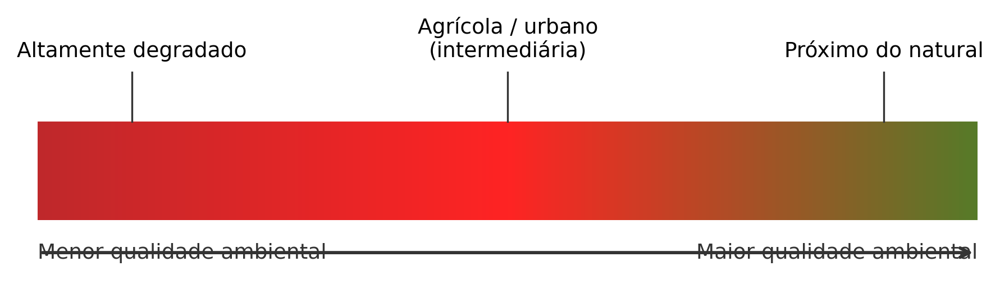
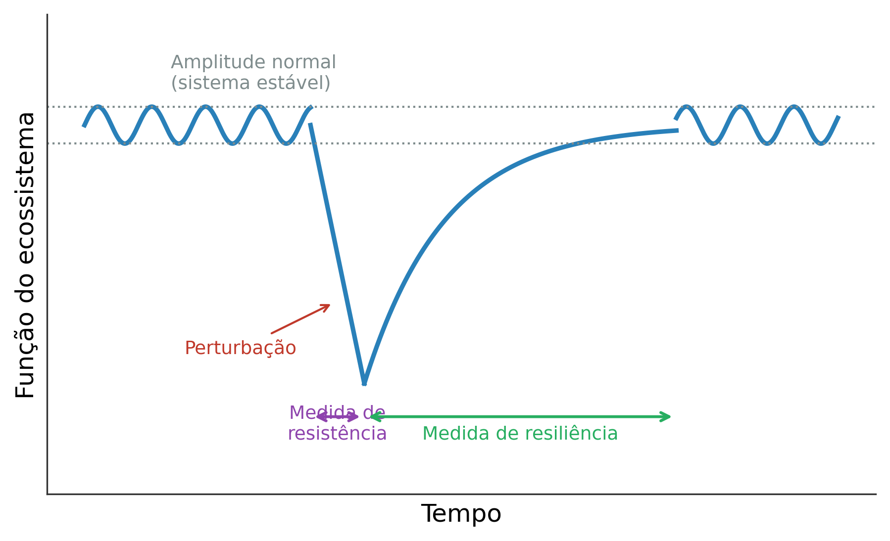

## Visão Geral da Aula {.smaller-text}

::: {.columns}
::: {.column width="50%"}
### Tópicos

- [1]{.circle} Ambiente, impacto e degradação
- [2]{.circle} Qualidade ambiental, poluição e resiliência
- [3]{.circle} AIA, licenciamento e etapas do EIA
- [4]{.circle} Termo de referência e dados de base
- [5]{.circle} Diagnóstico e prognóstico
- [6]{.circle} Previsão e identificação de impactos
- [7]{.circle} Mitigação, compensação e monitoramento
- [8]{.circle} Participação pública; Estudo Orientado nº 3
:::

::: {.column width="50%"}
::: {.info-box}
**Objetivo da Aula**

Consolidar os conceitos e fundamentos da AIA (ambiente, impacto, degradação, qualidade ambiental, resistência e resiliência), o fluxo de licenciamento e das etapas do EIA, e articular diagnóstico, prognóstico, mitigação, compensação, monitoramento e participação pública.
:::
:::
:::

# [1  -  CONCEITOS E FUNDAMENTOS]{.section-header}

## Ambiente, impacto e degradação {.smaller-text}

::: {.columns}
::: {.column width="50%"}
### Ambiente

- Conjunto de condições, leis e influências de ordem **física, química e biológica** que permite, abriga e rege a vida em todas as suas formas.
- O recorte do ambiente depende da **escala de estudo** (local, regional, global) e do objetivo da avaliação.
- Níveis de organização considerados: população, comunidade, ecossistema.

### Impacto ambiental (CONAMA 01/1986)

- Alteração das propriedades físicas, químicas ou biológicas do meio, causada por matéria ou energia resultante de atividades humanas.
- Afeta a saúde, a segurança e o bem-estar da população, as atividades sociais e econômicas, as condições estéticas e sanitárias e a qualidade dos recursos ambientais.
- Pode ser **positivo** ou **negativo**; a AIA se concentra nos negativos.
:::

::: {.column width="50%"}
::: {.highlight-box}
**Encadeamento**

Impacto ambiental → Degradação ambiental → Redução da qualidade ambiental

A degradação é **sempre negativa** e **sempre causada pelo homem**; o impacto pode ser benéfico.
:::

### EIA × RIMA

- **EIA**: estudo completo, linguagem técnica, construído por equipe multidisciplinar.
- **RIMA**: relatório do mesmo empreendimento em linguagem acessível aos afetados direta ou indiretamente.
:::
:::

---

## Qualidade ambiental e poluição {.smaller-text}

::: {.columns}
::: {.column width="50%"}
### Qualidade ambiental

- Medida da condição de um ambiente relativa aos requisitos de uma ou mais espécies e de qualquer necessidade ou objetivo humano.
- Quanto **mais próximo do natural**, maior a qualidade; ambientes agrícolas e urbanos têm qualidade **intermediária**.

{fig-alt="Escala de qualidade ambiental" width="100%"}

### Poluição (Lei 6.938/1981)

- Introdução, pelo homem, direta ou indiretamente, de substâncias ou energia no ambiente capazes de pôr em risco a saúde humana e causar danos aos recursos vivos e aos ecossistemas.
- Poluentes típicos: elementos químicos nas águas, material particulado, gases, ruído, vibrações, luz, radiações ionizantes.
- **Toda poluição é uma forma de degradação**; há padrões legais de tolerância.
:::

::: {.column width="50%"}
### Serviços ecossistêmicos

| Categoria | Exemplos |
|-----------|----------|
| **Provisão** | Água, alimentos, madeira, fibras |
| **Regulação** | Clima, erosão, polinização, pragas |
| **Suporte** | Ciclagem de nutrientes, formação do solo |
| **Cultural** | Lazer, espiritualidade, paisagem |

: {.striped .hover}

> Impactos ambientais reduzem a oferta de serviços ecossistêmicos; mensurar essa perda é a principal forma de dimensionar os efeitos.
:::
:::

---

## Resistência e resiliência {.smaller-text}

::: {.columns}
::: {.column width="50%"}
### Resistência

- Capacidade do ecossistema de **permanecer em equilíbrio apesar dos distúrbios**, resistindo a modificações (espécies exóticas, degradação de habitat).
- Um ambiente muito resistente suporta impactos até o limiar; ultrapassado esse limite, a degradação é profunda.

### Resiliência

- Capacidade de **retornar ao estado original após a degradação**.
- Limite da perturbação que o sistema suporta retendo função, estrutura e identidade, antes de mudar de estado.
- Quanto mais lenta a recuperação, menor a resiliência e mais significativo o impacto.

{fig-alt="Função do ecossistema ao longo do tempo, com perturbação, resistência e resiliência" width="95%"}
:::

::: {.column width="50%"}
::: {.highlight-box}
**Áreas de baixa resiliência (APP)**

- Topos de morros, montes, montanhas e serras.
- Encostas com declividade superior a 45°.
- Nascentes (raio mínimo de 50 m).
- Matas ciliares (30 a 500 m de cada margem, conforme a largura do curso d'água).

Impactos nessas áreas costumam ser altamente significativos.
:::
:::
:::

---

## Aspecto, impacto e recuperação {.smaller-text}

::: {.columns}
::: {.column width="50%"}
### Aspecto × impacto

- **Atividade, produto ou serviço** gera um **aspecto ambiental**, o elemento que interage com o meio.
- O aspecto desencadeia o **impacto**, a alteração sobre um componente do meio.
- Exemplo: lançamento de efluente (aspecto) → degradação da qualidade da água do rio (impacto).
- Uma atividade gera vários aspectos; um aspecto gera vários impactos.

### Impactos cumulativos e sinérgicos

- **Cumulativo**: soma de impactos de mesma natureza ao longo do tempo.
- **Sinérgico**: efeito conjunto **maior** que a soma das partes.
:::

::: {.column width="50%"}
### Recuperação ambiental

| Modalidade | Significado |
|------------|-------------|
| **Restauração** | Retorno às condições anteriores |
| **Reabilitação** | Ecossistema alternativo para outro uso |
| **Revitalização** | Recuperação de ambientes urbanos e rios degradados |
| **Remediação** | Remoção ou contenção de contaminantes |

: {.striped .hover}

> Recuperar é manejar para um objetivo; restaurar é voltar ao estado original, o que nem sempre é possível.
:::
:::

# [2  -  AIA, LICENCIAMENTO E ETAPAS DO EIA]{.section-header}

## O que é a AIA {.smaller-text}

::: {.columns}
::: {.column width="50%"}
### Definição e funções

- **AIA** (Sánchez, 2013): conjunto de procedimentos voltados a **prever**, **analisar** e **comunicar** as consequências ambientais prováveis de uma ação proposta.
- **AIA** (Bitar & Ortega, 1998): série de procedimentos legais, institucionais e técnico-científicos para **caracterizar impactos potenciais** e **prever magnitude e importância**.
- Objetivos: **impedir a degradação**, **reduzir a degradação** e **promover o desenvolvimento sustentável**.
- Abordagem **multidisciplinar**: meio físico e ecológico + dimensões econômica, social e cultural.
- Funções:
  - **Técnica** - identificar e quantificar impactos.
  - **Decisória** - subsidiar autorização ou negação do projeto.
  - **De negociação** - estabelecer medidas mitigadoras e compensatórias.
  - **De aprendizado social** - produzir conhecimento territorial público.

### Marco regulatório (Brasil)

| Norma | Conteúdo |
|-------|----------|
| Lei 6.938/1981 | PNMA, institui AIA como instrumento |
| Res. CONAMA 01/1986 | Define impacto e exige EIA/RIMA |
| Res. CONAMA 237/1997 | Procedimentos do licenciamento (LP/LI/LO) |
| LC 140/2011 | Competências federativas |

: {.striped .hover}
:::

::: {.column width="50%"}
::: {.highlight-box}
**Tipos de estudos**

| Estudo | Quando se aplica |
|--------|------------------|
| **EIA/RIMA** | Atividades de **significativo** impacto |
| **RAS / RCA** | Atividades de médio porte (varia por UF) |
| **PRAD** | Recuperação de áreas degradadas |
| **PBA** | Programas Básicos Ambientais (cumprimento de condicionantes da LP) |
| **AAE** | Avaliação Ambiental Estratégica (planos e políticas) |

: {.striped .hover}

> A AAE atua em escala mais ampla (programas), enquanto o EIA atua em escala de projeto.
:::
:::
:::

---

## Enquadramento no licenciamento {.smaller-text}

::: {.columns}
::: {.column width="50%"}
### Porte × potencial poluidor

- A **tipologia** do empreendimento cruza o **porte** (pequeno, médio, grande) com o **potencial poluidor** (pequeno, médio, grande) para água, solo e ar.
- Em Minas Gerais, a DN COPAM nº 217/2017 define **seis classes** (1 a 6), que determinam o tipo de estudo exigido.
- Classes menores admitem **licenciamento simplificado** ou **RAS**; classes maiores exigem **EIA/RIMA**.

### Critérios locacionais

- Recebem **peso** os critérios de localização (unidades de conservação, supressão em APP, reserva da biosfera).
- Fatores de **restrição ou vedação** podem inviabilizar o empreendimento no local.
:::

::: {.column width="50%"}
### Fases do licenciamento

| Licença | Autoriza |
|---------|----------|
| **LP** | Concepção e localização |
| **LI** | Instalação (construção) |
| **LO** | Operação |

: {.striped .hover}

> O órgão licenciador (municipal, estadual ou federal) depende da abrangência dos impactos.
:::
:::

---

## Etapas do EIA e termo de referência {.smaller-text}

::: {.columns}
::: {.column width="55%"}
### Fluxo do estudo

1. Apresentação da **proposta**, das características técnicas e da **justificativa locacional**.
2. Seleção das **ações** potencialmente causadoras de alterações.
3. **Triagem e escopo**: abrangência, profundidade e questões prioritárias.
4. Preparação do **Termo de Referência**.
5. **Plano de trabalho** e **estudos de base** (diagnóstico).
6. Identificação e **previsão** dos impactos.
7. Análise técnica, **consulta pública** e decisão do órgão ambiental.
8. **Monitoramento** e plano de gestão.
:::

::: {.column width="45%"}
::: {.info-box}
**Termo de Referência**

Roteiro do órgão ambiental com o conteúdo mínimo do EIA/RIMA (meios físico, biótico e socioeconômico). A empresa pode detalhar além do mínimo, jamais reduzi-lo.
:::

::: {.highlight-box}
**Resposta aos impactos**

Evitar → Minimizar → Corrigir → Compensar
:::
:::
:::

# [3  -  DIAGNÓSTICO E PROGNÓSTICO]{.section-header}

## Diagnóstico e prognóstico {.smaller-text}

::: {.columns}
::: {.column width="50%"}
### Diagnóstico ambiental

Caracterização do estado de referência (cenário **sem** o empreendimento) em três meios:

| Meio | Componentes |
|------|-------------|
| **Físico** | Clima, geologia, geomorfologia, solos, hidrologia, hidrogeologia, qualidade do ar e da água |
| **Biótico** | Flora, fauna terrestre, aquática e cavernícola, ecossistemas, espécies ameaçadas |
| **Antrópico** | População, atividades econômicas, patrimônio cultural, infraestrutura, governança |

: {.striped .hover}

### Escalas

- **Área de Influência Direta (AID)** - impacto pode ser causalmente atribuído.
- **Área de Influência Indireta (AII)** - efeitos secundários e sistêmicos.
- **Área Diretamente Afetada (ADA)** - área física do empreendimento.

{fig-alt="Mapas e limites territoriais" width="100%"}
:::

::: {.column width="50%"}
::: {.info-box}
**Prognóstico**

Projeção do estado ambiental em dois cenários:

- **Sem o empreendimento** (tendência atual).
- **Com o empreendimento** (em uma ou mais alternativas locacionais/tecnológicas).

A diferença entre cenários = **impacto previsto**.
:::
:::
:::

---

## Dados primários e secundários {.smaller-text}

::: {.columns}
::: {.column width="50%"}
### Fontes de dados

| Tipo | Característica |
|------|----------------|
| **Secundários** | Já existem (estações climáticas, IBGE, DataSUS, mapas); exigem checagem de **atualização** e **escala** |
| **Primários** | Coletados em campo para o estudo (meio biótico, qualidade da água, entrevistas) |

: {.striped .hover}

### Esforço amostral

- Planejar **quantas coletas** e **por quanto tempo**.
- No meio biótico, a **curva do coletor** (espécies acumuladas por dia de campo) indica quando a amostragem se torna suficiente.
:::

::: {.column width="50%"}
::: {.info-box}
**Vulnerabilidade e sensibilidade**

A significância do impacto depende da **vulnerabilidade natural** da área (relevo, declividade, nascentes, solos) e da qualidade ambiental prévia. Em área já degradada, o impacto marginal tende a ser menor.
:::
:::
:::

# [4  -  IMPACTOS, MITIGAÇÃO, MONITORAMENTO]{.section-header}

## Identificação e avaliação de impactos {.smaller-text}

::: {.columns}
::: {.column width="50%"}
### Métodos de identificação

| Método | Característica |
|--------|----------------|
| **Ad hoc** | Reunião de especialistas; rápida e de baixo custo, porém subjetiva |
| **Lista de verificação** (*checklist*) | Verifica impactos pré-listados |
| **Matriz de interação** (Leopold) | Cruza ações × fatores ambientais |
| **Diagrama de fluxos / redes de interação** | Visualiza encadeamentos causais |
| **Sobreposição cartográfica** (overlay/SIG) | Identifica conflitos espaciais |
| **Simulação (modelos matemáticos)** | Dispersão de poluentes, hidrologia, ruptura de barragens |

: {.striped .hover}

### Atributos do impacto (CONAMA 01/86)

Natureza, magnitude, abrangência, duração, reversibilidade, sinergia, cumulatividade, probabilidade de ocorrência e distribuição social dos riscos e benefícios.
:::

::: {.column width="50%"}
::: {.highlight-box}
**Hierarquia da mitigação** (BBOP/CSBI)

1. **Evitar** - impactos e prevenir riscos.
2. **Reduzir / minimizar** - impactos negativos.
3. **Compensar** - impactos que não podem ser evitados ou reduzidos.
4. **Recuperar** - o ambiente degradado ao final de cada etapa do ciclo de vida.

> Compensação é **último recurso**, não atalho.

### Medidas mitigadoras típicas

| Categoria | Exemplo |
|-----------|---------|
| Construtivas | Cortinas de drenagem, sed-traps |
| Operacionais | Programa de educação ambiental, gestão de resíduos |
| Compensatórias | UCs (SNUC), pagamento por serviços ambientais |
| Reparadoras | PRAD, recomposição de APP |
| Valorização de benefícios | Priorizar contratação e capacitação da mão de obra local |

> Exigências legais (licenças, outorga) e **monitoramento não são** medidas mitigadoras: mitigar é agir sobre o impacto.
:::
:::
:::

---

## Ciclo de vida e impactos por fase {.smaller-text}

::: {.columns}
::: {.column width="50%"}
### Fases do empreendimento

| Fase | Exemplos de impacto |
|------|---------------------|
| **Planejamento** | Tensão social e expectativa fundiária |
| **Implantação** | Supressão de vegetação, poeira, ruído, resíduos de construção |
| **Operação** | Efluentes, emissões, consumo de água, tráfego |
| **Desativação** | Demolição, reabilitação ou recuperação da área |

: {.striped .hover}

- O mesmo impacto pode ocorrer em mais de uma fase, com gravidade diferente em cada uma.
:::

::: {.column width="50%"}
::: {.info-box}
**Causa × efeito**

Toda ação humana é a **causa** (aspecto); o impacto é o **efeito** sobre o meio. Associar cada atividade do empreendimento às suas fases é o caminho mais completo para não deixar impacto de fora.
:::
:::
:::

---

## Matriz de Leopold e matriz ponderada {.smaller-text}

::: {.columns}
::: {.column width="50%"}
### Matriz de Leopold

- Cruza **ações do projeto** (linhas) com **componentes do meio** (colunas).
- Cada célula recebe **magnitude** e **importância** em escala de 1 a 10, com sinal positivo ou negativo.
- Objetiva e permite hierarquizar impactos, mas não capta impactos indiretos nem a dinâmica temporal.
- A pontuação não é transferível entre empreendimentos ou locais.
:::

::: {.column width="50%"}
### Matriz ponderada

- Classifica cada impacto por **caráter** (positivo, negativo, neutro), **importância**, **cobertura**, **duração** e **reversibilidade**.
- Cada classe recebe um **peso**; a soma ponderada gera o **impacto total** da célula.
- Permite comparar alternativas e fases do empreendimento e hierarquizar os impactos mais significativos.
:::
:::

---

## Monitoramento e PBA {.smaller-text}

::: {.columns}
::: {.column width="55%"}
### Plano de Monitoramento

- Indicadores específicos para cada impacto previsto.
- **Linha de base** estabelecida antes da implantação.
- Fases **pré-operacional**, **operacional** e **pós-operacional**.
- Frequência compatível com a dinâmica do processo monitorado.
- Limiares de alerta e de ação corretiva.

### Programas Básicos Ambientais (PBA)

Detalham as condicionantes da LP. Exemplos típicos:

- **Gestão e supervisão**: PGA, PCS, PEA e gerenciamento de riscos (PGR).
- **Monitoramento biofísico**: qualidade da água, fauna, flora e ruído.
- **Recuperação e compensação**: PRAD e programas de reassentamento.
:::

::: {.column width="45%"}
::: {.info-box}
**Estudo Orientado nº 4** (entrega na aula seguinte)

Selecionar um EIA/RIMA público (SIBE/IBAMA ou órgão estadual) e identificar:

1. Áreas de influência (ADA, AID, AII).
2. Três principais impactos previstos.
3. Lacunas no diagnóstico ambiental.
4. Coerência da hierarquia de mitigação.
5. Adequação do plano de monitoramento.
:::
:::
:::

---

## Participação pública {.smaller-text}

::: {.columns}
::: {.column width="50%"}
### Audiência e consulta pública

- Envolve indivíduos e grupos afetados, positiva ou negativamente, pela intervenção proposta.
- A **audiência pública** é obrigatória no rito do EIA/RIMA; a **consulta** pode ocorrer em várias etapas do estudo.
- Legitima a decisão, reduz conflitos e prazos e melhora a aceitação do projeto.

### Contribuições do público

- Proposição de medidas mitigadoras adequadas à realidade local.
- Redução de conflitos com comunidades, órgãos públicos e ONGs.
- Na prática, muitas vezes a participação limita-se ao direito de **ser informado** e de **exprimir pontos de vista**, com expectativa de influenciar a decisão.
:::

::: {.column width="50%"}
::: {.info-box}
**Quem participa**

Poder Executivo e Legislativo, órgãos públicos, conselhos, entidades da sociedade civil e pessoas físicas afetadas.

> Medidas mitigadoras copiadas de outros empreendimentos costumam falhar; o conhecimento local ajusta a medida ao contexto.
:::
:::
:::

# [Referências]{.section-header}

## Bibliografia da aula {.smaller-text}

- SÁNCHEZ, L. E. **Avaliação de impacto ambiental**: conceitos e métodos. 2. ed. São Paulo: Oficina de Textos, 2013. Capítulos de apoio a esta aula: *Identificação de impactos*; *Estudos de base e diagnóstico ambiental*; *Previsão de impactos*; *Mitigação e plano de gestão ambiental*.
- BITAR, O. Y.; ORTEGA, R. D. Gestão ambiental. In: OLIVEIRA, A. M. S.; BRITO, S. N. A. (org.). **Geologia de engenharia**. São Paulo: ABGE, 1998.
- BRASIL. **Lei nº 6.938, de 31 de agosto de 1981**. Política Nacional do Meio Ambiente.
- BRASIL. **Resolução CONAMA nº 01, de 23 de janeiro de 1986**. Dispõe sobre os critérios básicos e as diretrizes gerais para o Relatório de Impacto Ambiental (RIMA).
- BRASIL/MMA. **Procedimentos de licenciamento ambiental do Brasil**. Brasília: MMA, 2016.
- CETESB. **Manual para elaboração de estudos ambientais**. São Paulo: CETESB, [s.d.]. Roteiro de apoio ao Estudo Orientado nº 4.
