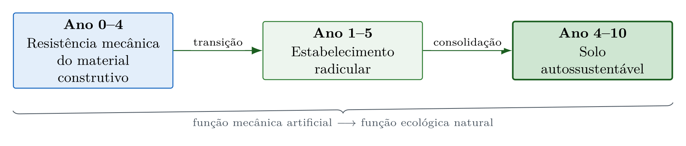

# Introdução à Bioengenharia de Água e Solo {#sec-introducao}

::: {.callout-note}
## Objetivos de aprendizagem
Ao final deste capítulo, o leitor deverá ser capaz de definir bioengenharia de água e solo e explicar o conceito de transição funcional que a distingue da engenharia convencional, comparar as duas abordagens quanto a durabilidade do material, trajetória temporal de desempenho e serviços ecossistêmicos, situar historicamente o desenvolvimento da disciplina, e reconhecer os desafios e as oportunidades específicos do contexto tropical.
:::

## O que é bioengenharia de água e solo

A bioengenharia de água e solo, designada na literatura internacional como *soil and water bioengineering*, é a disciplina que combina princípios da engenharia civil, da ecologia e da ciência do solo para projetar, construir e manter estruturas de estabilização e proteção do terreno utilizando materiais vivos, como plantas, raízes e estacas, associados ou não a materiais inertes biodegradáveis, como fibras naturais, madeira e bambu. A referência simultânea à água e ao solo expressa o acoplamento físico entre a solicitação hidráulica que destaca e transporta a partícula e a resistência edáfica que se opõe a esse processo, discutido em @sec-nbs.

O conceito difere da engenharia convencional em um aspecto fundamental. Enquanto as estruturas de concreto e aço são projetadas para resistir indefinidamente ao intemperismo, as estruturas de bioengenharia são projetadas para uma transição funcional, na qual a resistência mecânica inicial, fornecida pelos materiais construtivos, é progressivamente transferida ao sistema radicular das plantas à medida que estas se estabelecem (@fig-transicao). A leitura do esquema conceitual evidencia que o intervalo crítico da intervenção situa-se na sobreposição entre a perda de capacidade do material e o estabelecimento radicular, janela em que a estrutura precisa manter integridade suficiente para que a função ecológica assuma o controle.

{#fig-transicao fig-alt="Esquema conceitual da transição entre a função mecânica dos materiais construtivos e a função ecológica do sistema radicular" width="90%"}

## Bioengenharia e engenharia convencional em comparação

| Critério | Engenharia Convencional | Bioengenharia de Solos |
|----------|------------------------|----------------------|
| Material principal | Concreto, aço, gabião metálico | Plantas, fibras, madeira, bambu |
| Durabilidade do material | Décadas a séculos | 2–10 anos (biodegradável) |
| Função ao longo do tempo | Constante (ou degradante) | Crescente (sistema vivo) |
| Custo inicial | Alto | Moderado a baixo |
| Custo de manutenção | Médio | Baixo |
| Impacto paisagístico | Negativo | Positivo |
| Serviços ecossistêmicos | Nenhum | Múltiplos |
| Emissão de CO₂ | Alta | Sequestro de C |

: Comparativo entre engenharia convencional e bioengenharia de água e solo. {#tbl-comparativo .striped .hover}

## Histórico

A bioengenharia de água e solo tem raízes milenares. Na China, há registros de uso de fascinas de bambu para contenção de margens de rios datados de mais de 2.000 anos. Na Europa, técnicas de estabilização com estacas vivas de salgueiro (*Salix* spp.) são documentadas desde o século XVIII [@schiechtl1980].

O desenvolvimento moderno da disciplina ocorreu na segunda metade do século XX, com contribuições fundamentais de Hugo M. Schiechtl (Áustria), que sistematizou as técnicas de *Ingenieurbiologie* ao publicar o primeiro manual técnico em 1973. Na América do Norte, Donald H. Gray e Robbin B. Sotir consolidaram o campo com o clássico *Biotechnical and Soil Bioengineering Slope Stabilization* [@gray1996]. No Brasil, Fabrício J. Sutili e Miguel A. Durlo foram pioneiros na adaptação das técnicas europeias ao contexto subtropical brasileiro [@sutili2004; @durlo2005].

## Contexto Tropical

Em regiões tropicais, a bioengenharia enfrenta desafios e oportunidades particulares:

::: {.callout-important}
## Desafios tropicais
As regiões tropicais impõem condições severas à bioengenharia. A intensidade pluviométrica, com chuvas concentradas cuja erosividade é 3–5× maior que em zonas temperadas, exige estruturas com alta capacidade de dissipação de energia. O intemperismo profundo gera perfis de solo com 10–30 m de manto de alteração, nos quais predominam argilas 1:1 (caulinita) com baixa CTC (solos lateríticos). Soma-se a isso a necessidade de seleção criteriosa de espécies nativas adaptadas, dada a elevada biodiversidade das paisagens tropicais.
:::

::: {.callout-tip}
## Oportunidades tropicais
Em contrapartida, as condições tropicais oferecem vantagens expressivas. As taxas de rebrota vegetal são 2–4× maiores que em zonas temperadas, acelerando a transição funcional. A disponibilidade de fibras naturais (sisal, coco, taboa *Typha*, bananeira e rami) e de materiais locais (bambu, pedras e madeiras de rápido crescimento) reduz custos, enquanto a viabilidade econômica de mão de obra intensiva favorece técnicas de execução manual.
:::

## Estrutura deste livro

A obra está organizada em seis partes que progridem do enquadramento conceitual ao projeto executivo. A Parte I estabelece a definição de bioengenharia de água e solo, o enquadramento no campo das soluções baseadas na natureza e a tipologia das técnicas por função dominante. A Parte II apresenta a base científica do meio físico tropical, abrangendo formação dos solos, processos de intemperismo, mecanismos erosivos e classificação de feições. A Parte III detalha as técnicas construtivas em ordem crescente de complexidade, com equações de dimensionamento, exemplos resolvidos e roteiros de verificação, e dedica três capítulos às paliçadas permeáveis, do princípio hidráulico ao protocolo hidrogeotécnico e ao monitoramento pós-instalação. A Parte IV aborda geossintéticos convencionais, biotêxteis de fibras vegetais e biopolímeros superabsorventes, com a caracterização físico-química dos materiais e as patentes desenvolvidas pelo autor. A Parte V amplia a escala para a bacia hidrográfica, tratando da conectividade hidrossedimentológica, da bioengenharia de margens e do roteiro de projeto integrador. A Parte VI reúne o monitoramento tridimensional de estruturas e depósitos, a análise de viabilidade econômica, a adaptação às mudanças climáticas e o marco regulatório aplicável no Brasil.
