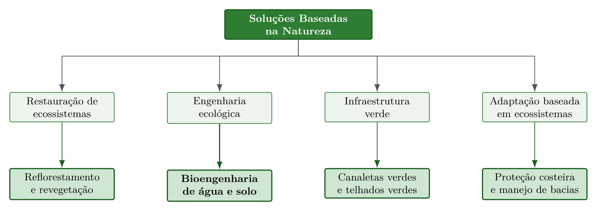

# Soluções Baseadas na Natureza para Água e Solo {#sec-nbs}

::: {.callout-note}
## Objetivos de aprendizagem
Ao final deste capítulo, o leitor deverá ser capaz de enunciar a definição de Soluções Baseadas na Natureza e os dois eixos que uma intervenção precisa atender para qualificar-se como tal, posicionar a bioengenharia de solos no campo conceitual das NBS em relação à engenharia ecológica, à restauração de ecossistemas e à infraestrutura verde, justificar por que água e solo constituem um único sistema de processos em feições erosivas tropicais, associar cada um dos oito critérios da IUCN a uma técnica concreta tratada neste livro, e identificar a escala espacial adequada a cada tipo de intervenção na cascata hidrossedimentológica.
:::

## Definição e dupla exigência

As Soluções Baseadas na Natureza, designadas na literatura internacional como *Nature-based Solutions* e abreviadas como NBS, são definidas pela IUCN como

> Ações para proteger, gerenciar de forma sustentável e restaurar ecossistemas naturais ou modificados, que abordam desafios sociais de forma eficaz e adaptativa, fornecendo simultaneamente benefícios para o bem-estar humano e para a biodiversidade. [@iucn2020]

Essa definição estabelece que uma intervenção somente se qualifica como NBS quando opera simultaneamente em dois eixos, resolvendo um desafio social concreto, como controle de erosão, mitigação de enchentes ou segurança hídrica, e gerando ganho líquido para a biodiversidade. A bioengenharia de água e solo, conforme apresentada ao longo deste livro, atende integralmente a esse duplo requisito, pois utiliza elementos vivos como componentes estruturais que, ao mesmo tempo em que estabilizam taludes e controlam feições erosivas, criam habitat, promovem ciclagem de nutrientes e sequestram carbono.

## Enquadramento conceitual

A bioengenharia de solos constitui uma vertente da engenharia ecológica, entendida como a aplicação de princípios ecológicos ao projeto de intervenções de engenharia, que por sua vez integra o guarda-chuva conceitual das NBS juntamente com a restauração de ecossistemas, a infraestrutura verde e a adaptação baseada em ecossistemas. A hierarquia entre esses campos (@fig-nbs-hierarquia) esclarece por que técnicas aparentemente distintas, como a revegetação de uma vertente e a implantação de uma canaleta verde, compartilham a mesma lógica de projeto.

{#fig-nbs-hierarquia fig-alt="Posição da bioengenharia de água e solo no campo conceitual das Soluções Baseadas na Natureza, como vertente da engenharia ecológica" width="90%"}

## Água e solo como um único sistema

A designação bioengenharia de água e solo não resulta de justaposição terminológica, pois os dois componentes participam do mesmo encadeamento de processos. A água fornece a energia que destaca e transporta a partícula, enquanto o solo fornece a resistência que se opõe a esse destacamento, de modo que toda feição erosiva expressa o desequilíbrio instantâneo entre uma solicitação hidráulica e uma resistência edáfica. Em regiões tropicais, esse acoplamento é especialmente estreito porque a infiltração restritiva de horizontes subsuperficiais argilosos converte rapidamente chuva em escoamento, elevando a tensão cisalhante disponível no talvegue, enquanto a perda de coesão aparente por dissipação da sucção matricial reduz simultaneamente a resistência das paredes da feição.

Essa reciprocidade produz três consequências práticas de projeto. A intervenção que atua apenas sobre a resistência do solo, como a revegetação de uma superfície exposta, falha quando a solicitação hidráulica remanescente excede a capacidade da cobertura implantada. A intervenção que atua apenas sobre a água, como a drenagem de um talude, deixa exposto um material cuja resistência não foi recomposta. E a intervenção que atua sobre ambos simultaneamente, caso das técnicas que compõem este livro, estabiliza o sistema mesmo quando um dos componentes varia, condição que explica a resiliência das estruturas vivas frente a eventos extremos.

::: {.callout-important}
## Leitura integrada da cascata hidrossedimentológica
A posição da intervenção na cascata hidrossedimentológica determina qual componente do sistema é dominante. Na área de contribuição, o manejo da infiltração e da cobertura controla a geração do escoamento. Na vertente, barreiras lineares de baixa altura fragmentam a lâmina e reduzem o comprimento de rampa. No talvegue, barreiras transversais permeáveis dissipam a energia do escoamento concentrado. No canal e na margem, a solicitação passa a ser hidrodinâmica permanente, e as estruturas precisam operar submersas ou na zona de variação de nível. Dimensionar uma técnica sem identificar sua posição nessa cascata é a origem mais frequente do subdimensionamento, porque transfere para uma estrutura isolada a função que pertence ao conjunto.
:::

## Critérios IUCN aplicados à bioengenharia

A IUCN estabelece oito critérios que qualificam uma intervenção como NBS [@iucn2020], e cada um deles encontra correspondência direta nas técnicas apresentadas nos capítulos seguintes (@tbl-criterios-iucn). A leitura da tabela cumpre função didática dupla, pois fornece ao estudante o vocabulário de enquadramento exigido em projetos submetidos a financiamento e, ao mesmo tempo, antecipa o mapa das técnicas que serão desenvolvidas ao longo do livro.

| # | Critério | Aplicação em bioengenharia de água e solo |
|---|----------|-------------------------------------|
| 1 | Aborda desafios sociais | O controle de erosão protege estradas, infraestrutura e comunidades rurais a jusante |
| 2 | Design em escala de paisagem | O projeto integrado de bacias hidrográficas (@sec-bacias-captacao) considera a conectividade hidrossedimentológica |
| 3 | Ganho líquido para biodiversidade | Espaços entre pedras de enrocamento e células de gabiões criam habitat (@sec-enrocamento, @sec-gabiao-vivo) |
| 4 | Economicamente viável | Custos 3--5× menores que engenharia civil convencional (@tbl-custos-nbs) |
| 5 | Governança inclusiva | A fabricação de biotêxteis em comunidades rurais gera renda local (@sec-biotexteis) |
| 6 | Equilíbrio entre trade-offs | O dimensionamento equilibra estabilidade mecânica e permeabilidade hidráulica |
| 7 | Gestão adaptativa | O monitoramento contínuo permite ajustes nas técnicas ao longo do tempo |
| 8 | Sustentável e integrada | Após 3--5 anos de consolidação, a vegetação assume a função protetora sem necessidade de manutenção |

: Critérios IUCN aplicados à bioengenharia de água e solo, com exemplos de atendimento para cada critério. {#tbl-criterios-iucn .striped}

## Por que a bioengenharia se qualifica como NBS

A bioengenharia de água e solo opera com processos naturais como motores de estabilização, condição que a distingue da engenharia convencional, dependente de materiais inertes cuja função é estritamente mecânica. O crescimento radicular incrementa a coesão efetiva do solo, conforme o modelo de Wu-Waldron detalhado em @sec-gabiao-vivo, a interceptação vegetal da chuva reduz a energia cinética do salpico, a ciclagem hidrológica pela evapotranspiração reduz a poropressão e estabiliza taludes, e a deposição de serrapilheira cria camada orgânica que protege a superfície e alimenta a atividade biológica do solo.

Esses processos geram múltiplos cobenefícios, abrangendo estabilidade geotécnica, conservação de biodiversidade, sequestro de carbono e valorização paisagística, e tornam-se autossustentáveis após a fase de consolidação de 3--5 anos. A diferença de trajetória temporal frente à engenharia convencional é o traço mais relevante para o projetista, pois um muro de concreto deteriora-se progressivamente enquanto uma encosta estabilizada por bioengenharia ganha resistência ao longo do tempo, à medida que o sistema radicular se expande e a coesão do solo aumenta.

## Tipologia das intervenções por função dominante

A classificação das técnicas por função dominante organiza o repertório apresentado no livro e orienta a composição de projetos integrados, nos quais estruturas com funções complementares operam em sequência ao longo da cascata (@tbl-tipologia-nbs).

| Função dominante | Processo controlado | Técnicas correspondentes |
|---|---|---|
| Proteção de superfície | Destacamento por impacto de gota e escoamento difuso | Revegetação (@sec-revegetacao), hidrossemeadura (@sec-hidrossemeadura), biomantas (@sec-biomantas), biotêxteis (@sec-biotexteis) |
| Fragmentação da rampa | Comprimento de escoamento e velocidade superficial | Cordões vegetativos e fascinas (@sec-cordoes-fascinas), feixes vivos (@sec-feixes-drenos) |
| Dissipação em escoamento concentrado | Tensão cisalhante de leito em feições lineares | Paliçadas permeáveis (@sec-palicadas, @sec-palicadas-protocolo, @sec-palicadas-execucao) |
| Retenção e infiltração | Volume de enxurrada e recarga | Bacias de captação e barraginhas (@sec-bacias-captacao) |
| Condução controlada | Transporte de vazão sem erosão | Canaletas verdes (@sec-canaleta-verde) |
| Contenção estrutural | Estabilidade de talude e empuxo de terra | Gabião vivo (@sec-gabiao-vivo), parede Krainer (@sec-parede-krainer), enrocamento vegetado (@sec-enrocamento) |
| Reforço e drenagem interna | Resistência de interface e poropressão | Geotêxteis (@sec-geotexteis), geodrenos vegetais (@sec-biotexteis), biopolímeros hidrorretentores (@sec-biopolimeros) |

: Tipologia das técnicas de bioengenharia de água e solo por função dominante e processo controlado. {#tbl-tipologia-nbs .striped .hover}

## Síntese do capítulo

A qualificação de uma intervenção como Solução Baseada na Natureza exige o atendimento simultâneo de um desafio social e de um ganho líquido para a biodiversidade, e a bioengenharia de água e solo satisfaz esse duplo requisito porque emprega elementos vivos como componentes estruturais. O campo situa-se como vertente da engenharia ecológica dentro do guarda-chuva das NBS, ao lado da restauração de ecossistemas, da infraestrutura verde e da adaptação baseada em ecossistemas. A integração entre água e solo decorre do fato de que a água fornece a solicitação e o solo a resistência, de modo que toda feição erosiva expressa o desequilíbrio entre essas duas grandezas, e a posição da intervenção na cascata hidrossedimentológica determina qual componente é dominante e, portanto, qual técnica se aplica. Os oito critérios da IUCN encontram correspondência direta nas técnicas do livro, e a tipologia por função dominante fornece o mapa que orienta a composição de projetos integrados.

::: {.callout-tip}
## Questões para estudo
1. Uma prefeitura propõe revestir em concreto um canal urbano erodido, alegando que a obra resolve o problema social da inundação. Avalie se a intervenção se qualifica como NBS e indique qual critério da IUCN permanece desatendido.
2. Explique, em termos de solicitação hidráulica e resistência edáfica, por que a revegetação isolada de uma ravina ativa com declividade de fundo elevada tende a falhar.
3. Classifique as técnicas de paliçada permeável, biomanta e bacia de captação segundo a função dominante da @tbl-tipologia-nbs e indique a posição de cada uma na cascata hidrossedimentológica.
4. Discuta por que a trajetória temporal de desempenho da bioengenharia é crescente enquanto a da engenharia convencional é decrescente, e identifique a implicação dessa diferença na análise econômica de longo prazo.
5. Selecione um dos oito critérios da IUCN e descreva, para um projeto de controle de voçoroca em propriedade familiar, qual evidência documental comprovaria o seu atendimento.
:::
