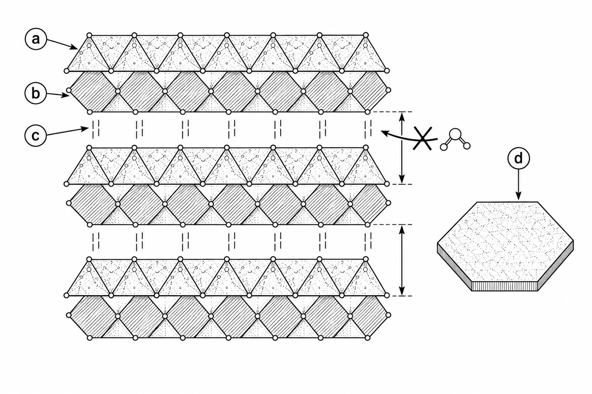
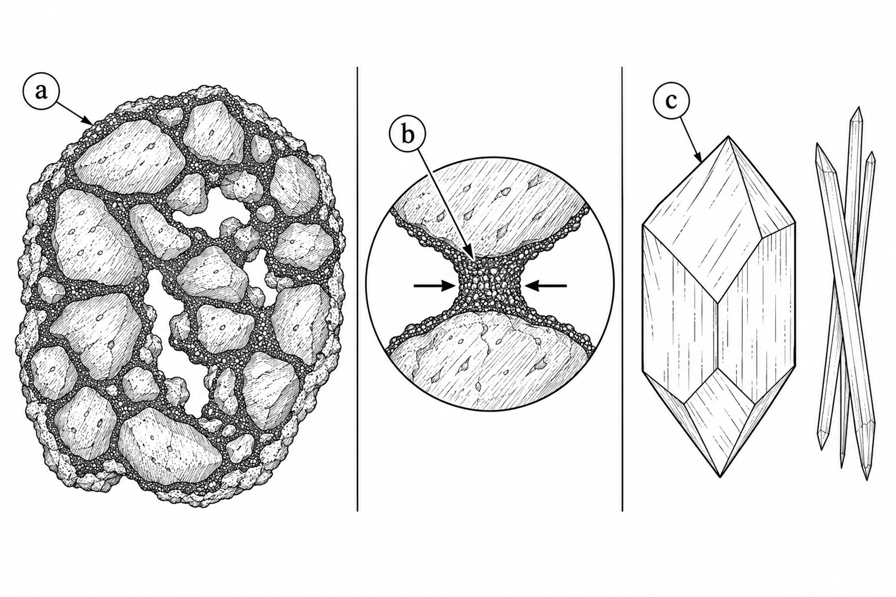

# Intemperismo e Transformação do Solo {#sec-intemperismo}

## Conceito de Intemperismo

O intemperismo é o conjunto de processos físicos, químicos e biológicos que transformam rochas consolidadas em materiais inconsolidados (saprolito e solo). Para quem trabalha com bioengenharia, compreender o intemperismo é essencial por uma razão simples: ele é o processo que "fabrica" o substrato sobre o qual todas as intervenções são projetadas. A profundidade do manto de alteração, a mineralogia das argilas formadas e a estrutura do solo resultante são consequências diretas da intensidade e do tipo de intemperismo atuante.

Em regiões tropicais, o intemperismo é mais intenso e profundo do que em qualquer outra zona climática do planeta. A combinação de temperaturas médias elevadas (> 20 °C), precipitação abundante (> 1.200 mm/ano) e intensa atividade biológica acelera as reações de decomposição mineral, resultando em mantos de alteração que podem alcançar dezenas de metros de espessura. A @fig-agentes sintetiza os agentes que atuam simultaneamente nesse processo de transformação.

## Intemperismo Físico

{#fig-agentes fig-alt="Agentes ativos do intemperismo" width="85%"}

O intemperismo físico fragmenta mecanicamente a rocha sem alterar sua composição mineralógica. Trata-se da "quebra" da rocha em pedaços cada vez menores, aumentando a superfície específica exposta e, com isso, acelerando o ataque químico subsequente. É importante compreender que o intemperismo físico não atua sozinho; ele prepara o terreno para o intemperismo químico, que será o agente dominante nos trópicos. Os principais mecanismos em regiões tropicais são descritos a seguir.

### Alívio de Pressão

Quando rochas formadas em grande profundidade (sob pressão de quilômetros de material sobrejacente) são gradualmente expostas à superfície pela remoção erosiva das camadas superiores, a descompressão gera fraturas subparalelas à topografia, fenômeno conhecido como *sheet joints* ou *sheeting*. Esse processo é visível na @fig-alivio.

{#fig-alivio fig-alt="Alívio de pressão em rocha granítica" width="85%"}

Esse mecanismo é particularmente importante em maciços graníticos e gnáissicos nos inselbergs do Nordeste brasileiro, onde as fraturas geradas pelo alívio de pressão criam caminhos preferenciais para a infiltração da água, acelerando o intemperismo químico nos planos de descontinuidade. Em termos práticos, encostas rochosas com *sheeting* bem desenvolvido são mais suscetíveis a desprendimentos de lajes e blocos, o que deve ser considerado no projeto de intervenções.

### Termoclastia

A variação diurna de temperatura causa expansão e contração diferencial dos minerais que compõem a rocha. Como cada mineral tem um coeficiente de dilatação térmica diferente, os ciclos de aquecimento e resfriamento geram tensões internas heterogêneas que, com o tempo, produzem microfissuras e fraturam progressivamente a rocha. A @fig-termoclastia ilustra esse processo.

{#fig-termoclastia fig-alt="Termoclastia e amplitude térmica" width="85%"}

Em regiões semiáridas tropicais (como a Caatinga brasileira), a amplitude térmica superficial pode alcançar 60 °C (rocha exposta ao sol a 70 °C versus ar noturno a 10 °C), gerando tensões suficientes para fraturar até rochas muito competentes. A termoclastia é um dos fatores que explicam a produção de cascalho e areia grossa nos pedimentos semiáridos, materiais que podem ser aproveitados como agregados em estruturas de bioengenharia.

### Crescimento de Cristais

Em ambientes semiáridos, a evaporação de soluções salinas nos poros e fraturas da rocha gera cristais de sais (cloretos, sulfatos, carbonatos) que exercem pressão de cristalização de até 300 MPa sobre as paredes dos poros, fragmentando progressivamente o substrato. Esse processo, chamado haloclastia, é responsável pela degradação acelerada de rochas em ambientes costeiros e em regiões com solos salinos, sendo especialmente relevante em obras de bioengenharia no Semiárido nordestino.

### Ação Biológica Mecânica

As raízes de árvores e arbustos penetram fraturas preexistentes e exercem pressão mecânica de expansão à medida que crescem em diâmetro. Esse processo, chamado *root wedging*, é capaz de fragmentar blocos de rocha ao longo de décadas. Liquens e fungos contribuem para a fragmentação superficial combinando ação mecânica (hifas que penetram microfissuras) e ação química (exsudação de ácidos orgânicos). Para a bioengenharia, isso tem uma implicação paradoxal: embora o enraizamento seja desejável para estabilizar taludes de solo, raízes penetrando fraturas de rocha podem desestabilizar encostas rochosas.

## Intemperismo Químico

O intemperismo químico é o processo dominante nos trópicos úmidos, responsável por transformar minerais primários (formados a altas temperaturas e pressões durante a consolidação da rocha) em minerais secundários (argilas e óxidos estáveis nas condições de superfície). A água é o agente principal dessas transformações, e sua abundância nos trópicos explica por que os solos tropicais são os mais profundamente intemperizados do planeta.

### Papel da Água

A molécula de água desempenha três funções simultâneas e indissociáveis no intemperismo químico. Atua como solvente (dissolvendo íons e moléculas dos minerais por sua elevada constante dielétrica), como reagente (participando diretamente das reações de hidrólise, que são as mais importantes nos trópicos) e como meio de transporte (removendo produtos solúveis por lixiviação e redistribuindo materiais ao longo do perfil).

A taxa de intemperismo químico aumenta exponencialmente com a temperatura, seguindo a Lei de Arrhenius:

$$
k = A \cdot e^{-E_a / RT}
$$

onde $k$ é a constante de velocidade da reação, $A$ é o fator de frequência (frequência com que as moléculas colidem com orientação favorável), $E_a$ é a energia de ativação (barreira energética que deve ser superada para que a reação ocorra), $R$ é a constante universal dos gases (8,314 J mol⁻¹ K⁻¹) e $T$ é a temperatura absoluta (em kelvin). Em termos práticos, cada aumento de 10 °C na temperatura duplica aproximadamente a velocidade das reações de intemperismo, o que explica por que solos tropicais atingem graus de intemperismo que solos temperados levariam milhões de anos adicionais para alcançar.

### Principais Reações

A hidrólise constitui a reação mais importante nos trópicos, pois é o mecanismo pelo qual os silicatos (minerais dominantes nas rochas da crosta) são decompostos pela ação de íons H⁺ da água. O exemplo clássico é a hidrólise do feldspato potássico (ortoclásio, um dos minerais mais comuns em granitos) para caulinita (a argila dominante nos solos tropicais):

$$
2 \text{KAlSi}_3\text{O}_8 + 2\text{H}^+ + 9\text{H}_2\text{O} \rightarrow \text{Al}_2\text{Si}_2\text{O}_5(\text{OH})_4 + 4\text{H}_4\text{SiO}_4 + 2\text{K}^+
$$

Note que a reação consome dois moles de feldspato e produz caulinita (que permanece no solo) e sílica dissolvida e potássio em solução (que são exportados pela drenagem). Essa exportação contínua de sílica e bases é responsável pelo empobrecimento químico progressivo dos solos tropicais.

A oxidação promove a conversão de ferro ferroso (Fe²⁺, solúvel) em ferro férrico (Fe³⁺, insolúvel), formando os óxidos de ferro responsáveis pelas cores vermelhas e amarelas características dos solos tropicais:

$$
4\text{Fe}^{2+} + 3\text{O}_2 + 6\text{H}_2\text{O} \rightarrow 4\text{FeOOH} + 8\text{H}^+
$$

O produto dessa reação (goethita, FeOOH) é um dos minerais mais estáveis nas condições tropicais e desempenha papel fundamental na microagregação dos solos lateríticos, conferindo-lhes estabilidade estrutural mesmo com altos teores de argila. Esse é um aspecto positivo para a bioengenharia, pois a microagregação facilita a infiltração e a penetração radicular.

A dissolução corresponde à remoção completa de íons solúveis (Ca²⁺, Mg²⁺, K⁺, Na⁺) pela lixiviação, concentrando residualmente os óxidos de ferro e alumínio mais insolúveis. É esse processo de empobrecimento seletivo que transforma, ao longo de milhões de anos, uma rocha rica em diversos minerais em um solo dominado por caulinita, goethita e gibbsita.

### Série de Goldich

A série de estabilidade de Goldich (inversa da série de cristalização de Bowen) ordena os minerais segundo sua resistência ao intemperismo. Minerais formados em altas temperaturas e pressões (primeiros a cristalizar no magma) são os menos estáveis nas condições de superfície e, portanto, os primeiros a serem destruídos pelo intemperismo.

| Mais susceptível → | → Menos susceptível |
|-------------------|---------------------|
| Olivina | Quartzo |
| Piroxênio | Muscovita |
| Anfibólio | Feldspato potássico |
| Biotita | — |

: Série de estabilidade de Goldich, onde minerais formados em altas temperaturas (esquerda) são os primeiros a intemperizar. {#tbl-goldich .striped}

Para a bioengenharia, a série de Goldich tem uma implicação prática imediata. Solos derivados de rochas ricas em olivina e piroxênio (como basaltos) intemperizam rapidamente e produzem solos argilosos profundos (Latossolos), enquanto solos derivados de rochas quartzosas (como arenitos) geram solos arenosos rasos com baixa coesão e alta erodibilidade. A identificação da rocha-mãe permite, portanto, antecipar as propriedades do solo e selecionar as técnicas de bioengenharia mais adequadas.

## Índice de Intemperismo Químico (CIA)

Para quantificar objetivamente o grau de intemperismo de um solo ou saprolito, utiliza-se o Chemical Index of Alteration (CIA), proposto por Nesbitt e Young (1982):

$$
\text{CIA} = \frac{\text{Al}_2\text{O}_3}{\text{Al}_2\text{O}_3 + \text{CaO}^* + \text{Na}_2\text{O} + \text{K}_2\text{O}} \times 100
$$

O CIA mede a proporção de alumínio (que permanece no solo como argilas e hidróxidos) em relação à soma de alumínio e bases (cálcio, sódio e potássio, que são progressivamente removidos pela lixiviação). Quanto mais alto o CIA, mais intenso foi o intemperismo. A @tbl-cia apresenta a interpretação dos valores.

| CIA | Grau de intemperismo | Exemplo |
|-----|---------------------|---------|
| 50 | Rocha fresca | Granito inalterado |
| 60–70 | Moderado | Solos de zona temperada |
| 75–85 | Avançado | Argissolos tropicais |
| 85–100 | Extremo | Latossolos, bauxitas |

: Interpretação do CIA para diferentes graus de intemperismo. {#tbl-cia .striped}

## Minerais Diagnósticos dos Solos Tropicais

Os produtos finais do intemperismo nos trópicos são um conjunto restrito de minerais muito estáveis que dominam a mineralogia dos solos. Conhecê-los é fundamental para a bioengenharia, pois cada mineral confere propriedades geotécnicas e químicas distintas ao solo.

### Caulinita

A caulinita é uma argila do tipo 1:1 (uma lâmina tetraédrica de sílica ligada a uma lâmina octaédrica de alumina), com espaçamento basal de 7,2 Å. Trata-se do argilomineral mais abundante nos solos tropicais bem drenados, sendo o produto direto da hidrólise dos feldspatos conforme discutido acima. A @fig-caulinita mostra a organização das lâminas, as ligações de hidrogênio que bloqueiam a entrada de água no espaço interlamelar e o hábito em plaquetas.

{#fig-caulinita fig-alt="Estrutura em camadas da caulinita e bloqueio do espaço interlamelar" width="85%"}

Para a bioengenharia, as propriedades da caulinita têm implicações diretas. Sua baixa capacidade de troca catiônica (CTC ≈ 3–15 cmolc/kg, contra 80–150 cmolc/kg em argilas montmoriloníticas) significa que solos cauliníticos retêm poucos nutrientes, exigindo adição de matéria orgânica para sustentar o crescimento vegetal. Sua baixa expansibilidade (não incha nem contrai com variações de umidade, diferentemente das argilas 2:1) confere estabilidade volumétrica ao solo, o que é vantajoso para estruturas construídas sobre ele. Sua coesão moderada explica a estabilidade aparente dos solos tropicais secos, mas a perda rápida de resistência quando saturados.

### Goethita (FeOOH)

A goethita é o óxido de ferro responsável pela cor amarela dos solos tropicais. Predomina em ambientes mais úmidos e com menor variação sazonal de umidade (como topos de morro sombreados ou solos de encostas voltadas para o sul no hemisfério sul). A goethita cristaliza com maior teor de água em sua estrutura e reflete a luz na faixa do amarelo-ocre. Em termos geotécnicos, a presença dominante de goethita em relação à hematita indica solos com regime hídrico mais úmido, o que deve ser considerado no dimensionamento da drenagem em projetos de bioengenharia.

### Hematita (Fe₂O₃)

A hematita é o óxido de ferro que confere a cor vermelha intensa aos solos tropicais, sendo o resultado da desidratação da goethita em condições de boa drenagem e estação seca definida. A @fig-hematita relaciona o revestimento por óxidos à cimentação das partículas e à estabilidade dos agregados.

{#fig-hematita fig-alt="Agregado de solo, ponte cimentante de óxido e hábitos cristalinos de óxidos de ferro" width="85%"}

A hematita possui papel fundamental na microagregação dos solos tropicais (Latossolos). Ela atua como agente cimentante entre partículas de caulinita, formando microagregados esféricos de 0,1–1,0 mm de diâmetro que conferem ao solo uma estrutura granular extremamente estável e, paradoxalmente, fazem com que solos com 60–80% de argila se comportem hidraulicamente como areias (alta permeabilidade, baixa plasticidade). Essa microagregação é benéfica para a bioengenharia por facilitar a infiltração e o enraizamento, mas é destruída por compactação ou erosão superficial intensa.

### Gibbsita (Al(OH)₃)

A gibbsita é um hidróxido de alumínio indicador de intemperismo extremo (ferraltização). Sua presença abundante indica que o solo perdeu praticamente toda a sílica por lixiviação, restando apenas alumínio e ferro como componentes minerais. É o mineral diagnóstico dos Latossolos mais intemperizados e das bauxitas (minério de alumínio). Em termos de bioengenharia, solos com alto teor de gibbsita são extremamente pobres em nutrientes (CTC da gibbsita ≈ 0) e exigem adição massiva de matéria orgânica para qualquer estratégia de revegetação.

## Implicações para a Bioengenharia

O grau de intemperismo determina diretamente as propriedades geotécnicas do solo e, consequentemente, as decisões de projeto de bioengenharia. A compreensão da mineralogia e da evolução geoquímica do perfil permite antecipar comportamentos e selecionar técnicas com maior probabilidade de sucesso.

::: {.callout-warning}
## Atenção
Solos extremamente intemperizados (CIA > 85) apresentam um conjunto de propriedades que exige abordagens específicas de bioengenharia. A baixa CTC (dominada por caulinita e gibbsita) demanda reposição contínua de matéria orgânica para viabilizar o crescimento vegetal. A coesão aparente (conferida por cimentação por óxidos e sucção matricial) implica estabilidade temporária que é rapidamente perdida quando o solo satura, tornando essencial o gerenciamento da drenagem. A microagregação por óxidos de ferro gera comportamento pseudo-arenoso (alta permeabilidade em solo argiloso), o que pode parecer contraditório mas facilita tanto o enraizamento quanto a drenagem interna.
:::

Essas propriedades influenciam diretamente a seleção de técnicas. A baixa CTC demanda técnicas que agreguem matéria orgânica (mulch, biomantas, hidrossemeadura com compostos orgânicos), enquanto a coesão aparente torna essencial a drenagem superficial e subsuperficial para evitar saturação e colapso. Por outro lado, a microagregação facilita a penetração radicular, favorecendo técnicas vegetativas que se beneficiam da estrutura granular do solo. Em resumo, cada decisão de projeto de bioengenharia em solos tropicais deve ser fundamentada no conhecimento do grau de intemperismo e da mineralogia dominante do perfil.
