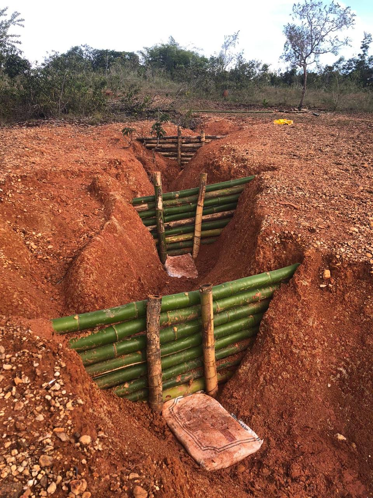
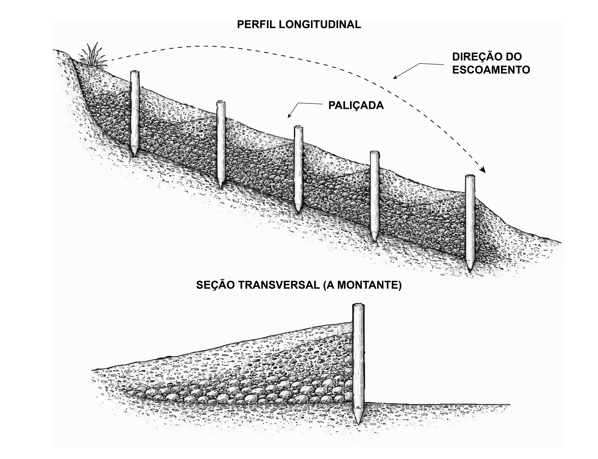
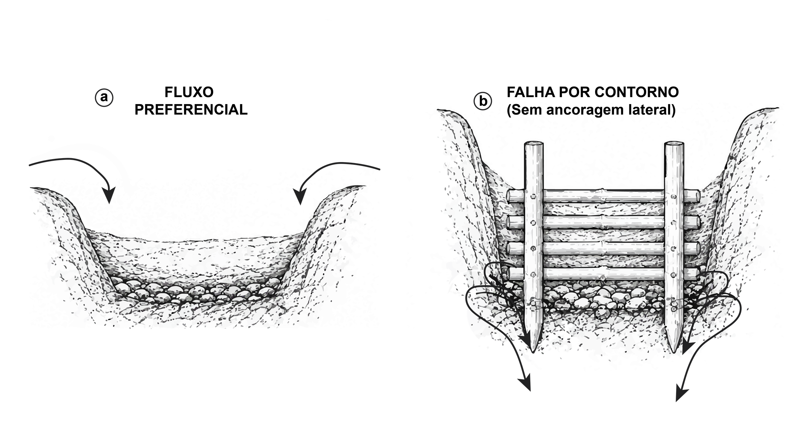
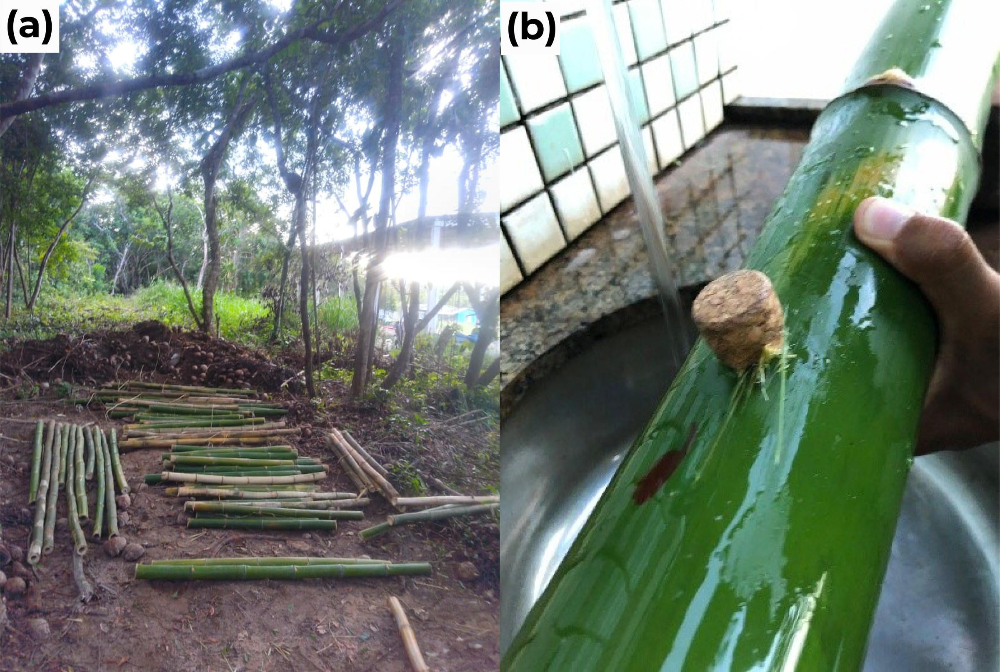
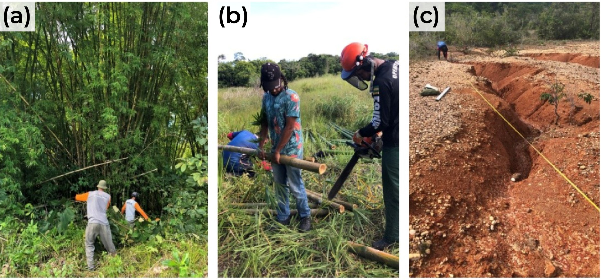

# Paliçadas Permeáveis: Princípios e Materiais {#sec-palicadas}

::: {.callout-note}
## Objetivos de aprendizagem
Ao final deste capítulo, o leitor deverá ser capaz de explicar o mecanismo hidráulico pelo qual uma barreira transversal permeável reduz a capacidade de transporte de sedimentos em feições erosivas lineares, distinguir o efeito da estrutura sobre o trecho assoreado do efeito sobre o leito ainda exposto, identificar os três modos de falha dominantes e associar cada um ao controle construtivo correspondente, selecionar o material da barreira a partir de critérios de resistência, durabilidade e custo, e executar a rotina de preparo prévio dos colmos que antecede a montagem em campo.
:::

## Barreiras transversais permeáveis em feições lineares

As paliçadas operam como barreiras transversais permeáveis instaladas no interior de feições erosivas lineares, reduzindo a velocidade do escoamento concentrado, retardando o transporte de sedimentos e criando condições favoráveis ao estabelecimento vegetal. A literatura internacional as trata como *permeable check-dams*, vertente de baixo custo e material local de uma família de estruturas cuja lógica remonta às intervenções francesas em torrentes alpinas do século XIX, quando sequências de barragens de alvenaria estabilizaram o perfil longitudinal de cursos d'água declivosos, conceito depois adaptado a materiais permeáveis e a bacias menores [@piton_et_al_2017]. É nessa forma adaptada que a técnica chega à bioengenharia tropical, onde a disponibilidade de bambu em touceiras próximas às áreas degradadas dispensa transporte pesado e viabiliza a execução por mão de obra local.

A simplicidade construtiva da técnica contrasta com a exigência analítica do seu dimensionamento. O desempenho da barreira depende de decisões sobre altura efetiva, espaçamento e embutimento que raramente aparecem explicitadas nos manuais de campo, de modo que as causas mais frequentes de ruína remetem a decisões de dimensionamento mal fundamentadas, condição que motivou a construção do protocolo apresentado em @sec-palicadas-protocolo.

A estrutura transversal de bambu entrelaçado, ancorada nas paredes laterais e assentada sobre vala basal no talvegue, define a geometria elementar dessa família de intervenções (@fig-palicada-campo). O registro de campo evidencia a trama com vãos preservados para passagem da água, condição que distingue a barreira permeável de um barramento impermeável e governa a ausência de carga hidrostática plena sobre a face montante.

{#fig-palicada-campo fig-alt="Paliçada de bambu instalada em ravina" width="56%"}

## Funcionamento hidráulico e hidrossedimentológico

Estruturas permeáveis interceptam o escoamento concentrado sem bloquear integralmente a passagem da água, reduzindo a velocidade do fluxo por resistência hidráulica e por armazenamento temporário a montante [@stokes_et_al_2014; @castillo_2014]. A queda da tensão cisalhante sobre o leito favorece a deposição progressiva, com formação de patamares de sedimento que suavizam o gradiente longitudinal da feição e criam locais favoráveis à colonização vegetal [@morgan_rickson_2020].

O mecanismo encadeia quatro processos. A trama de varas impõe rugosidade localizada e dissipa energia cinética, reduzindo a velocidade imediatamente a montante da estrutura. A redução da velocidade, somada ao pequeno represamento, diminui a tensão cisalhante atuante sobre o fundo e, com ela, a capacidade de transporte de sedimentos. As partículas em trânsito depositam-se então a montante, formando cunha sedimentar que avança progressivamente em direção à crista da barreira. Ao final do ciclo de preenchimento, o trecho tratado passa a operar com a declividade do depósito, muito inferior à original, condição em que a velocidade diminui para uma mesma lâmina e a estabilização se consolida.

A geometria da cunha em fase intermediária de preenchimento, com o depósito ainda abaixo da crista, permite visualizar o estado em que a estrutura ainda recebe a solicitação hidrodinâmica máxima enquanto o patamar não se consolidou (@fig-deposicao-patamar). Nessa condição, a rugosidade hidráulica aumenta e o gradiente longitudinal efetivo diminui à medida que o depósito avança, de modo que a solicitação sobre a trama cresce enquanto a energia disponível no trecho decresce [@morgan_rickson_2020; @lucas_borja_et_al_2021].

{#fig-deposicao-patamar fig-alt="Deposição a montante da paliçada e formação do patamar" width="85%"}

Essa transformação do perfil longitudinal constitui o mecanismo central da bioengenharia aplicada ao controle de erosão linear, porque a redução do gradiente diminui a velocidade do escoamento para uma mesma lâmina, reduz a capacidade de transporte de sedimento e favorece deposição adicional, com efeito acumulado sobre a conectividade hidrossedimentológica da bacia [@frankl_et_al_2021; @galia_et_al_2022].

::: {.callout-important}
## O alcance real da intervenção
A tensão cisalhante do leito ainda não tratado permanece inalterada pela presença da estrutura, uma vez que $\tau$ responde ao produto $\gamma R_h S_f$ e, portanto, à declividade e à lâmina locais (@sec-palicadas-protocolo). A sequência de paliçadas atua substituindo progressivamente a declividade original pela declividade do depósito nos trechos já assoreados, de modo que o espaçamento controla a fração do talvegue convertida em patamar por ciclo de preenchimento. Reconhecer esse limite separa o dimensionamento hidrogeotécnico da simples instalação de barreiras.
:::

## Desempenho documentado e limites de transferência

A quantificação do desempenho em contextos climáticos e pedológicos distintos fornece as ordens de grandeza que sustentam tecnicamente a escolha da técnica frente a alternativas mais caras. Sequências de check-dams permeáveis em bacias mediterrâneas associaram-se a reduções de 60--85% na carga sólida transportada [@zema_et_al_2018; @lucas_borja_et_al_2021], enquanto em ambientes semiáridos da Índia intervenções com barreiras transversais combinadas a cobertura vegetal registraram retenção de 12,3 a 18,7 t ha^-1^ ano^-1^ de sedimento, valores que representam de 40 a 65% da perda de solo anual estimada para ravinas ativas não tratadas [@meena_et_al_2023]. Nos Tabuleiros Costeiros e no Baixo São Francisco, intervenções com bioengenharia de solos e geotêxteis naturais produziram estabilização parcial quando associadas à revegetação e ao manejo do escoamento concentrado [@antonio_2021_avaliacao_de_eficiencia_da_; @fontes_2021_erosion_control_with_geotext; @holanda_et_al_2021].

::: {.callout-warning}
## Transferência de parâmetros entre bacias
O efeito das barreiras depende da declividade local, da granulometria do material transportado e da manutenção após eventos extremos, fatores que variam entre bacias e dificultam a transferência direta de parâmetros de dimensionamento de uma região para outra [@tang_catchment_2019]. Números de eficiência publicados servem para estimar ordem de grandeza e devem ser substituídos pela parametrização hidrogeotécnica da feição a tratar.

A base aplicada brasileira permanece predominantemente descritiva e raramente relaciona altura efetiva, espaçamento e volume retido a parâmetros hidráulicos e geotécnicos medidos em campo, condição que limita a reprodutibilidade das intervenções e dificulta a comparação de desempenho entre sítios.
:::

## Modos de falha e controles construtivos correspondentes

Três mecanismos concentram as ruínas observadas em campo, e cada um remete a uma decisão construtiva específica, razão pela qual o reconhecimento antecipado dos modos de falha é mais produtivo que o reforço indiscriminado da estrutura (@tbl-falhas-palicada).

| Modo de falha | Mecanismo dominante | Controle de projeto |
|---|---|---|
| Erosão lateral de contorno | O escoamento encontra caminho preferencial pelas margens, onde não há trama nem compactação, e contorna a barreira antes de a deposição central consolidar o patamar | Embutimento das varas em entalhes de 0,50 m ou mais em material não perturbado de cada parede |
| *Piping* e percolação basal | Gradiente hidráulico sob a fundação gera fluxo preferencial quando a vedação basal é insuficiente ou a altura efetiva é excessiva | Vala basal, compactação de solo a montante e limite $H \le D/3$ |
| Sobrecarga hidrostática | A altura efetiva se aproxima da profundidade local da ravina, gerando represamento excessivo e empuxo acima da capacidade da trama | Limite $H \le D/3$ e verificação da estabilidade de talude |

: Modos de falha em paliçadas permeáveis e os respectivos controles de projeto. {#tbl-falhas-palicada .striped .hover}

A evolução da falha por contorno percorre dois estágios físicos distintos (@fig-falha-contorno). No estágio inicial, o escoamento concentrado identifica a zona de menor resistência ao fluxo junto às margens, onde a ausência de compactação e de trama elimina a dissipação, e contorna a barreira antes que a deposição central consolide o patamar [@zema_et_al_2014]. O fluxo lateral concentra tensão cisalhante junto ao contato vara--parede e evolui para o estágio terminal, no qual a escavação progressiva da margem rompe a continuidade transversal da barreira e reduz rapidamente a vida útil da intervenção [@Chen_2024].

{#fig-falha-contorno fig-alt="Fluxo preferencial lateral e falha por contorno em paliçada" width="85%"}

::: {.callout-important}
## Ponto crítico
O embutimento mínimo de 0,50 m em cada parede lateral é condição necessária para conduzir o fluxo pela seção completa da barreira. Em Plintossolos, o contraste de resistência entre o horizonte Bt plíntico e o Ap superficial favorece a subestimativa da ancoragem lateral e da compactação basal, porque o material da parede superior apresenta coesão inferior à que a inspeção visual do fundo sugere.
:::

## Materiais e critérios de seleção

A escolha do material responde à disponibilidade local, ao custo e à durabilidade exigida pelo horizonte de projeto, e em regiões tropicais três materiais predominam com desempenhos e indicações distintas (@tbl-materiais-palicada).

| Material | Resistência (MPa) | Vida útil sem tratamento | Custo (R\$/m²) | Indicação |
|---|:---:|:---:|:---:|---|
| Bambu (*Bambusa*, *Dendrocalamus*) | 120--230 (tração) | 6--12 meses | 35--70 | Ravinas pequenas e médias |
| Madeira roliça (eucalipto, leucena, gliricídia) | 40--90 (compressão) | 3--8 anos | 80--150 | Ravinas médias e grandes |
| Pedra seca | n.a. (empilhamento) | > 50 anos | 50--120 | Encostas serranas, leitos pedregosos |

: Comparação técnico-econômica dos materiais para paliçadas em regiões tropicais. {#tbl-materiais-palicada .striped .hover}

### Bambu

O bambu (*Bambusa* spp., *Dendrocalamus* spp.) predomina em regiões tropicais por associar resistência mecânica adequada à função estrutural, disponibilidade abundante em touceiras próximas a áreas de pastagem degradada e facilidade de processamento por ferramentas manuais [@acharya_2018; @holanda_et_al_2021]. A resistência à tração longitudinal de colmos maduros situa-se entre 120 e 230 MPa, sustentada pela orientação das microfibrilas de celulose e pela concentração de feixes vasculares no terço externo da parede, arranjo que confere rigidez à flexão compatível com a função das estacas verticais [@janssen_2000; @sharma_et_al_2015; @ghavami_marinho_2005].

Uma propriedade adicional distingue o bambu dos demais materiais inertes, porque colmos parcialmente enterrados em solo úmido podem emitir brotação a partir de gemas axilares, convertendo a barreira em estrutura parcialmente viva com reforço radicular progressivo [@trujillo_lopez_2016], possibilidade tratada em @sec-palicadas-execucao.

A durabilidade constitui a principal limitação do material. Em ambiente tropical úmido, colmos sem tratamento perdem integridade estrutural em 6--12 meses pela ação de fungos xilófagos e insetos, intervalo eventualmente suficiente para o estabelecimento vegetal em ravinas de pequeno porte e insuficiente para completar um ciclo de preenchimento em feições médias. O tratamento por imersão em solução de sais de boro estende a vida útil mecânica para 2--5 anos [@kaminski_et_al_2016; @khatun_et_al_2025].

### Madeira roliça

Troncos de eucalipto, pinus ou espécies de rápido crescimento como leucena e gliricídia oferecem maior resistência à compressão e durabilidade de 3--8 anos sem tratamento, alcançando 10--15 anos com tratamento em autoclave. A indicação recai sobre ravinas de médio a grande porte, nas quais o empuxo do sedimento retido exige robustez estrutural superior, com a contrapartida de custo e peso mais elevados que oneram o transporte em terreno acidentado.

### Pedra seca

Em regiões com disponibilidade de pedras, como encostas serranas e leitos pedregosos de rios intermitentes, o empilhamento sem argamassa produz barreiras cuja permeabilidade intergranular cumpre função de filtro, retendo sedimentos grossos e permitindo a passagem da água, com durabilidade de décadas, resistência a incêndios e manutenção mínima. O peso e a dificuldade de transporte em terrenos íngremes restringem a aplicação.

## Seleção e preparo prévio do material

A seleção do material deve preceder em 30--60 dias a montagem em campo, intervalo necessário para corte, secagem parcial, tratamento para durabilidade e, quando aplicável, indução de brotação dos colmos. Tratar o preparo como etapa de projeto condiciona a diferença entre uma paliçada com vida útil de cinco anos e uma estrutura que falha no primeiro período chuvoso.

A triagem de qualidade no bambuzal e o ensaio hidrostático de estanqueidade compõem a rotina de preparo que antecede o transporte (@fig-selecao-bambus). A seleção morfo-etária prioriza colmos maduros de 3--5 anos, caracterizados pela coloração amarelo-acinzentada com líquens nos entrenós e pela ausência de bainhas foliares basais, reduzindo a mobilização de colmos jovens com menor lignificação ou de espécimes com fissuras longitudinais [@correal_arbelaez_2010; @bantie_et_al_2025].

{#fig-selecao-bambus fig-alt="Seleção de colmos maduros e teste hidrostático de estanqueidade" width="85%"}

A integridade dos diafragmas internos é avaliada pelo preenchimento de cada colmo com água por 30 minutos, procedimento que destina os colmos estanques às estacas verticais, responsáveis por suportar o empuxo do aterro sedimentar e os arrastes dinâmicos, enquanto vazamentos direcionam o material para tramas horizontais secundárias de permeabilidade controlada, onde a solicitação é menor. Esse ensaio dispensa qualquer equipamento e elimina falhas mecânicas antes do canteiro.

A separação dimensional ocorre diretamente no bambuzal para otimizar transporte e montagem, destinando colmos de 6--10 cm às estacas estruturais verticais e de 3--5 cm às varas horizontais da trama. O comprimento das estacas resulta da soma da altura efetiva $H$ calculada pelo protocolo (@sec-palicadas-protocolo) e da profundidade enterrada total, totalizando 60--80 cm de embutimento e estacas de 1,0--1,2 m na variante inerte, e 70--100 cm de embutimento e estacas de 1,1--1,4 m na variante viva, em conformidade com as recomendações clássicas de bioengenharia para estacas vegetativas em paliçadas vivas [@schiechtl_1973; @florineth_2004].

A operação de corte dos colmos na touceira, o seccionamento em estacas de comprimento padronizado e a aferição métrica que vincula o estoque produzido às dimensões da feição constituem a transição entre a matriz vegetal e o canteiro de instalação (@fig-producao-estacas). O corte é executado rente à base do colmo de maior diâmetro disponível por ferramentas manuais, preservando a integridade física da touceira para não comprometer a regeneração vegetativa futura, e a aferição métrica em campo confirma largura e comprimento útil da ravina, balizando o número total de paliçadas pelo espaçamento calculado.

{#fig-producao-estacas fig-alt="Corte, seccionamento e aferição das estacas de bambu" width="85%"}

O tratamento para durabilidade antecede a instalação e consiste na imersão dos colmos em solução aquosa boratada, mistura de bórax e ácido bórico a 4--6% em massa, por sete a quatorze dias em tambores plásticos de 200 L, com os septos internodais parcialmente perfurados para que a solução penetre o lume e atinja o parênquima. A secagem subsequente sobre estrado ventilado, ao abrigo do solo nu, evita a reabsorção de umidade e favorece a fixação dos sais preservativos nas paredes celulares antes do contato com o solo úmido da vala basal, conforme protocolos consolidados de preservação de bambu por tratamento hidrossolúvel à base de boro [@liese_kumar_2003; @iwst_2001_sap_displacement]. A eficácia dessa sequência contra fungos xilófagos e cupins subterrâneos em colmos de *Bambusa* e *Guadua* spp. está documentada na construção tropical [@kaminski_et_al_2016; @bamboo_sustainable_construction_2023].

::: {.callout-tip}
## Quantitativo de material por metro de largura
Para cada metro de largura de ravina a tratar, o espaçamento de 30--50 cm entre estacas verticais implica aproximadamente três peças estruturais, acrescidas das varas horizontais necessárias para empilhar a altura efetiva mantendo vãos de 2--5 cm entre fiadas. A reserva de 15--20% de peças excedentes absorve a perda por fissuras durante o cravamento, cuja ocorrência é normal, e evita a interrupção da montagem para busca de material, principal fonte de atraso em campo.
:::

## Custo de implantação e estrutura da vantagem econômica

A comparação por metro quadrado de barreira transversal indica que o bambu reduz a dependência de cimento, areia, brita e transporte pesado, preservando função hidráulica compatível com ravinas pequenas e médias (@tbl-custos-palicada).

| Item | Paliçada de bambu | Check-dam de alvenaria |
|---|:---:|:---:|
| Material (R\$/m²) | 15--30 | 150--300 |
| Mão de obra (R\$/m²) | 20--40 | 80--150 |
| Custo total (R\$/m²) | 35--70 | 230--450 |
| Vida útil | 3--5 anos | 20+ anos |
| Custo anual equivalente (R\$/m² ano^-1^) | 7--23 | 12--23 |
| Manutenção | Anual | Quinquenal |

: Comparativo de custos por metro quadrado de barreira transversal, com preços de referência do mercado local e custo anual equivalente obtido pela razão entre custo total e vida útil, sem taxa de desconto. {#tbl-custos-palicada .striped .hover}

::: {.callout-note}
## Onde reside a vantagem econômica
Em capital inicial, a paliçada de bambu é 5 a 7× mais barata que a alternativa em alvenaria. Quando os custos são anualizados pela vida útil de cada solução, as faixas se sobrepõem, situando-se em 7--23 contra 12--23 R\$/m² ao ano, de modo que a preferência pelo bambu se apoia na redução da barreira de entrada e na mobilização de mão de obra local não especializada, com desempenho comparável ao longo do ciclo de vida [@abbasi_et_al_2019].

Esse enquadramento quantitativo sustenta o argumento diante de órgãos licenciadores e agências de fomento. A dispensa de formas, cura e equipamentos de mistura viabiliza a intervenção em propriedades rurais onde o transporte de concreto é inviável [@fao_1985_watershed_management], e a degradação gradual do material lenhoso aporta matéria orgânica ao patamar sedimentar formado.
:::

## Condições que contraindicam a técnica

Quatro condições de contorno restringem a aplicação da paliçada permeável e o seu reconhecimento prévio evita desperdício de material e de trabalho comunitário. Em feições alimentadas por contribuição subsuperficial dominante, com incisão sustentada por escoamento no contato entre horizontes ou pelo lençol freático, a barreira transversal atua sobre o sintoma enquanto o processo permanece ativo, condição em que a drenagem subsuperficial precede qualquer estrutura. Em taludes já instáveis, com razão entre a profundidade da feição e a altura admissível de corte vertical acima do limiar operacional de 0,40 (@sec-palicadas-protocolo), o colapso gravitacional das paredes tende a soterrar e desalinhar as estruturas antes do preenchimento. Em voçorocas com profundidade superior a 5 m, a paliçada só cumpre função como componente de projeto integrado com retaludamento, drenagem e estruturas de maior porte (@sec-classificacao-feicoes, @sec-projeto-integrador). Finalmente, na ausência de manutenção programada, a ruína de elementos isolados ao final da janela de vida útil reativa o transporte de sedimentos no segmento e pode devolver a feição a condição pior que a inicial, conforme a programação de reposição modular discutida em @sec-palicadas-execucao.

## Da técnica ao protocolo

Recomendações genéricas de espaçamento, frequentemente expressas como faixas fixas de 3 a 5 m, omitem a relação entre altura efetiva, declividade do leito e declividade final do depósito, e essa simplificação responde por parte considerável das falhas sintetizadas na @tbl-falhas-palicada. Os dois capítulos seguintes convertem as medidas da própria feição em critérios verificáveis, com @sec-palicadas-protocolo dedicado ao protocolo hidrogeotécnico de dimensionamento e @sec-palicadas-execucao à execução em campo, à conversão para paliçada viva, à durabilidade do material e ao monitoramento pós-instalação.

## Síntese do capítulo

A paliçada permeável converte energia de escoamento concentrado em deposição controlada, atuando pela imposição de rugosidade localizada e pelo armazenamento temporário a montante, de modo que a estabilização efetiva decorre da substituição progressiva da declividade original pela declividade do depósito nos trechos assoreados. O desempenho documentado em bacias mediterrâneas, no semiárido indiano e nos Tabuleiros Costeiros fornece ordens de grandeza úteis, cuja transferência entre pedoambientes exige nova parametrização hidrogeotécnica. A ruína da intervenção concentra-se em três mecanismos, a erosão lateral de contorno, o *piping* basal e a sobrecarga hidrostática, controlados respectivamente pelo embutimento lateral de 0,50 m, pela vedação da base com vala e compactação a montante, e pelo limite de altura efetiva em um terço da profundidade da feição. Entre os materiais tropicais, o bambu associa resistência à tração de 120--230 MPa, disponibilidade local e aptidão à brotação, com durabilidade de 6--12 meses sem tratamento e de 2--5 anos após imersão em solução boratada, condição que inscreve o preparo prévio dos colmos, iniciado 30--60 dias antes da montagem, entre as etapas de projeto.

::: {.callout-tip}
## Questões para estudo
1. Explique por que a instalação de uma paliçada não altera a tensão cisalhante do leito situado a jusante da estrutura e identifique qual grandeza de projeto controla a fração do talvegue convertida em patamar.
2. Uma ravina apresenta profundidade de 0,90 m na seção de instalação. Determine a altura efetiva máxima admissível e justifique fisicamente o critério adotado.
3. Dois colmos foram submetidos ao ensaio hidrostático de estanqueidade e um deles apresentou vazamento no terceiro entrenó. Indique a destinação de cada peça na estrutura e explique a razão mecânica da decisão.
4. Compare o custo inicial e o custo anual equivalente da paliçada de bambu e do check-dam de alvenaria, e formule o argumento técnico que sustenta a escolha do bambu em propriedade rural sem acesso a maquinário.
5. Em uma feição com razão $D/H_{c,adm}$ igual a 0,55, discuta a pertinência de instalar paliçadas e indique qual intervenção deve precedê-las.
:::
