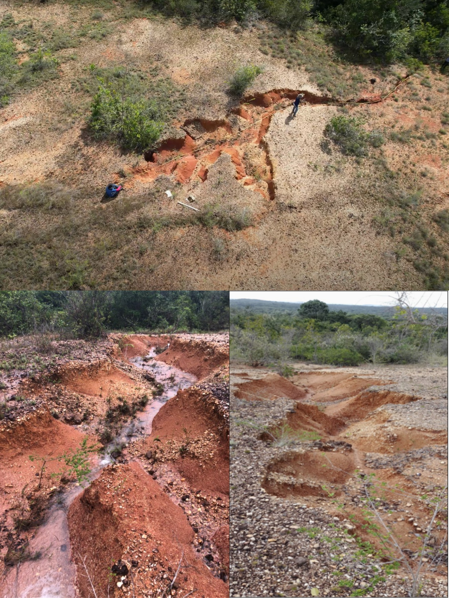

# Protocolo Hidrogeotécnico para Dimensionamento de Paliçadas {#sec-palicadas-protocolo}

::: {.callout-note}
## Objetivos de aprendizagem
Ao final deste capítulo, o leitor deverá ser capaz de conduzir o inventário morfométrico de uma feição erosiva por aerofotogrametria e segmentá-la em trechos hidraulicamente homogêneos, interpretar a velocidade de infiltração básica como critério de decisão sobre o regime de escoamento dominante, calcular a altura crítica de corte vertical a partir de parâmetros de resistência ao cisalhamento em condição inundada e verificar a estabilidade das paredes pelo limiar operacional adotado, deduzir a declividade de compensação a partir do limiar de destacamento do horizonte superficial, dimensionar altura efetiva, espaçamento e volume de retenção por segmento, e reconhecer as limitações que condicionam a transferência do protocolo para outros pedoambientes.
:::

## Por que um protocolo substitui a faixa fixa de espaçamento

Poucas rotinas publicadas encadeiam a caracterização hidrogeotécnica da feição, o cálculo das dimensões da barreira e os procedimentos de execução, de modo que a sólida base empírica internacional sobre check-dams permeáveis (@sec-palicadas) raramente se converte em critérios aplicáveis com material disponível localmente. Na ausência dessa ponte, o projetista de campo recorre a faixas fixas de espaçamento herdadas de manuais, prescrição que omite a relação física entre altura efetiva, declividade do leito e declividade final do depósito.

O protocolo apresentado neste capítulo foi parametrizado em campo para paliçadas permeáveis de bambu em ravinas sobre Plintossolos dos Tabuleiros Costeiros de Sergipe e é aplicável, após nova parametrização, a outros pedoambientes tropicais. A característica didaticamente mais importante da rotina é que todas as grandezas de projeto derivam de medidas tomadas na própria feição, de modo que o mesmo procedimento produz dimensões distintas em ravinas distintas, comportamento esperado de um método de dimensionamento e ausente nas prescrições por faixa fixa.

::: {.callout-note}
## Área de referência do protocolo
As ravinas que parametrizaram o protocolo situam-se no povoado Timbó, em São Cristóvão (SE), sobre Plintossolo Háplico Distrófico do Grupo Barreiras, em vertentes com declividade de 7--24% sob pastagem degradada. O sítio combina clima úmido sazonal, precipitação média anual de 1.372 mm e máximo mensal histórico de 454,8 mm em maio, conforme a série 2005--2025 da estação automática INMET A409 [@inmet_2025_a409; @aragao_et_al_2013_chuvas].

O inventário-piloto compreendeu seis feições erosivas ativas, identificadas de F1 a F6, com profundidades entre 0,40 e 1,50 m, larguras médias entre 1,30 e 2,37 m e comprimentos entre 8,0 e 35,0 m. As seções transversais variaram de formato em V, nas feições mais rasas, a formato em U, nas feições mais evoluídas, com cabeceiras escarpadas associadas a profundidades superiores a 1,0 m. A feição F1, com 35,0 m de extensão, 1,10 m de profundidade máxima e 1,37 m de largura média, foi selecionada como feição-tipo por representar a condição modal de ravina ativa em Plintossolo sob pastagem degradada, e a ela se referem os exemplos resolvidos deste capítulo.
:::

A distribuição espacial das ravinas-piloto orientou a logística de transporte dos colmos, a ordem de instalação das estruturas e a leitura comparativa dos segmentos monitorados (@fig-area-estudo-palicadas). A posição relativa de cada feição na vertente condiciona o regime de infiltração que será diagnosticado na Etapa 2, razão pela qual o inventário espacial precede qualquer medição pontual.

{#fig-area-estudo-palicadas fig-alt="Mapa da área de estudo das paliçadas em Sergipe" width="56%"}

## Rotina operacional

O dimensionamento hidrogeotécnico de paliçadas permeáveis segue rotina encadeada em oito etapas, na qual medições físicas determinam limites geométricos estruturais. Cada etapa possui produto e critério de saída explícitos, condição que permite auditar o projeto e identificar em que ponto uma intervenção malsucedida se afastou do procedimento (@tbl-rotina-protocolo).

| Etapa | Produto | Insumo | Critério de saída |
|:---:|---|---|---|
| 1 | Inventário morfométrico | Voo UAV (GSD ≤ 5 cm) | $W$, $D$, $S_f$ por seção |
| 2 | Diagnóstico hidráulico | Infiltrômetro de duplo anel | VIB por posição (cm h^-1^) |
| 3 | Parâmetros geotécnicos | Cisalhamento direto inundado | $c$, $\phi$, $\gamma_{sat}$, $H_c$ |
| 4 | Dimensionamento | Equações @eq-hc a @eq-vr | $H$, $\tau$, $E$, $V_r$ |
| 5 | Seleção de material | Disponibilidade local | Bambu, madeira roliça ou pedra seca |
| 6 | Construção | Equipe de 2--4 pessoas | Montagem com ancoragem lateral |
| 7 | Monitoramento | Método dos pinos | Taxa de assoreamento (cm mês^-1^) |
| 8 | Programação de manutenção | Tratamento para durabilidade e modelo exponencial de biodegradação | Janela de reposição modular (anos) |

: Rotina operacional do protocolo hidrogeotécnico para paliçadas permeáveis. {#tbl-rotina-protocolo .striped .hover}

As quatro primeiras etapas, que convertem medidas em dimensões, constituem o objeto deste capítulo. A seleção de material foi tratada em @sec-palicadas, enquanto construção, monitoramento e programação de manutenção são desenvolvidas em @sec-palicadas-execucao.

## Etapa 1: inventário morfométrico e segmentação hidráulica

Os atributos geométricos da ravina, representados pela largura $W$, pela profundidade $D$ e pela declividade do fundo $S_f$, são extraídos de Modelo Digital de Elevação gerado por aerofotogrametria com UAV. Na parametrização do protocolo empregou-se DJI Phantom 4 PRO a 40 m de altura, com sobreposição longitudinal de 80% e lateral de 60%, geometria de voo que corresponde a *Ground Sampling Distance* próximo de 1,1 cm/pixel no ortomosaico, com o modelo de elevação gerado por *Structure from Motion* em resolução de 4,4 cm/pixel [@raj_et_al_2022; @wilkinson_et_al_2024].

A extração obedece a três regras que preservam o sentido físico dos parâmetros. As seções transversais são extraídas a cada 1,0 m ao longo do eixo da ravina, resolução compatível com a individualização de segmentos hidraulicamente homogêneos e com a identificação de pontos de estrangulamento, onde a largura se reduz e a energia do escoamento se concentra [@thwaites_et_al_2022]. A declividade do fundo é calculada por regressão linear sobre o perfil longitudinal, procedimento que evita transferir ruído altimétrico pontual ao parâmetro que governará o espaçamento. A segmentação da feição adota como limite de homogeneidade hidráulica variações de declividade de fundo inferiores a 30% em seções consecutivas [@castillo_2014], e em feições com extensão superior a 20 m as subdivisões menores que 10 m evitam a subestimação da energia do feixe de escoamento em trechos de alta declividade, prevenindo erosão retrogressiva localizada decorrente de espaçamentos excessivos.

::: {.callout-warning}
## Limitações do levantamento sem pontos de controle
Quando o voo não emprega pontos de controle no terreno nem posicionamento RTK ou PPK, a acurácia vertical absoluta permanece não verificada, e $D$ e $S_f$ devem ser interpretados como medidas relativas internas ao bloco fotogramétrico, suficientes para dimensionar e insuficientes para comparar campanhas sucessivas. Em vertentes sob pastagem, a nuvem densa reproduz preferencialmente o topo do dossel herbáceo, viés que tende a subestimar a profundidade em trechos com vegetação remanescente sobre as margens, atenuado pela priorização de faixas de solo exposto no interior da feição durante a extração das seções. Para monitoramento multitemporal por diferença de modelos digitais de terreno, os pontos de controle deixam de ser opcionais (@sec-modelagem-3d).
:::

## Etapa 2: diagnóstico hidráulico de infiltração

A capacidade de infiltração usada no dimensionamento é obtida com infiltrômetro de duplo anel, com anel interno de 20 cm e externo de 40 cm cravados 5 cm no solo [@bernardo_et_al_2008]. O desenho amostral prevê nove ensaios por feição, distribuídos entre os terços superior, médio e inferior da vertente, com três repetições por posição. As séries têm duração mínima de 120 min, com registros a cada 5 min até 30 min e, em seguida, a cada 10 min até que três leituras sucessivas variem menos de 10%, e a velocidade de infiltração básica operacional de cada posição corresponde à média das cinco últimas leituras da série.

Esse arranjo amostral vincula a parametrização hidráulica da paliçada ao gradiente vertical da vertente. O terço superior tende a apresentar maior infiltração sob horizonte A mais espesso, enquanto o terço inferior, próximo ao exutório da ravina, aproxima-se da condutividade hidráulica do horizonte Bt plíntico, que controla a geração de escoamento subsuperficial e a suscetibilidade à erosão por *piping* [@correa_et_al_2023_tabuleiros; @wang_et_al_1999].

A velocidade de infiltração básica estratifica o regime de escoamento e orienta a decisão sobre qual prática deve preceder a instalação das barreiras (@tbl-vib). Sob regime escoamento-dominante, o cisalhamento hidráulico de leito controla o destacamento sedimentar, condição que indica a necessidade de dissipação de energia por barreiras permeáveis [@lafayette_cantalice_coutinho_2011; @lee_et_al_2022], enquanto valores intermediários sugerem a incorporação de cobertura morta ou hidrossemeadura a montante para mitigar a geração de enxurrada antes do talvegue [@prats_et_al_2012; @yue_et_al_2020].

| VIB (cm h^-1^) | Regime dominante | Decisão de projeto |
|:---:|---|---|
| > 6 | Infiltração-dominante | Efeito isolado da paliçada reduzido; prioridade ao manejo da área de contribuição |
| 2--6 | Intermediário | Cobertura morta ou hidrossemeadura a montante antes do talvegue |
| < 2 | Escoamento-dominante | Dissipação de energia por barreiras transversais permeáveis |

: Estratificação do regime de escoamento pela velocidade de infiltração básica, com a decisão de projeto correspondente. {#tbl-vib .striped}

A classificação pressupõe intensidades de chuva superiores à velocidade de infiltração básica durante os eventos de projeto, premissa que deve ser verificada contra a série pluviométrica local antes de aplicar o critério.

## Etapa 3: caracterização geotécnica e estabilidade de talude

A paliçada é dimensionada para uma feição cujas paredes precisam permanecer estáveis ao longo do ciclo de preenchimento. Quando o colapso gravitacional das margens antecede o assoreamento, a estrutura é soterrada e desalinhada e o investimento se perde, razão pela qual o protocolo incorpora verificação geotécnica explícita antes de qualquer cálculo geométrico.

### Ensaio de cisalhamento direto em condição inundada

Na parametrização, quatro corpos de prova de 50 × 50 × 20 mm foram preparados a partir de bloco indeformado coletado no horizonte Bt, a 1,20 m de profundidade junto à face da ravina. O carregamento normal foi aplicado em 20, 40, 80 e 200 kPa, com deslocamento controlado a 0,5 mm/min, em ensaio de cisalhamento direto em caixa conduzido sob condição rápida, sem adensamento prévio e com inundação, seguindo o arranjo experimental da ASTM D3080/D3080M. A ausência de medição de poropressão implica que os parâmetros obtidos são totais, ou aparentes, com interpretação distinta dos parâmetros efetivos.

A condição inundada representa o cenário de projeto pós-chuva intensa, no qual a frente de umedecimento alcança o horizonte Bt, a sucção matricial se anula e a resistência ao cisalhamento tende ao valor mínimo [@fredlund_rahardjo_1993; @caputo_2015]. A massa específica dos grãos, determinada pelo método DNER-ME 93-94, foi de 2,65 g/cm³. A envoltória de Mohr-Coulomb ajustada aos quatro pontos do ensaio resultou em coesão aparente de 13,0 kPa e ângulo de atrito aparente de 34,9°, e o peso específico saturado, calculado a partir do índice de vazios final médio de 0,60, foi de 19,9 kN m^-3^.

### Altura crítica de corte vertical

A resistência ao cisalhamento delimita a altura crítica de corte vertical por pressões ativas de Rankine com fenda de tração, grandeza que expressa até que profundidade a parede se sustenta sem reforço antes de mobilizar ruptura:

$$
H_c = \frac{4 c}{\gamma_{sat}} \tan\!\left(45^\circ + \frac{\phi}{2}\right) - \frac{2 c \sqrt{K_a}}{\gamma_{sat}}
$$ {#eq-hc}

onde $c$ é a coesão aparente (kPa), $\phi$ é o ângulo de atrito aparente, $\gamma_{sat}$ é o peso específico saturado (kN m^-3^) e $K_a = \tan^2(45^\circ - \phi/2)$ é o coeficiente de empuxo ativo. O primeiro termo quantifica a contribuição da coesão para a sustentação do corte, amplificada pelo fator de empuxo passivo associado ao ângulo de atrito, enquanto o segundo desconta a profundidade da fenda de tração que se abre no topo do talude e antecipa a ruptura. Com os parâmetros inundados da feição-tipo, a @eq-hc fornece $H_c = 4{,}33$ m, valor sobre o qual se aplica fator de segurança de 1,5, usual em taludes permanentes de pequeno porte, resultando na altura admissível $H_{c,adm} = 2{,}89$ m.

### Limiar operacional de instabilidade

A razão entre a profundidade da feição e a altura admissível define o indicador de risco de colapso adotado no protocolo:

$$
\frac{D}{H_{c,adm}} > 0{,}40 \;\Rightarrow\; \text{suscetibilidade a colapso progressivo sob saturação}
$$ {#eq-limiar-talude}

Acima desse limiar, a feição é classificada como suscetível a instabilidade de talude por sapa basal e colapso gravitacional, condição que recomenda a fixação de paliçadas adicionais imediatamente a montante do recuo de cabeceira para conter a expansão da feição [@firoozi_firoozi_2024; @vanmaercke_et_al_2021]. Em Plintossolos, a verificação assume relevância particular porque a evolução das ravinas alterna estágios de incisão vertical, alargamento por colapso de taludes e estabilização parcial, sequência na qual a largura tende a aumentar mesmo após a profundidade atingir o limite do horizonte resistente subjacente [@sidorchuk_2006; @hayas_et_al_2024].

::: {.callout-warning}
## Duas ressalvas sobre a verificação geotécnica
A primeira ressalva é amostral. Um corpo de prova por tensão normal impede estimar a dispersão e o intervalo de confiança da envoltória, e a faixa de tensões ensaiada excede em uma ordem de grandeza a tensão vertical *in situ* na profundidade da ravina, condição que tende a superestimar o intercepto coesivo quando a envoltória é extrapolada para tensões baixas.

A segunda ressalva é estratigráfica. Os parâmetros provêm do horizonte Bt, amostrado a 1,20 m, enquanto o colapso das paredes mobiliza também o horizonte Ap sobrejacente, cuja resistência não foi ensaiada. A verificação de $H_c$ é, portanto, representativa do material basal e indeterminada quanto ao terço superior do perfil, de modo que ensaiar ambos os horizontes e adotar o menor valor de $H_c$ constitui a conduta conservadora em aplicações de maior exigência.
:::

## Etapa 4: dimensionamento hidráulico e geométrico

### Altura efetiva

A altura efetiva da barreira acima do talvegue regula a retenção de sedimentos e o empuxo hidrodinâmico, e limita-se a um terço da profundidade da ravina:

$$
H \le \frac{D}{3}
$$ {#eq-altura}

Gradientes hidráulicos gerados por alturas superiores a $D/3$ podem iniciar fluxos preferenciais de *piping* sob a fundação quando o depósito de sedimentos se aproxima da crista, risco ampliado em Plintossolos pela drenagem impedida e pelo acúmulo hídrico no contato abrupto Ap--Bt [@correa_et_al_2023_tabuleiros]. A razão de um terço é adotada como critério operacional conservador, com fundamento empírico, sem derivar de ensaio de gradiente crítico.

### Tensão cisalhante de leito

A estabilidade do leito é avaliada pela tensão cisalhante média do escoamento em regime permanente uniforme:

$$
\tau = \gamma \cdot R_h \cdot S_f
$$ {#eq-tau}

onde $\gamma$ é o peso específico do fluido (9,81 kN m^-3^), $R_h$ é o raio hidráulico (m), dado pela razão entre a área molhada e o perímetro molhado da seção, e $S_f$ designa a declividade hidráulica longitudinal. A estrutura multiplicativa da @eq-tau informa uma propriedade decisiva para o projeto, porque a tensão de leito responde apenas à geometria da seção molhada e à declividade, permanecendo indiferente ao número de barreiras instaladas a jusante.

### Limiar de destacamento e declividade de compensação

O limiar de destacamento de agregados do horizonte Ap situa-se próximo de $\tau_{crit} = 6$ Pa, valor superior aos 1--2 Pa característicos de areias finas não coesivas e inferior ao de argilas rijas, posição intermediária que reflete a coesão interagregados moderada de um horizonte superficial sob pastagem [@blanco_lal_2023_water_erosion]. Esse limiar define a declividade de compensação:

$$
S_e = \frac{\tau_{crit}}{\gamma \cdot R_h}
$$ {#eq-se}

A grandeza $S_e$ expressa a declividade da superfície de deposição na qual a tensão de leito se iguala ao limiar de destacamento e o transporte tende a cessar, correspondendo portanto à declividade final esperada do patamar sedimentar, superfície que permanece inclinada ao término do ciclo de preenchimento.

### Espaçamento entre estruturas sequenciais

O espaçamento é projetado para que o pé de uma paliçada coincida com a crista da estrutura a jusante no instante em que o depósito atinge a declividade de compensação:

$$
E = \frac{H}{S_f - S_e}
$$ {#eq-espacamento}

::: {.callout-important}
## Exemplo resolvido: o efeito de ignorar a declividade de compensação
Adotar $S_e = 0$, como nas prescrições que reduzem o espaçamento a $H/S_f$, equivale a supor deposição horizontal e superestima a distância entre estruturas, com efeito tanto maior quanto menor a declividade do leito [@castillo_2014; @lucas_borja_et_al_2021].

Para a feição-tipo, com $H = 0{,}37$ m e $S_f = 0{,}12$ m/m, a regra simplificada fornece $E = H/S_f = 3{,}06$ m contra 3,25 m da formulação completa, diferença modesta porque a declividade de compensação de 0,0070 m/m representa apenas 5,8% da declividade do leito. Em uma ravina de fundo suave, com $S_f = 0{,}03$ m/m, a mesma declividade de compensação passa a representar 23% do gradiente disponível, e a regra simplificada fornece 12,2 m contra 15,9 m da formulação completa. O erro de 30% nesse segundo caso posiciona a estrutura a jusante abaixo do pé do depósito a montante, deixando o trecho intermediário exposto à tensão original e quebrando o encadeamento dos patamares.
:::

### Volume potencial de retenção

O volume de sedimentos retidos por paliçada unitária é estimado pela geometria prismática triangular formada no leito a montante:

$$
V_r = \frac{E \cdot W \cdot H}{2}
$$ {#eq-vr}

A @eq-vr pressupõe seção transversal aproximadamente retangular e cunha de deposição que preenche o vão entre estruturas. Em seções em V, o volume efetivo é menor, e a estimativa deve ser corrigida pela razão entre a área da seção real e a do retângulo equivalente, correção frequentemente omitida que produz expectativas otimistas de retenção justamente nas ravinas jovens, cuja seção em V é a mais comum.

## Aplicação do protocolo à feição-tipo

A feição-tipo F1 apresenta profundidade máxima $D = 1{,}10$ m, largura média $W = 1{,}37$ m, declividade do fundo $S_f = 0{,}12$ m/m e velocidade de infiltração básica de 1,53 cm h^-1^ no terço intermediário da vertente. A infiltração situa-se abaixo das intensidades de chuva de curta duração recorrentes na estação chuvosa local, condição que caracteriza regime escoamento-dominante pelo critério da @tbl-vib e para a qual a retenção por paliçadas se destina a reduzir a tensão cisalhante do fluxo e induzir deposição progressiva. A lâmina de projeto não foi obtida por medição de vazão na área de contribuição, tendo-se adotado lâmina de referência de 0,10 m, à qual corresponde $R_h = 0{,}087$ m em seção de 1,37 m de largura.

| Parâmetro | Equação | Valor | Observação |
|---|:---:|---:|---|
| Altura crítica de corte vertical $H_c$ | @eq-hc | 4,33 m | $H_{c,adm} = 2{,}89$ m após FS = 1,5; $D/H_{c,adm} = 0{,}38$ |
| Altura efetiva $H$ | @eq-altura | 0,37 m | Limite $D/3$ |
| Tensão cisalhante $\tau$ (lâmina 0,10 m) | @eq-tau | 102 Pa | $R_h = 0{,}087$ m; leito acima do limiar de 6 Pa |
| Declividade de compensação $S_e$ | @eq-se | 0,0070 m/m | Declividade final esperada do patamar |
| Espaçamento $E$ | @eq-espacamento | 3,25 m | Executado a 3,0 m em campo |
| Volume retido $V_r$ | @eq-vr | 0,82 m³ | 0,75 m³ no espaçamento executado de 3,0 m |

: Dimensionamento prescrito pelo protocolo para a feição-tipo F1, com parâmetros de entrada $D = 1{,}10$ m, $W = 1{,}37$ m, $S_f = 0{,}12$ m/m, VIB = 1,53 cm h^-1^, $\tau_{crit} = 6$ Pa e FS = 1,5. {#tbl-dimensionamento-f1 .striped .hover}

### Interpretação mecanística dos resultados

A tensão cisalhante média do leito, 102 Pa para lâmina de referência de 0,10 m e raio hidráulico de 0,087 m, supera em cerca de dezessete vezes o limiar de destacamento de 6 Pa atribuído ao horizonte Ap, o que caracteriza leito francamente transportador antes da intervenção. Reduzir o espaçamento não altera essa razão, uma vez que $\tau$ responde ao produto $\gamma R_h S_f$, de modo que a sequência de barreiras atua ao substituir progressivamente a declividade original de 0,12 m/m pela declividade de compensação de 0,0070 m/m sobre os trechos já assoreados, condição em que a tensão de leito converge para o limiar e o transporte tende a cessar. O espaçamento controla, portanto, a fração do talvegue convertida em patamar por ciclo de preenchimento, e não a tensão instantânea sobre o leito ainda não tratado.

A razão $D/H_{c,adm} = 0{,}38$ permanece abaixo do limiar operacional de 0,40 estabelecido pela @eq-limiar-talude, indicando margem contra colapso progressivo de talude sob saturação, ainda que essa verificação se apoie em envoltória obtida no horizonte Bt e não contemple parâmetros de resistência do horizonte Ap.

### Projeto da sequência e sensibilidade à declividade

Segmentos com $S_f \ge 0{,}15$ m/m exigem espaçamento igual ou inferior a 2,5 m para manter a continuidade entre patamares, exigência que acrescenta estruturas ao trecho de maior declividade e eleva a densidade de paliçadas onde a energia do escoamento é máxima. Para a extensão útil de 35 m da feição F1, a combinação de 3,0 m nos trechos de declividade modal e 2,5 m no segmento íngreme resulta em 12 a 13 estruturas e retenção potencial acumulada próxima de 9,0 m³ por ciclo de preenchimento, considerando volume unitário de 0,75 m³ nas paliçadas espaçadas a 3,0 m e de 0,63 m³ naquelas espaçadas a 2,5 m.

A sensibilidade do espaçamento à declividade do fundo, calculada para altura efetiva de 0,37 m, largura de 1,37 m e declividade de compensação de 0,0070 m/m, fornece a tabela de consulta que converte o resultado da segmentação em decisão construtiva (@tbl-sensibilidade-sf).

| $S_f$ (m/m) | $E$ calculado (m) | $E$ adotado (m) | $V_r$ (m³) |
|:---:|:---:|:---:|:---:|
| 0,06 | 6,92 | 7,0 | 1,76 |
| 0,09 | 4,42 | 4,5 | 1,13 |
| 0,12 | 3,25 | 3,0 | 0,75 |
| 0,15 | 2,56 | 2,5 | 0,63 |
| 0,20 | 1,90 | 2,0 | 0,50 |

: Sensibilidade do espaçamento e do volume unitário de retenção à declividade do fundo, para $H = 0{,}37$ m, $W = 1{,}37$ m e $S_e = 0{,}0070$ m/m. {#tbl-sensibilidade-sf .striped}

::: {.callout-tip}
## Uso da tabela de sensibilidade em campo
A aplicação prática encadeia a segmentação da Etapa 1, a atribuição da declividade medida a cada segmento, a leitura do espaçamento correspondente e o arredondamento para o valor construtivo imediatamente inferior. O arredondamento para cima constitui fonte silenciosa de patamares desconectados, porque posiciona a estrutura a jusante abaixo do pé do depósito a montante e mantém o trecho intermediário exposto à tensão original do leito.
:::

## Limitações do protocolo

A utilidade de um protocolo depende da declaração explícita de suas fronteiras, e quatro limitações condicionam a aplicação da rotina em sua forma atual.

A lâmina de projeto de 0,10 m é de referência e não deriva da vazão de projeto, de modo que aplicações subsequentes devem obtê-la por fórmula de resistência ao escoamento, com coeficiente de rugosidade compatível com leito de ravina em solo exposto ou parcialmente vegetado, lacuna que constitui a principal limitação hidrológica do método. Os parâmetros geotécnicos são aparentes e provêm de um único horizonte, conforme discutido na Etapa 3. A morfometria é relativa quando o voo não dispõe de pontos de controle ou de posicionamento RTK e PPK. Por fim, a eficiência de retenção não foi quantificada, pois o protocolo foi demonstrado em implantação de campo sem trecho-controle nem série pluviométrica associada ao período monitorado, condição que restringe as conclusões ao domínio do projeto e da execução e exige, para transferência a outros pedoambientes, nova parametrização hidrogeotécnica e replicação experimental com delineamento que inclua segmento-controle em redes de ravinas-piloto.

## Síntese do capítulo

O protocolo converte medidas morfométricas, hidráulicas e geotécnicas obtidas na própria feição em critérios verificáveis de altura efetiva, espaçamento e volume retido, substituindo faixas fixas de espaçamento por um limiar derivado da declividade em que a tensão de leito retorna ao valor de destacamento do horizonte superficial. A morfometria por aerofotogrametria fornece largura, profundidade e declividade por segmento hidraulicamente homogêneo; a velocidade de infiltração básica classifica o regime de escoamento e define quais práticas devem preceder as barreiras; o ensaio de cisalhamento direto em condição inundada estabelece a altura crítica de corte vertical e o limiar operacional de 0,40 que sinaliza risco de colapso de talude; e o conjunto das equações de altura efetiva, tensão de leito, declividade de compensação, espaçamento e volume de retenção fecha o dimensionamento. Aplicado à feição-tipo F1, o encadeamento prescreveu paliçadas de 0,37 m de altura efetiva espaçadas a 3,25 m, com volume unitário de 0,82 m³, e revelou que a redução do espaçamento não altera a tensão instantânea do leito ainda exposto, cuja mitigação depende da conversão progressiva do talvegue em patamares.

::: {.callout-tip}
## Questões para estudo
1. Uma ravina apresenta profundidade de 1,50 m, largura média de 2,00 m e declividade de fundo de 0,08 m/m. Calcule a altura efetiva, a declividade de compensação para lâmina de 0,10 m, o espaçamento e o volume unitário de retenção, adotando $\tau_{crit} = 6$ Pa.
2. Demonstre algebricamente por que o erro relativo do espaçamento calculado por $H/S_f$ cresce quando a declividade do leito diminui, e identifique a condição em que a simplificação se torna aceitável.
3. Um ensaio de cisalhamento direto inundado em outro Plintossolo forneceu coesão aparente de 8,0 kPa, ângulo de atrito aparente de 30° e peso específico saturado de 18,5 kN m^-3^. Calcule $H_c$ e $H_{c,adm}$ e avalie a estabilidade de uma feição com 1,40 m de profundidade.
4. Explique por que a velocidade de infiltração básica deve ser medida nos três terços da vertente e qual decisão de projeto depende especificamente da leitura obtida no terço inferior.
5. Discuta as consequências de dimensionar o espaçamento a partir de declividade obtida por diferença entre as cotas extremas do perfil longitudinal, em vez de regressão linear sobre o perfil completo.
:::

## Roteiro de verificação de projeto

| Verificação | Critério de conformidade |
|---|---|
| Modelo digital de elevação | GSD ≤ 5 cm e seções transversais extraídas a cada 1,0 m |
| Declividade do fundo | Obtida por regressão sobre o perfil longitudinal, por segmento homogêneo |
| Velocidade de infiltração básica | Medida nos três terços da vertente, com três repetições por posição |
| Regime de escoamento | Classificado pela @tbl-vib e práticas de montante definidas |
| Parâmetros de resistência | $c$, $\phi$ e $\gamma_{sat}$ obtidos em condição inundada |
| Estabilidade de talude | $H_c$, $H_{c,adm}$ e $D/H_{c,adm}$ calculados e comparados ao limiar de 0,40 |
| Dimensionamento geométrico | $H$, $\tau$, $S_e$, $E$ e $V_r$ calculados por segmento |
| Correção de volume | Aplicada quando a seção transversal é em V |
| Quantitativo da sequência | Número de estruturas e retenção acumulada por ciclo estimados |
| Preparo de material | Comprimento das estacas definido e preparo iniciado 30--60 dias antes da montagem |

: Roteiro de verificação a ser percorrido antes da mobilização da equipe de campo. {#tbl-checklist-projeto .striped .hover}
