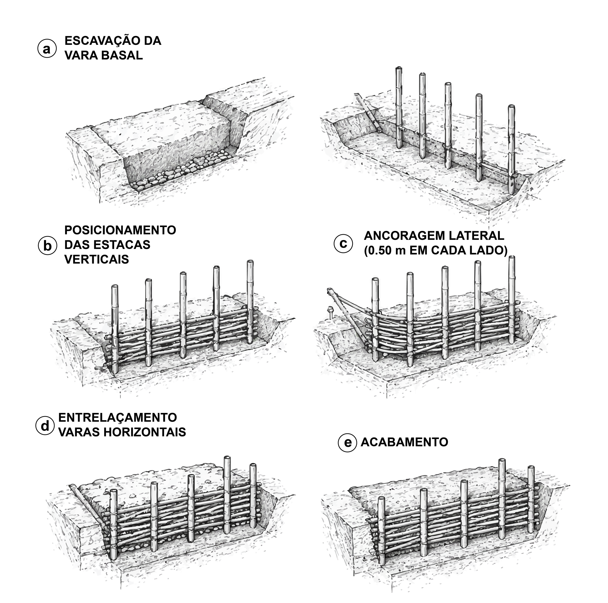
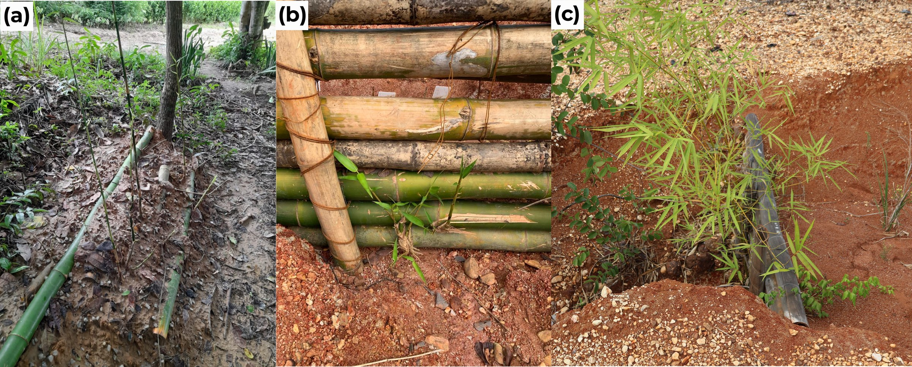
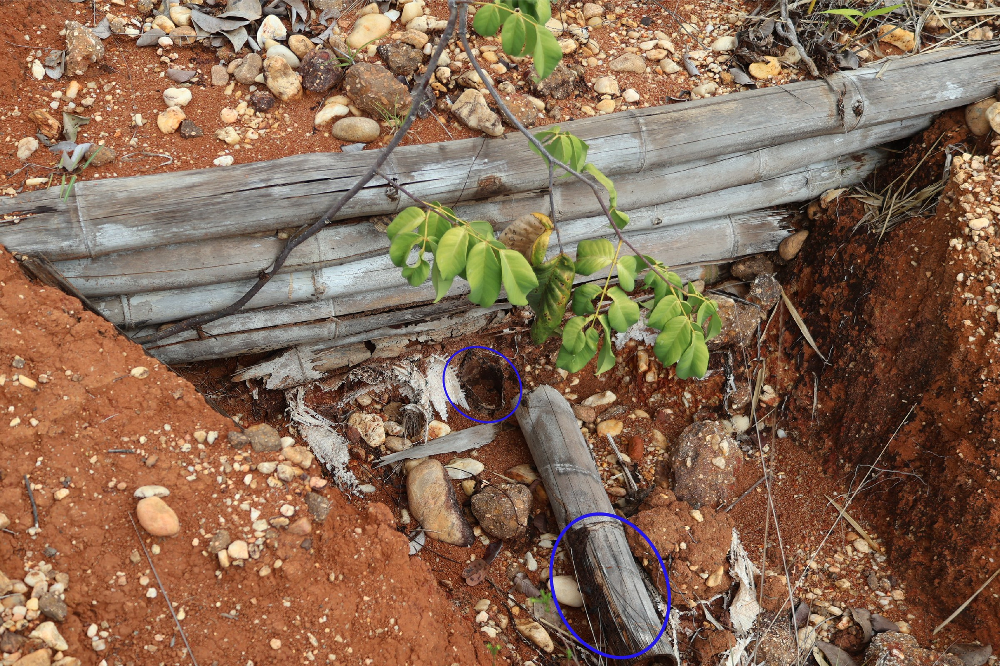
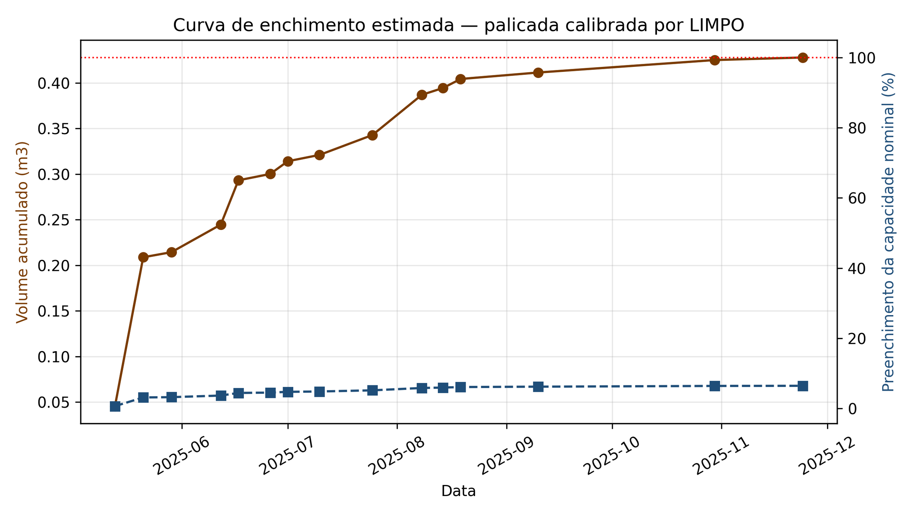
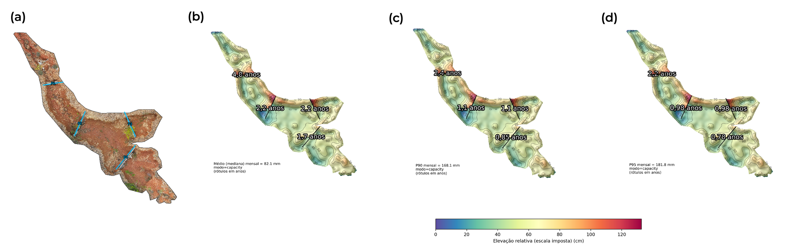

# Paliçadas: Execução, Estruturas Vivas e Monitoramento {#sec-palicadas-execucao}

::: {.callout-note}
## Objetivos de aprendizagem
Ao final deste capítulo, o leitor deverá ser capaz de escolher a geometria da vala de fundação a partir da forma da seção transversal e da profundidade da feição, executar a sequência de montagem na ordem que minimiza o deslocamento da estrutura durante os primeiros eventos de escoamento concentrado, dimensionar o embutimento vertical e a ancoragem lateral que controlam os modos de falha por percolação e por contorno, conduzir a propagação assistida que converte a barreira inerte em paliçada parcialmente viva, programar a reposição modular a partir do modelo exponencial de biodegradação, e converter leituras do método dos pinos em volume retido e em taxa de assoreamento.
:::

## Da prancheta ao talvegue

O dimensionamento desenvolvido em @sec-palicadas-protocolo entrega quatro grandezas, a altura efetiva, a tensão cisalhante de leito, o espaçamento e o volume de retenção. Este capítulo trata da transferência dessas grandezas para o terreno, da conversão da barreira inerte em estrutura parcialmente viva, da perda de capacidade mecânica do material ao longo do tempo e da verificação de desempenho por monitoramento instrumentado.

A montagem é executada por equipe de 2--4 trabalhadores com enxada, facão e marreta, seguindo a lógica de estruturas transversais leves consolidada em bioengenharia de solos [@nardin_et_al_2010; @acharya_2018]. Nenhuma etapa exige equipamento especializado, embora todas dependam da ordem executiva, porque a resistência mobilizada em cada movimento depende da condição em que o movimento anterior deixou o solo de fundação.

## Geometria da vala de fundação

A escavação da vala basal assenta a estrutura abaixo do nível do leito, restringe o fluxo erosivo sob a barreira e cria uma zona inicial de dissipação e infiltração que tende a reduzir a carga hidrostática a montante durante eventos moderados [@piton_recking_2016; @lucas_borja_et_al_2021]. A geometria admite variações conforme a forma da seção da ravina e a profundidade local, seguindo o princípio de ajustar a fundação da estrutura ao talvegue e às paredes, onde se concentram os contrastes de energia e de resistência ao escoamento [@zema_et_al_2014; @wang_et_al_2021].

Em feições rasas com seção em V, com profundidade inferior a 0,60 m, adota-se vala em V com profundidade de 0,30 m no eixo central, decrescente em direção às margens, configuração que minimiza o volume escavado e acompanha a geometria do leito. Feições intermediárias com seção em U, com profundidade entre 0,60 e 1,20 m, faixa em que se enquadra a feição-tipo F1, demandam vala retangular com profundidade uniforme de 0,30--0,40 m, que assenta a base das estacas em material não perturbado e facilita a compactação do solo de vedação a montante, em consonância com critérios de fundação rasa em valas prismáticas adotados em estruturas de contenção e estabilização geotécnica de pequeno porte [@muthukkumaran_et_al_2023]. Em cabeceiras escarpadas e feições profundas, com profundidade superior a 1,20 m, a vala escalonada em dois níveis, com degrau central mais profundo de 0,40--0,50 m sob o talvegue e degraus laterais rasos de 0,20--0,30 m sob as margens, combina ancoragem reforçada na zona de maior energia hidrodinâmica com economia de escavação nas faixas laterais (@tbl-vala).

| Seção da feição | Profundidade $D$ | Geometria da vala | Lógica construtiva |
|---|:---:|---|---|
| V (feições rasas) | < 0,60 m | Vala em V, 0,30 m no eixo central, decrescente às margens | Minimiza volume escavado e acompanha a geometria do leito |
| U (intermediárias) | 0,60--1,20 m | Vala retangular, profundidade uniforme de 0,30--0,40 m | Assenta as estacas em material não perturbado e facilita a compactação de vedação |
| Cabeceiras escarpadas | > 1,20 m | Vala escalonada, degrau central de 0,40--0,50 m e laterais de 0,20--0,30 m | Reforça a ancoragem na zona de maior energia e economiza escavação lateral |

: Geometria da vala de fundação por tipo de seção transversal da feição erosiva. {#tbl-vala .striped .hover}

A profundidade enterrada total das estacas verticais resulta da soma da profundidade da vala e da penetração mínima de 30 cm abaixo do fundo, totalizando 60--80 cm em paliçadas inertes e 70--100 cm em paliçadas vivas.

A relação entre a barreira e a geometria transversal da ravina evidencia a função combinada da vala basal, da compactação de solo a montante e do embutimento lateral das varas em entalhes de pelo menos 0,50 m nas paredes (@fig-corte-palicada). Essa combinação é coerente com recomendações de travamento de estruturas de bioengenharia no solo de fundação e com a necessidade de evitar escoamento de contorno em check-dams permeáveis [@tardio_mickovski_2017; @world_bank_undp_2012].

{#fig-corte-palicada fig-alt="Corte transversal de paliçada com vala basal e ancoragem lateral" width="85%"}

::: {.callout-important}
## Janela curta entre escavação e cravamento
A abertura da vala e o cravamento das estacas devem ocorrer no mesmo turno de trabalho, porque a janela curta preserva o solo de fundação úmido e não perturbado, condição recomendada para fundações rasas e trincheiras de corte em estruturas transversais de controle erosivo [@usda_forest_service_2006]. Uma vala aberta que recebe chuva antes do cravamento perde parte da resistência passiva que deveria mobilizar contra o empuxo do sedimento retido.
:::

## Sequência executiva de montagem

A sequência operacional em campo transfere as cargas hidrodinâmicas da estrutura ao solo de fundação em cinco movimentos e instancia, na feição-tipo F1 de seção em U com profundidade de 1,10 m, a variante de vala retangular descrita anteriormente (@fig-sequencia-executiva). A escavação basal sob o eixo transversal da ravina abre a vala que define o plano de apoio inferior da estrutura. Sobre esse plano posicionam-se as estacas verticais com o embutimento definido na seleção do material, suficiente para mobilizar resistência passiva do solo contra o empuxo do sedimento retido e, na variante viva, manter os nós basais com gemas viáveis abaixo da zona de dessecamento sazonal. Os entalhes de ancoragem lateral prendem os extremos da trama em material não perturbado além da zona de alívio das margens, reduzindo a tendência ao escoamento de contorno. O entrelaçamento alternado das varas horizontais forma a face permeável da barreira, distribui o empuxo entre estacas sucessivas e mantém porosidade controlada para drenagem. O acabamento com sacos de ráfia preenchidos com solo local sobre a face montante sela a interface basal, completa a vedação iniciada pela compactação do solo escavado e favorece a deposição inicial do patamar sedimentar [@nardin_et_al_2010]. Essa ordem executiva tende a reduzir o deslocamento da estrutura durante os primeiros eventos de escoamento concentrado, quando o sedimento ainda não consolidou o patamar a montante e a barreira está sujeita à carga hidrodinâmica máxima [@tardio_mickovski_2017].

{#fig-sequencia-executiva fig-alt="Cinco etapas da montagem da paliçada de bambu" width="76%"}

Cravadas a cada 30--50 cm, as estacas verticais têm espaçamento ditado pela largura da ravina e pelo diâmetro das varas disponíveis, e a penetração mínima de 30 cm abaixo do fundo da vala ancora a estrutura contra o empuxo do sedimento retido e contra a componente horizontal da força de arraste durante eventos extremos [@reese_cox_koop_1975; @reese_van_impe_2011].

### Trama permeável e transferência de esforços

Sobre as estacas, as varas horizontais são dispostas em cruzamento alternado entre as faces montante e jusante, passando por trás e pela frente de estacas sucessivas para formar trama permeável cujos vazios permitem a passagem da água e reduzem a carga hidrostática, enquanto a rugosidade do conjunto dissipa energia cinética e induz deposição das partículas transportadas (@fig-trama-bambu). Os cruzamentos geram pontos de contato capazes de transferir o empuxo do sedimento para as estacas verticais e destas para o solo de fundação, mantendo porosidade suficiente para drenagem controlada, solução descrita em recomendações de bioengenharia de solos para estruturas leves de contenção [@Chen_2024; @piton_recking_2016; @tardio_mickovski_2017; @world_bank_undp_2012].

{#fig-trama-bambu fig-alt="Cruzamento das varas horizontais e corte A-A da trama" width="52%"}

No corte A--A, o arame galvanizado aparece como recurso complementar de ajuste nos pontos de contato entre varas horizontais e estacas verticais, empregado quando a irregularidade dos colmos ou a sobreposição em campo reduz o travamento obtido por cruzamento. Na implantação da feição-tipo, essa amarração estabilizou as varas sobrepostas e manteve a continuidade transversal da barreira sem vedar os vãos necessários à permeabilidade hidráulica.

### Vedação basal e semeadura do patamar

Concluído o entrelaçamento, a compactação de solo contra a face montante veda a base e reduz fluxo preferencial sob a estrutura, procedimento compatível com a função hidráulica de check-dams permeáveis e com a necessidade de estabilizar o depósito inicial [@lucas_borja_et_al_2021]. Sobre essa base vedada, a semeadura de gramíneas a montante, preferencialmente *Brachiaria decumbens* ou *Paspalum notatum*, acelera a cobertura dos sedimentos depositados e aumenta a rugosidade superficial do patamar em formação, contribuindo para a transição da função estabilizadora da estrutura física para a cobertura vegetal [@bombino_et_al_2019; @gyssels_et_al_2005; @vannoppen_2015]. A escolha dessas espécies justifica-se por características biotécnicas mensuráveis, como densidade de raízes na camada de 0--20 cm e resistência à tração radicular, que ampliam a coesão do solo superficial e reduzem a erodibilidade do patamar sob escoamento concentrado [@holanda_2022_avaliacao_das_caracteristic; @ferreira_et_al_2022_jatropha].

## Propagação assistida e paliçada viva

O enterrio parcial de *Bambusa vulgaris* estimula a brotação de gemas axilares em contato com o solo úmido, ativando um sistema radicular adventício estabilizador [@ray_ali_2017; @hossain_et_al_2005]. Esse processo converte a barreira inerte em paliçada parcialmente viva e desloca gradualmente a função estabilizadora do material construtivo para o reforço radicular sobre o patamar formado.

A indução em leito sombreado durante 30--45 dias antes do plantio definitivo acumula umidade no parênquima fibroso e ativa a rizogênese [@kalanzi_mwanja_2023], e o estabelecimento definitivo nas feições erosivas deve coincidir com o início da estação chuvosa local para mitigar o dessecamento sazonal, com o embutimento no subsolo ampliado para 40--50 cm a fim de resguardar os nós vegetativos da insolação térmica superficial [@manohar_et_al_2024_propagation]. Sob essas condições, o brotamento de folhas e o enraizamento transversal estendem a vida útil da intervenção degradável para além de seu limite físico de 2--5 anos, aumentando progressivamente a rugosidade hidráulica superficial e elevando a coesão efetiva do solo contra escorregamentos e colapso de taludes [@gantait_et_al_2018; @bischetti_et_al_2021].

A progressão do processo, desde os colmos enterrados para indução até a paliçada brotada em campo, documenta a transição funcional em três estágios observáveis (@fig-brotacao). A emissão de folhas nos colmos já instalados indica que as gemas axilares permaneceram viáveis após o cravamento, condição necessária para que o enraizamento transversal subsequente acrescente coesão ao solo adjacente à barreira.

{#fig-brotacao fig-alt="Indução de brotação, brotação nos colmos instalados e paliçada brotada" width="90%"}

::: {.callout-note}
## Por que a variante viva muda o enquadramento da técnica
A literatura de engenharia ecológica trata estruturas de bioengenharia de solos como sistemas temporais, nos quais a eficiência inicial de retenção sedimentar, o desenvolvimento vegetal e a perda gradual de capacidade dos materiais lenhosos precisam ser avaliados em conjunto [@erktan_rey_2013; @bischetti_et_al_2021; @romano_et_al_2016]. Esse enquadramento desloca a paliçada de bambu de uma solução construtiva isolada para uma intervenção baseada na natureza (@sec-nbs), com desempenho condicionado pela evolução simultânea do depósito, da rugosidade hidráulica, da integridade do material e da sucessão vegetal sobre o patamar estabilizado [@preti_et_al_2022].

Em regiões tropicais, o uso de espécies nativas com propagação vegetativa por estacas amplia essa possibilidade além do bambu, apoiado na aptidão ao enraizamento de estacas de *Gliricidia sepium* e *Erythrina* spp. verificada entre espécies nativas das Antilhas Francesas [@Mira_Evette_2021], uma vez que o sistema radicular assim estabelecido acrescenta coesão ao solo adjacente [@ferreira_et_al_2022_jatropha; @stokes_et_al_2014].
:::

## Durabilidade do material e programação de manutenção

A retenção permanece efetiva enquanto a barreira preserva capacidade portante, condição que o ataque de coleobrocas e cupins subterrâneos compromete progressivamente nas zonas internodais e nos diafragmas, onde a difusão de oxigênio e umidade é facilitada e o parênquima rico em amido funciona como substrato preferencial para *Coptotermes* e gêneros correlatos [@kadir_abd_hamid_2024; @brito_paes_oliveira_2020]. A frente de degradação biológica em materiais lenhosos expostos ao solo úmido evidencia o substrato preferencial que motiva o tratamento prévio à instalação (@fig-degradacao-bambu), e o tratamento com sais de boro prolonga a vida útil mecânica desses elementos em condições tropicais [@liese_kumar_2003; @bamboo_sustainable_construction_2023].

{#fig-degradacao-bambu fig-alt="Degradação biológica em material lenhoso" width="70%"}

### Modelo exponencial de biodegradação

Em ambiente tropical sem proteção, a perda de propriedades mecânicas do bambu pode seguir trajetória exponencial:

$$
P(t) = P_0 \cdot e^{-k t}
$$ {#eq-biodegradacao}

onde $P_0$ é a capacidade inicial, $t$ é o tempo em anos e $k$ é a taxa de decaimento, situada entre 0,03 e 0,10 ano^-1^ em estruturas de bioengenharia expostas à umidade [@romano_et_al_2016; @correal_ramirez_pena_2025; @akita_et_al_2014]. A forma exponencial expressa a hipótese de que a taxa instantânea de perda é proporcional à capacidade remanescente, comportamento coerente com degradação biológica progressiva em que a área de material íntegro disponível ao ataque diminui com o avanço da frente de degradação.

Sob a taxa pessimista de 0,10 ano^-1^, a perda acumulada alcança cerca de 39% em cinco anos e atinge metade da resistência inicial em torno do sétimo ano, faixa coerente com decomposição e intemperismo documentados em bambu e madeira expostos à umidade [@ghimire_et_al_2013]. Perdas progressivas semelhantes foram observadas em geotêxteis de fibras naturais sob exposição tropical, nos quais a degradação microbiológica e a foto-oxidação reduzem a resistência à tração conforme o tempo de exposição e a composição da fibra [@holanda_2024_resistance_of_the_fiber_der; @santos_2025_analysis_of_fracture_charact], paralelo desenvolvido em @sec-biotexteis.

A trajetória de capacidade remanescente nos dois cenários de taxa de decaimento fornece a base quantitativa da programação de manutenção (@tbl-biodegradacao).

| Ano | Capacidade remanescente ($k = 0{,}10$) | Capacidade remanescente ($k = 0{,}03$) | Condição operacional |
|:---:|:---:|:---:|---|
| 1 | 90% | 97% | Acomodação da estrutura |
| 3 | 74% | 91% | Patamar em formação |
| 5 | 61% | 86% | Gatilho de reposição modular |
| 7 | 50% | 81% | Perda de metade da resistência |
| 10 | 37% | 74% | Falha provável sem reposição |

: Capacidade mecânica remanescente das estacas verticais pelo modelo exponencial de biodegradação, nos cenários pessimista e otimista de taxa de decaimento. {#tbl-biodegradacao .striped .hover}

### Gatilho de reposição modular

Na programação da reposição, adota-se como referência a fração de capacidade mecânica remanescente prevista pelo modelo exponencial sob a taxa pessimista de 0,10 ano^-1^, aplicada às estacas verticais, identificadas como elementos críticos pela concentração de momento fletor nas junções com as varas horizontais. O gatilho de reposição corresponde ao instante em que a capacidade remanescente se aproxima de 60% do valor inicial, condição alcançada próximo ao quinto ano e adotada como limiar operacional conservador, uma vez que a solicitação sobre a barreira tende a crescer à medida que a cunha sedimentar se acumula a montante e transfere empuxo adicional para a face da trama. Antecipar a substituição em relação à perda de metade da resistência, prevista para o sétimo ano, preserva margem para esse crescimento de solicitação e reduz o risco de que a ruína de elementos isolados reative o transporte de sedimentos no segmento [@leng_xu_chen_2023; @tang_et_al_2022].

::: {.callout-tip}
## Reposição modular em vez de reconstrução
A manutenção substitui estacas e fiadas comprometidas, preservando os elementos cuja integridade a inspeção confirma. A inspeção visual em campo, associada às leituras do método dos pinos, verifica se a perda observada de integridade dos colmos acompanha a trajetória prevista pela @tbl-biodegradacao e permite antecipar ou postergar a substituição. Em paliçadas que emitiram brotação, parte da função estabilizadora já migrou para o sistema radicular, condição em que a reposição pode ser menos extensa que a prevista pelo modelo.
:::

## Monitoramento pós-instalação

### Método dos pinos

O monitoramento pós-instalação é estruturado pelo método dos pinos, com três a cinco hastes graduadas de PVC de 1,0 m instaladas a montante de cada paliçada, distribuídas no eixo do talvegue e junto às margens para registrar a heterogeneidade transversal da deposição. A leitura em pontos fixos converte o assoreamento em indicador de desempenho da estrutura, pois a diferença entre medições sucessivas estima a espessura de sedimento acumulado e indica deslocamento lateral do fluxo quando as hastes marginais registram deposição inferior à observada no eixo da ravina, sinal precoce do mecanismo de falha por contorno descrito em @sec-palicadas.

As leituras são organizadas em série temporal mensal no semestre inicial e trimestral após a estabilização visual do patamar, produzindo taxa de assoreamento em cm mês^-1^. A frequência maior no início acompanha a fase de acomodação da estrutura, quando o solo mobilizado pela escavação e o sedimento transportado pelos primeiros eventos de chuva ainda preenchem de modo subcrítico o volume útil $V_r$. Após eventos diários superiores a 50 mm, a inspeção de campo é direcionada à ancoragem lateral, à vedação basal e à presença de fluxo de contorno, pois esse limiar é compatível com saturação rápida do horizonte Ap em Plintossolos com velocidade de infiltração básica restritiva [@de_oliveira_et_al_2024].

### Conversão das leituras em volume retido

A conversão das leituras pontuais em volume retido emprega integração trapezoidal das espessuras entre seções transversais sucessivas de pinos, procedimento compatível com o número reduzido de pontos por estrutura. A lógica de quantificação segue a adotada por @ramos_diez_et_al_2017 em check-dams nas *badlands* de Saldaña, onde o desempenho foi avaliado pela geometria do sedimento acumulado a montante [@zema_et_al_2018].

::: {.callout-warning}
## Densidade amostral e interpolação geoestatística
A interpolação geoestatística é inadequada nesse arranjo, pois o ajuste de variograma experimental exigiria densidade amostral muito superior às três a cinco hastes disponíveis por paliçada. A krigagem cumpre aqui função conceitual, representando a geometria esperada da cunha de deposição e orientando a locação das hastes, sem servir à estimativa de volume a partir dos dados de campo.
:::

A geometria esperada da cunha foi representada por modelo numérico da espessura do depósito a montante de uma paliçada, construído por krigagem ordinária sobre pontos simulados a partir de decaimento exponencial da espessura com a distância à barreira (@fig-krigagem-deposito). O corte longitudinal reproduz a concentração de sedimento no setor imediatamente a montante da estrutura, onde a perda de velocidade do escoamento tende a ser maior e a capacidade de transporte diminui mais rapidamente [@piton_recking_2016; @schiechtl_stern_1996; @morgan_rickson_1995], padrão que orienta a locação das hastes de leitura e o cálculo do volume por integração trapezoidal. Em planta, as isolinhas distribuem-se de modo aproximadamente simétrico em relação ao eixo do talvegue, condição de referência contra a qual leituras de campo assimétricas indicariam desvio lateral dominante do fluxo e necessidade de reforço da ancoragem marginal [@gray_sotir_1996]. O modelo não corresponde a leituras realizadas nas paliçadas-piloto e cumpre função ilustrativa do critério de monitoramento.

{#fig-krigagem-deposito fig-alt="Corte longitudinal e isolinhas da espessura do depósito a montante da paliçada" width="90%"}

### Curva de enchimento e expectativa temporal

A série de leituras produz curva de enchimento do volume útil que permite projetar o instante de preenchimento e, com ele, a necessidade de manutenção ou de instalação de estruturas complementares (@fig-curva-enchimento). A inflexão da curva informa o momento em que a taxa de assoreamento decresce por aproximação da declividade de compensação, condição em que o segmento tratado deixa de receber sedimento adicional e o controle do transporte se transfere ao trecho a montante ainda exposto.

{#fig-curva-enchimento fig-alt="Curva de enchimento do volume de retenção da paliçada" width="80%"}

A projeção temporal do encadeamento de patamares ao longo de uma sequência de estruturas completa a leitura do processo (@fig-simulacao). O assoreamento progressivo converte estruturas isoladas em degraus deposicionais conectados, condição em que a rugosidade hidráulica aumenta e o gradiente longitudinal efetivo diminui à medida que cada patamar se consolida.

{#fig-simulacao fig-alt="Simulação temporal de retenção de sedimentos em sequência de paliçadas" width="85%"}

Estudos em Plintossolo degradado nos Tabuleiros Costeiros de Sergipe documentaram retenção de 76 cm de sedimento em 12 meses em paliçada de 1,0 m de altura, com colonização vegetal espontânea a montante após seis meses. A projeção de preenchimento total do espaço entre paliçadas consecutivas situa-se entre 3 e 5 anos, intervalo no qual a vegetação assume progressivamente a função de estabilização, realizando a transição funcional discutida em @sec-introducao.

::: {.callout-important}
## O que o monitoramento por pinos não resolve
As leituras de pinos medem deposição, grandeza distinta da eficiência de retenção. Sem trecho-controle a montante ou a jusante e sem série pluviométrica associada ao período monitorado, permanece indeterminada a atribuição do sedimento acumulado ao efeito da estrutura em contraste com a variabilidade do aporte. Projetos que pretendam quantificar eficiência devem incluir, desde o desenho experimental, segmento-controle não tratado e pluviógrafo na área de contribuição (@sec-classificacao-feicoes).
:::

## Síntese do capítulo

A execução transfere ao terreno as grandezas calculadas pelo protocolo e concentra o risco da intervenção em três interfaces físicas. A interface basal, controlada pela vala de fundação e pela compactação do solo a montante, governa a percolação sob a estrutura. A interface lateral, controlada pelo embutimento de pelo menos 0,50 m em material não perturbado, governa o escoamento de contorno. A interface entre varas e estacas, mantida por cruzamento alternado e ajustada por arame galvanizado quando a irregularidade dos colmos o exige, governa a transferência do empuxo sedimentar ao solo de fundação. A propagação assistida de *Bambusa vulgaris*, induzida por 30--45 dias em leito sombreado e instalada no início da estação chuvosa com embutimento de 40--50 cm, converte a barreira inerte em estrutura parcialmente viva e estende a função estabilizadora além do limite físico do material. O modelo exponencial de biodegradação, com taxa pessimista de 0,10 ano^-1^, situa o gatilho de reposição modular no quinto ano, quando a capacidade remanescente se aproxima de 60%. O monitoramento por três a cinco hastes de PVC, lido mensalmente no primeiro semestre e trimestralmente em seguida, converte-se em volume retido por integração trapezoidal e em taxa de assoreamento em cm mês^-1^, indicadores que medem deposição e exigem segmento-controle para sustentar afirmações sobre eficiência.

::: {.callout-tip}
## Questões para estudo
1. Justifique, em termos de resistência passiva do solo, por que a penetração das estacas verticais deve alcançar 30 cm abaixo do fundo da vala, e discuta a consequência de reduzir essa penetração em feições com horizonte superficial compactado.
2. Uma paliçada instalada em feição de seção em V com 0,55 m de profundidade recebeu vala retangular de 0,35 m. Avalie a adequação da escolha e indique a geometria recomendada pela @tbl-vala.
3. Aplicando a @eq-biodegradacao com taxa de 0,06 ano^-1^, determine o ano em que a capacidade remanescente alcança 60% e compare o resultado com o gatilho adotado no protocolo.
4. As hastes marginais de uma paliçada registraram 4 cm de deposição enquanto a haste do eixo registrou 11 cm na mesma campanha. Interprete o padrão e indique a ação corretiva prioritária.
5. Explique por que a integração trapezoidal é preferível à krigagem na conversão das leituras de pinos em volume retido, considerando a densidade amostral disponível por estrutura.
:::

## Roteiro de verificação de execução e manutenção

| Momento | Verificação | Critério de conformidade |
|---|---|---|
| Montagem | Marcação do eixo | Transversal e perpendicular ao escoamento |
| Montagem | Vala de fundação | Geometria conforme @tbl-vala, aberta e cravada no mesmo turno |
| Montagem | Estacas verticais | Espaçamento de 30--50 cm e penetração ≥ 30 cm abaixo do fundo da vala |
| Montagem | Ancoragem lateral | Entalhes de ≥ 0,50 m em material não perturbado de cada parede |
| Montagem | Trama horizontal | Cruzamento alternado com vãos preservados para drenagem |
| Montagem | Vedação | Solo compactado na face montante e sacos de ráfia na interface basal |
| Montagem | Cobertura vegetal | Gramíneas semeadas a montante |
| Montagem | Instrumentação | Três a cinco pinos de PVC instalados com cota inicial registrada |
| Ciclo de vida | Leituras | Mensais no primeiro semestre e trimestrais em seguida |
| Ciclo de vida | Inspeção dirigida | Executada após todo evento diário superior a 50 mm |
| Ciclo de vida | Volume retido | Calculado por integração trapezoidal a cada campanha |
| Ciclo de vida | Integridade do material | Comparada à trajetória prevista pela @tbl-biodegradacao |
| Ciclo de vida | Reposição modular | Programada para o quinto ano, com capacidade remanescente próxima de 60% |

: Roteiro de verificação da execução e da manutenção de paliçadas permeáveis. {#tbl-checklist-execucao .striped .hover}
