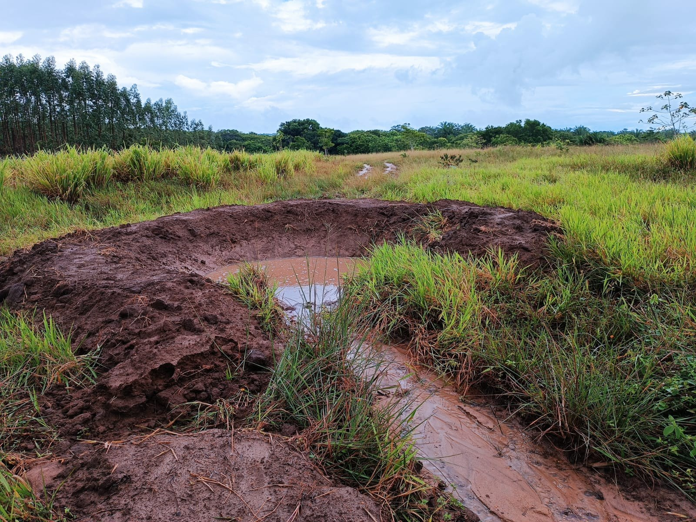
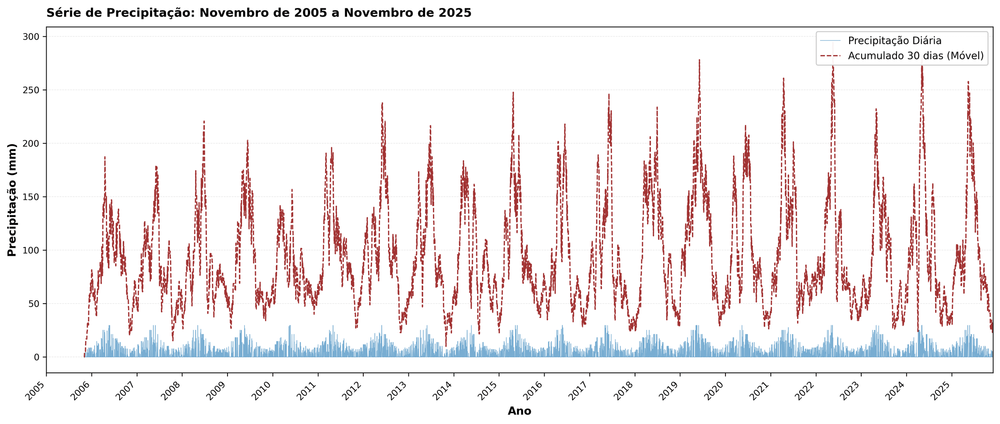

# Bacias de Captação e Barraginhas {#sec-bacias-captacao}

## Bacias de Captação

As bacias de captação (ou barraginhas) são estruturas de retenção de enxurrada escavadas ao longo de estradas rurais ou em encostas, cujo propósito é interceptar, reter e infiltrar o escoamento superficial antes que ele cause erosão a jusante. Em essência, trata-se de pequenas depressões côncavas escavadas no solo (normalmente com formato de meia-lua ou circular), dimensionadas para receber o volume de enxurrada gerado pela área de contribuição a montante. A água captada permanece na bacia por horas a dias, infiltrando gradualmente no solo e recarregando o lençol freático, em vez de escoar em alta velocidade pela superfície, erodindo estradas e formando ravinas.

A técnica foi amplamente difundida pela Embrapa Milho e Sorgo no Semiárido brasileiro, onde estradas rurais não pavimentadas concentram o escoamento superficial e geram ravinas laterais que, sem intervenção, evoluem para voçorocas em poucos anos. No entanto, a aplicabilidade das barraginhas estende-se a qualquer região onde o escoamento superficial concentrado cause erosão em estradas, encostas ou áreas de pastagem degradada. A @fig-barraginha mostra uma barraginha típica implantada em estrada rural, onde se observa a geometria côncava da escavação e a interceptação do escoamento lateral.

{#fig-barraginha fig-alt="Barraginha em estrada rural" width="80%"}

## Funções

As bacias de captação desempenham quatro funções hidrológicas e geomorfológicas interconectadas. A retenção de sedimentos é a função mais imediata, operando com eficiência de 50–80% na remoção de partículas do escoamento, uma vez que a redução brusca de velocidade da água ao entrar na bacia causa a deposição gravitacional das partículas em suspensão: primeiro as areias (em minutos), depois os siltes (em horas) e por último as argilas floculadas (em dias). A recarga de aquíferos é a função menos visível mas mais relevante para a sustentabilidade hídrica da paisagem, promovendo infiltração de 20–60 m³ por evento chuvoso, o que equivale, em uma propriedade com 30 barraginhas, a um volume anual de recarga da ordem de 2.000–6.000 m³. O amortecimento do pico de cheia pode atingir 40% de redução na vazão máxima a jusante, protegendo pontes, bueiros e estradas de acessso. A proteção de estradas rurais evita a formação de ravinas laterais ao interceptar o escoamento antes que ele atinja velocidades erosivas.

A @fig-barraginha2 permite observar o funcionamento hidráulico da bacia após um evento chuvoso, com a água retida infiltrando gradualmente no solo, enquanto a @fig-mapa-decliv demonstra como o planejamento espacial das barraginhas é orientado por critérios topográficos, com a declividade do terreno determinando o espaçamento e o posicionamento ideal das estruturas.

::: {layout-ncol=2}
{#fig-barraginha2 fig-alt="Barraginha após chuva"}

{#fig-mapa-decliv fig-alt="Mapa de declividade"}
:::

## Dimensionamento

O dimensionamento adequado é o fator determinante da eficiência das barraginhas. Uma bacia subdimensionada transbordará com frequência, anulando suas funções de retenção e infiltração; uma bacia superdimensionada representa desperdício de recursos de escavação e ocupa área útil desnecessariamente. O dimensionamento envolve três cálculos fundamentais.

### Método EUPS + VIB

O volume da bacia deve ser suficiente para conter o escoamento gerado por uma chuva de projeto (tipicamente com período de retorno de 10 anos e duração igual ao tempo de concentração da área de contribuição), descontando-se a parcela que infiltra durante o próprio evento. A equação que integra esses fatores é

$$
V_{bacia} = A_c \cdot P \cdot C \cdot (1 - VIB/P)
$$

onde $A_c$ é a área de contribuição (m²), que corresponde à porção do terreno cujo escoamento é direcionado para a bacia pelo relevo e pela infraestrutura viária; $P$ é a precipitação de projeto (m), obtida a partir de curvas IDF (Intensidade-Duração-Frequência) da estação meteorológica mais próxima; $C$ é o coeficiente de escoamento superficial (adimensional, tipicamente 0,30–0,60 para estradas não pavimentadas e 0,10–0,30 para pastagens); e $VIB$ é a velocidade de infiltração básica do solo (m/h), determinada por ensaio de infiltração com infiltrômetro de duplo anel conforme a norma ABNT NBR 7229. O termo $(1 - VIB/P)$ representa a fração da chuva que efetivamente gera escoamento, descontada a infiltração simultânea.

{#fig-precipitacao fig-alt="Gráfico de distribuição da precipitação" width="80%"}

### Área de Contribuição

Para estradas rurais, a área de contribuição é calculada como

$$
A_c = L \cdot (W_{estrada} + W_{talude})
$$

onde $L$ é o comprimento da estrada que drena para a bacia (m), $W_{estrada}$ é a largura da plataforma da estrada (tipicamente 4–8 m para estradas vicinais) e $W_{talude}$ é a largura horizontal do talude de corte a montante que também contribui com escoamento para a estrada (0–5 m, dependendo da geometria). A identificação precisa de $A_c$ pode ser realizada em campo com nível de mangueira ou, de forma mais acurada, a partir de Modelo Digital de Terreno (MDT) com resolução mínima de 1 m, conforme abordagem discutida na @fig-mapa-decliv.

### Dimensões Típicas

A @tbl-dimensoes-bacia sintetiza os valores típicos de dimensionamento adotados em projetos de barraginhas para estradas rurais no Brasil.

| Parâmetro | Valor típico | Observação |
|-----------|-------------|------------|
| Profundidade | 0,8–1,5 m | Limitada pelo nível do lençol freático |
| Diâmetro superior | 3–6 m | Maior em solos com baixa VIB |
| Volume | 5–30 m³ | Proporcional a $A_c$ |
| Espaçamento | 30–80 m | Reduzir em declividades > 8% |
| Declividade lateral | 1:1 a 1:1,5 | Mais suave em solos arenosos |

: Dimensões típicas de bacias de captação para estradas rurais. {#tbl-dimensoes-bacia .striped .hover}

## Espaçamento

O espaçamento entre bacias consecutivas deve garantir que cada uma receba um volume compatível com sua capacidade, sem que o escoamento excedente gere erosão no trecho entre bacias sucessivas. A equação de espaçamento é

$$
E_{bacias} = \frac{V_{bacia}}{W_{estrada} \cdot P \cdot C}
$$

Em terrenos com declividade > 8%, o espaçamento deve ser reduzido em 30–50%, pois a velocidade do escoamento aumenta e o tempo de concentração diminui, gerando picos de vazão mais intensos que exigem maior capacidade de retenção por unidade de comprimento de estrada. Uma regra prática amplamente adotada em programas de conservação de estradas rurais é posicionar as barraginhas nos pontos naturais de concentração de enxurrada (curvas, depressões, confluências de trilhas laterais), ajustando o espaçamento calculado à realidade topográfica do terreno.

## Vida Útil e Manutenção

A vida útil projetada das bacias situa-se entre 10 e 20 anos, dependendo fundamentalmente da taxa de produção de sedimentos na área de contribuição a montante (que por sua vez depende do tipo de solo, cobertura vegetal, uso da terra e declividade) e da frequência de manutenção. O assoreamento é o principal fator de degradação das barraginhas, reduzindo progressivamente o volume útil disponível para retenção de enxurrada. O monitoramento deve acompanhar a evolução do nível de sedimentos no interior da bacia, e a manutenção principal consiste na limpeza mecanizada (retroescavadeira) a cada 2–5 anos, removendo o sedimento acumulado e restaurando a capacidade de retenção original. O sinal de esgotamento funcional é o assoreamento superior a 70% da capacidade, quando a bacia já não consegue amortecer adequadamente os picos de cheia e passa a transbordar com frequência.

O sedimento removido das bacias pode ser reaproveitado como material de aterro em estradas ou como substrato para revegetação de áreas degradadas, fechando o ciclo de materiais e reduzindo custos de disposição.

::: {.callout-warning}
## Atenção
Em solos com VIB muito baixa (< 5 mm/h), como Vertissolos ou Planossolos, as bacias podem transbordar com frequência mesmo quando adequadamente dimensionadas. Nesses casos, o projetista deve dimensionar com chuva de menor período de retorno (5 anos) ou prever um sangradouro lateral vegetado, que é um canal de extravasamento revestido com gramíneas (preferencialmente *Paspalum notatum* ou *Cynodon* spp.) que conduz o excedente para a bacia seguinte sem causar erosão.
:::

## Custos

Os custos de implantação variam entre R$ 200 e R$ 500 por bacia para escavação mecanizada com retroescavadeira (1–2 horas de máquina por bacia, incluindo mobilização e desmobilização) e entre R$ 400 e R$ 800 por bacia para escavação manual (2–3 dias de trabalho de 2 operários, indicada para locais sem acesso para máquinas). O custo por hectare protegido situa-se entre R$ 500 e R$ 1.500, considerando a densidade média de 3–5 bacias/ha em estradas rurais com declividade moderada.

A relação custo-benefício é extremamente favorável, com evidências de que cada real investido em barraginhas evita R$ 5–12 em custos de manutenção de estradas rurais (patrolamento, reposição de cascalho, reconstrução de bueiros danificados), além dos benefícios indiretos de recarga hídrica, redução de assoreamento de corpos d'água a jusante e preservação de áreas de cultivo adjacentes.
