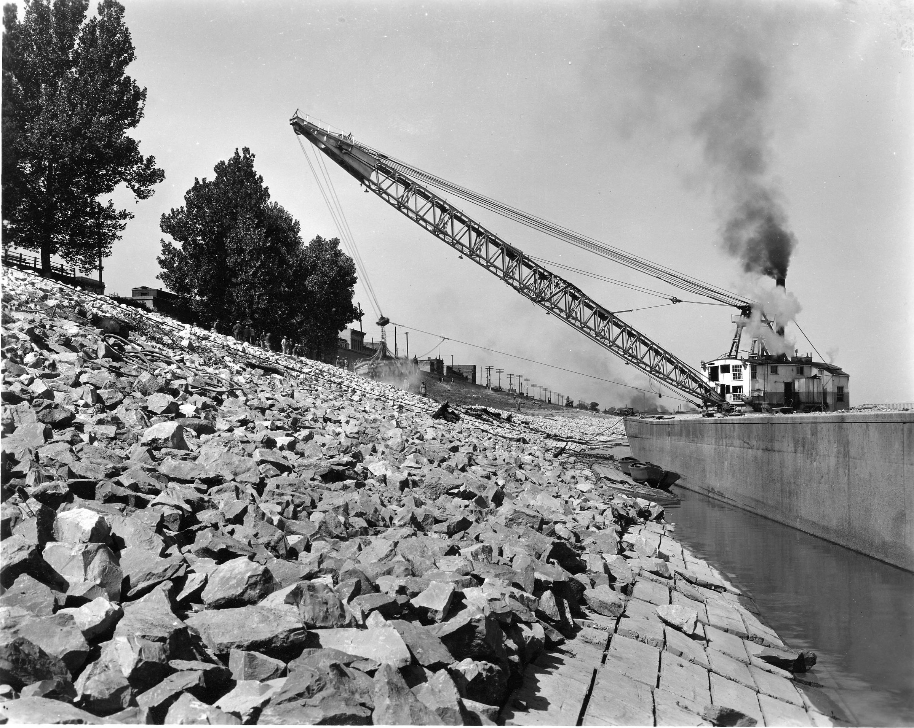

# Enrocamento Vegetado {#sec-enrocamento}

## Enrocamento Vegetado

O enrocamento vegetado (*vegetated riprap*) combina a proteção mecânica imediata de pedras com o reforço biológico progressivo fornecido por plantas vivas inseridas entre as pedras. Trata-se de uma técnica de bioengenharia para proteção de margens fluviais e bases de taludes submetidos a fluxo d'água, onde a ação hidrodinâmica (velocidade, turbulência, ondas) exige uma resistência mecânica que a vegetação sozinha não pode oferecer nos primeiros anos, mas a solução puramente inerte (enrocamento convencional) não proporciona os serviços ecossistêmicos e a durabilidade de longo prazo que o sistema radicular proporciona.

O princípio de funcionamento baseia-se na complementaridade temporal entre dois mecanismos de proteção. Nos primeiros 3–5 anos após a instalação, as pedras fornecem 100% da resistência ao arraste e à erosão, enquanto as estacas vivas inseridas entre elas enraízam, brotam e desenvolvem progressivamente um sistema radicular que penetra 1–3 m no solo subjacente. Após esse período de transição, as raízes criam uma ancoragem biológica que complementa e paulatinamente substitui a função mecânica das pedras, de modo que eventuais deslocamentos de pedras individuais não comprometem a estabilidade do conjunto. A @fig-riprap-rio mostra um enrocamento convencional em margem fluvial, onde as pedras protegem a base contra a erosão do fluxo, enquanto a @fig-riprap-vegetado apresenta um enrocamento vegetado em estágio avançado de consolidação biológica, com a vegetação já plenamente estabelecida entre as pedras.

::: {layout-ncol=2}
{#fig-riprap-rio fig-alt="Enrocamento em margem de rio"}

{#fig-riprap-vegetado fig-alt="Enrocamento vegetado consolidado"}
:::

## Componentes

O enrocamento vegetado é composto por três elementos estruturais. As pedras devem ter diâmetro médio entre 15 e 50 cm e massa individual entre 5 e 150 kg, privilegiando-se rochas compactas, densas e resistentes à abrasão (granito, gnaisse, basalto), evitando-se rochas friáveis (xisto, arenito mal cimentado) que se fragmentam sob impacto. As estacas vivas são ramos ou troncos jovens de espécies com elevada capacidade de enraizamento vegetativo, inseridos entre as pedras durante a construção, com diâmetro de 3–8 cm e comprimento suficiente para transpor toda a espessura do enrocamento e penetrar no solo subjacente. A camada de filtro é o elemento mais frequentemente negligenciado em projetos mal executados, consistindo em geotêxtil não-tecido ou camada de transição granulométrica posicionada entre o solo natural e as pedras, cuja função é impedir a remoção seletiva de partículas finas do solo pelo fluxo d'água (*suffusion*), que é a principal causa de colapso de enrocamentos pela perda de suporte da fundação.

## Dimensionamento das Pedras

O diâmetro médio das pedras ($D_{50}$) é a variável de projeto mais importante e é calculado em função da velocidade do fluxo a que a margem está submetida, utilizando a equação de Isbash adaptada

$$
D_{50} = \frac{0{,}06 \cdot V^2}{(\gamma_s / \gamma_w - 1) \cdot g}
$$

onde $V$ é a velocidade do fluxo na margem (m/s), determinada por medição em campo ou por modelagem hidráulica, $\gamma_s$ é o peso específico da pedra (tipicamente 26 kN/m³ para granito e basalto), $\gamma_w$ é o peso específico da água (9,81 kN/m³) e $g$ é a aceleração gravitacional (9,81 m/s²). O resultado dessa equação indica o diâmetro mínimo da pedra que resiste ao arraste hidrodinâmico sem ser mobilizada pelo fluxo.

### Espessura da Camada

A espessura mínima do enrocamento ($e$) deve ser

$$
e = 1{,}5 \cdot D_{50}
$$

e nunca inferior a 30 cm, garantindo que as pedras se arranjem em pelo menos duas camadas sobrepostas, criando intertravamento mecânico que impede o deslocamento individual. Em margens submetidas a ondas de embarcações ou variação rápida de nível d'água, a espessura deve ser aumentada para $2{,}0 \cdot D_{50}$.

## Vegetação no Enrocamento

### Espécies Indicadas

A seleção de espécies para vegetação do enrocamento deve priorizar a capacidade de enraizamento em ambiente parcialmente submerso (zona de variação do nível d'água), a tolerância a inundações periódicas e a produção de raízes profundas e densas. As espécies mais indicadas para o contexto brasileiro incluem *Salix* spp. (salgueiro) em zonas temperadas e subtropicais do Sul e Sudeste, com taxa de enraizamento superior a 90% e crescimento rápido (2–3 m/ano); *Mimosa caesalpiniifolia* (sabiá) na Caatinga e Tabuleiros Costeiros, com madeira de alta durabilidade natural que resiste à degradação mesmo quando parcialmente submersa; *Gliricidia sepium* (gliricídia) em regiões pantropicais, combinando excelente brotação com fixação biológica de nitrogênio; *Inga* spp. (ingá) em mata ciliar tropical, espécie nativa que reconstitui a vegetação ripária original; além de gramíneas rizomatosas (*Paspalum*, *Cynodon*) nos interstícios superficiais, que proporcionam cobertura rápida e filtração de sedimentos finos.

### Instalação

O procedimento de instalação é executado em camadas, iniciando com a preparação da base do talude mediante colocação de filtro geotêxtil não-tecido (gramatura mínima 200 g/m²) ou geotêxtil biodegradável de coco (ver @sec-biomantas) sobre o solo natural da margem. Sobre o filtro, assenta-se a primeira camada de pedras, arranjadas com a face mais plana voltada para baixo para maximizar o contato e o intertravamento. As estacas vivas são então inseridas entre as pedras, em ângulo de 15–20° com a horizontal (essa inclinação facilita o enraizamento e direciona o crescimento da copa para fora da face do enrocamento), com as pontas inferiores penetrando no solo subjacente e as superiores projetando-se 20–30 cm além da face do enrocamento. Os interstícios são preenchidos com solo vegetal (mistura de solo local com 20% de composto orgânico). Camadas adicionais são completadas até a cota de projeto, repetindo o procedimento de alternância pedras–estacas–solo, finalizando com semeadura de gramíneas nos interstícios superficiais.

::: {.callout-tip}
## Transição funcional
Após 3–5 anos, as raízes das estacas vivas penetram 1–3 m no solo, criando uma ancoragem biológica que complementa e gradualmente substitui a função mecânica das pedras. O enrocamento evolui de uma estrutura inerte para um ecossistema ripário funcional, com contribuições ecossistêmicas adicionais como habitat para fauna aquática e terrestre, filtração de nutrientes e sedimentos do escoamento lateral, estabilidade térmica da água pela sombra da copa e sequestro de carbono na biomassa e no solo.
:::

## Aplicações Típicas

A @tbl-enrocamento orienta o dimensionamento do enrocamento em função da velocidade do fluxo para as situações mais comuns de projeto, desde margens com erosão lenta até vertedouros de barragens.

| Situação | Velocidade do fluxo | D₅₀ recomendado | Espessura mínima |
|----------|---------------------|-----------------|-----------|
| Margens com erosão lenta | 1–2 m/s | 10–20 cm | 30 cm |
| Margens com erosão ativa | 2–3 m/s | 20–35 cm | 40–55 cm |
| Pilares de ponte | 3–4 m/s | 35–50 cm | 55–75 cm |
| Vertedouros de barragens | > 4 m/s | > 50 cm | > 75 cm |

: Dimensionamento de enrocamento por velocidade de fluxo. {#tbl-enrocamento .striped .hover}

## Custos

O enrocamento simples (sem vegetação) custa entre R$ 80 e R$ 150/m², incluindo pedras, filtro geotêxtil, transporte e mão de obra. O enrocamento vegetado situa-se entre R$ 100 e R$ 200/m², com o acréscimo correspondendo às estacas vivas, ao solo vegetal, ao composto orgânico e à semeadura de gramíneas. Para comparação, o muro de gabião (ver @sec-gabiao-vivo) varia de R$ 200 a R$ 400/m² e o muro de concreto armado de R$ 800 a R$ 1.500/m².

O sobrecusto da vegetação (20–30% sobre o enrocamento simples) é justificado pela durabilidade ampliada da obra (as raízes compensam a perda de intertravamento por deslocamento de pedras), pelos serviços ecossistêmicos adicionais (habitat, filtração, paisagem, carbono) e pela redução de custos de manutenção a longo prazo, uma vez que o enrocamento vegetado consolidado dispensa as intervenções periódicas de reposição de pedras que o enrocamento convencional frequentemente exige após cheias excepcionais.
