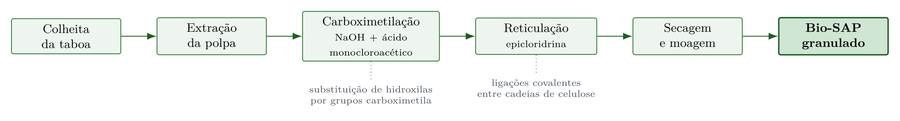
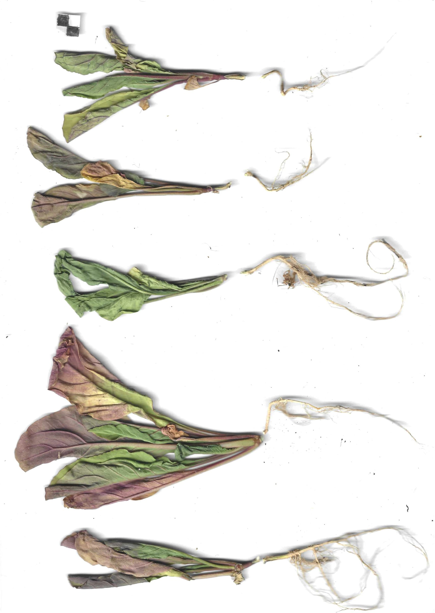

# Biopolímeros Superabsorventes {#sec-biopolimeros}

## Biopolímeros Superabsorventes

Os biopolímeros superabsorventes (Bio-SAP, do inglês *Superabsorbent Biopolymer*) são materiais de origem vegetal capazes de absorver e reter grandes volumes de água (100–500 vezes seu peso seco), liberando-a gradualmente para a zona radicular das plantas à medida que o potencial matricial do solo diminui por evapotranspiração. Diferentemente dos hidrogéis sintéticos (poliacrilatos de sódio), os Bio-SAPs são integralmente biodegradáveis e não geram resíduos de microplásticos no solo. Essa característica os torna especialmente relevantes para aplicações de bioengenharia de solos em regiões semiáridas, onde o déficit hídrico no período pós-plantio é o principal fator de mortalidade de mudas em taludes recuperados. A @fig-taboa mostra o material vegetal de taboa (*Typha domingensis*) que constitui a matéria-prima do Bio-SAP, cuja polpa celulósica é processada quimicamente para adquirir propriedades superabsorventes.

{#fig-taboa fig-alt="Material de taboa para Bio-SAP" width="80%"}

## Bio-SAP de Taboa

### Desenvolvimento

O Bio-SAP de taboa (*Typha domingensis*) é uma inovação desenvolvida a partir da polpa celulósica da planta, processada por duas reações químicas sequenciais (carboximetilação e reticulação) que modificam a estrutura molecular da celulose, conferindo-lhe a capacidade de formar hidrogéis com elevada retenção hídrica. A celulose nativa possui grupos hidroxila (-OH) que atraem moléculas de água por ligações de hidrogênio, mas a capacidade de absorção é limitada. A carboximetilação substitui parte desses grupos hidroxila por grupos carboximetila (-CH₂COONa), que são aniônicos em solução aquosa e criam pressão osmótica no interior da rede polimérica, atraindo grandes volumes de água. A reticulação subsequente (com epicloridrina) cria ligações covalentes entre as cadeias de celulose, formando uma rede tridimensional que impede a dissolução do material e confere elasticidade mecânica.

### Processo de Produção

O encadeamento das etapas de produção (@fig-biosap-processo) vai da colheita da taboa em campo até a obtenção do produto granulado pronto para aplicação, com as duas reações químicas concentradas no trecho intermediário da linha.

{#fig-biosap-processo fig-alt="Etapas de produção do Bio-SAP de taboa, da colheita ao granulado, com as duas reações químicas que conferem a capacidade superabsorvente" width="90%"}

### Propriedades

A microestrutura do Bio-SAP pode ser observada na @fig-mev, que apresenta imagens de microscopia eletrônica de varredura (MEV) comparando o material antes e após a absorção de água. No estado seco, o Bio-SAP exibe uma superfície rugosa e compacta com microporos colapsados; após a absorção, a estrutura se expande dramaticamente, revelando uma rede tridimensional de poros interconectados que retêm a água por capilaridade e pressão osmótica. A @tbl-biosap quantifica as principais propriedades do material.

{#fig-mev fig-alt="MEV do Bio-SAP" width="80%"}

| Propriedade | Valor | Significado prático |
|-------------|-------|---------------------|
| Capacidade de absorção em água destilada | 300–500 g/g | 1 kg de Bio-SAP retém 300–500 L de água |
| Capacidade de absorção em solo | 150–250 g/g | Reduzida pela presença de sais e finos |
| Tempo de absorção (90%) | 15–30 min | Resposta rápida a eventos de chuva |
| Taxa de liberação (50%) | 12–48 h | Liberação gradual compatível com demanda radicular |
| Biodegradação completa | 6–18 meses | Não deixa resíduos no solo |
| Granulometria | 0,5–2,0 mm | Compatível com mistura em substrato |

: Propriedades do Bio-SAP de taboa. {#tbl-biosap .striped}

### Núcleo hidrorretentivo por consolidação morfoquímica

A rota de fabricação validada para *Typha domingensis* pelo grupo de Bioengenharia de Solos da Universidade Federal de Sergipe produz um núcleo hidrorretentivo por consolidação morfoquímica, no qual o particulado e as fibras da macrófita são aglutinados por resina bicomponente de poliuretano de óleo de mamona, na proporção de duas partes de isocianato para uma de poliol, com D-limoneno como solvente natural e espessantes de origem vegetal [@santosHolanda2026]. A formulação consolidada emprega 24% de particulado, 20% de fibras, 20% de resina bicomponente, 6% de D-limoneno e 30% de espessantes naturais, arranjo em que a fração de resina responde simultaneamente pela rigidez do núcleo e pela proteção da fibra contra fotodegradação.

O desempenho hidráulico e térmico do núcleo estabelece a janela funcional do material em campo. A capacidade de retenção hídrica mantém-se superior a 80% após 72 h de saturação, condição que caracteriza o núcleo como reservatório poroso temporário capaz de absorver água durante eventos de irrigação ou de chuva e liberá-la gradualmente sob gradiente de potencial hídrico, enquanto a estabilidade térmica alcança 285 °C, valor muito acima das temperaturas de superfície registradas em taludes expostos e que descarta perda de integridade por aquecimento solar direto [@santosHolanda2026]. A estabilidade mecânica do conjunto montado como geocomposto multicamada, com o núcleo acoplado a geogrelhas de *Boehmeria nivea*, preservou mais de 85% da resistência à punção ao longo de 60 ciclos de envelhecimento ultravioleta acelerado, resultado que confirma adequação funcional dentro da janela de estabelecimento vegetal e cuja análise de confiabilidade é apresentada em @sec-biotexteis [@santosMechanical2026].

A composição lignocelulósica da matéria-prima governa a formulação. A razão lignina/celulose de 0,46 da taboa fornece barreira ultravioleta intrínseca que permite operar com 20% de resina, enquanto matérias-primas com razão inferior, caso do sisal com 0,15, exigem elevação dessa fração para cerca de 26% ou a incorporação de bloqueador ultravioleta natural para alcançar vida útil equivalente [@santosMechanical2026]. Essa dependência converte a caracterização química da fibra, tratada em @sec-biotexteis, em etapa obrigatória do projeto de formulação.

## Geocompostos Hidrorretentores Typha-Rami

### Conceito dos Geocompostos Hidrorretentores

Os geocompostos hidrorretentores integram o Bio-SAP em uma estrutura sanduíche de biotêxtil (ver @sec-biotexteis), criando um sistema de retenção hídrica distribuída que pode ser instalado diretamente sobre o talude como uma manta, eliminando a necessidade de misturar manualmente o Bio-SAP ao solo. A @fig-confeccao mostra o processo de confecção do geocomposto, onde o núcleo de Bio-SAP é confinado entre duas camadas de biotêxtil de taboa-rami.

{#fig-confeccao fig-alt="Confecção do geocomposto" width="80%"}

### Estrutura

A @tbl-geocomposto-hidro detalha os componentes da estrutura sanduíche, onde cada camada desempenha uma função específica e complementar.

| Camada | Material | Função |
|--------|----------|--------|
| Exterior (×2) | Biotêxtil de taboa-rami | Proteção mecânica, filtração e reforço |
| Interior | Núcleo de Bio-SAP (300–800 g/m²) | Reservatório hídrico distribuído |
| Aglutinante | *Aloe vera* + amida 90% | Fixação do Bio-SAP e ativação da absorção |

: Estrutura do geocomposto hidrorretentor Typha-Rami. {#tbl-geocomposto-hidro .striped}

### Desempenho

O geocomposto hidrorretentor apresenta WHC (*Water Holding Capacity*) superior a 300% do peso seco, o que significa que cada m² de geocomposto (com gramatura total de ~1.500 g/m²) retém até 4,5 L de água, funcionando como um reservatório laminar distribuído sobre toda a superfície do talude. A retenção de macronutrientes (N, P, K) é superior a 60%, reduzindo a lixiviação de fertilizantes aplicados durante a revegetação. A integridade estrutural é mantida por pelo menos 180 dias em campo (período crítico de estabelecimento vegetal), e a curva de retenção hídrica do geocomposto pode ser ajustada pela equação de van Genuchten

$$
\theta(h) = \theta_r + \frac{\theta_s - \theta_r}{[1 + (\alpha \cdot h)^n]^m}
$$

onde $\theta_r$ e $\theta_s$ são os teores de água residual e saturado (cm³/cm³), $h$ é o potencial matricial (cm de coluna d'água), e $\alpha$ (cm⁻¹), $n$ e $m = 1 - 1/n$ são parâmetros de ajuste que descrevem a forma da curva. A determinação desses parâmetros por ajuste a dados experimentais permite prever a disponibilidade de água para as plantas em função da tensão do solo, subsidiando o dimensionamento da gramatura de Bio-SAP necessária para cada condição climática.

## Aplicações

A @fig-alelopatia apresenta ensaios de alelopatia e germinação com Bio-SAP, demonstrando que o biopolímero não exerce efeito inibitório sobre a germinação e o desenvolvimento de plântulas, condição essencial para sua aplicação em projetos de revegetação.

{#fig-alelopatia fig-alt="Ensaio de germinação com Bio-SAP" width="53%"}

O ensaio de fitotoxicidade com rúcula (*Eruca sativa*) quantifica essa ausência de efeito inibitório. O Bio-SAP de taboa elevou a germinação a 98%, contra 92,6% do controle, e ampliou o comprimento do hipocótilo em 106,6% e a biomassa fresca em 158,5%, sem evidência de fitotoxicidade aguda [@santosHolanda2026]. O ganho de biomassa acima do controle indica que a liberação gradual de água pelo núcleo opera como vantagem fisiológica mensurável na fase de germinação.

Em projetos de recuperação de encostas, o Bio-SAP é instalado sob biomantas (ver @sec-biomantas) ou incorporado à pasta de hidrossemeadura (ver @sec-hidrossemeadura), retendo a água da chuva na zona radicular e reduzindo a necessidade de irrigação em 50–70% nos primeiros 90 dias, fator crítico em regiões semiáridas com déficit hídrico prolongado. Na revegetação de taludes em áreas de mineração, onde os substratos são altamente degradados (pH extremo, ausência de matéria orgânica, baixa capacidade de retenção hídrica), a combinação de Bio-SAP com composto orgânico cria condições mínimas para o estabelecimento vegetal ao fornecer um reservatório hídrico e nutricional que compensa as deficiências edáficas. Na produção de mudas em viveiros, a incorporação de Bio-SAP ao substrato reduz a frequência de irrigação em 40–60% e aumenta a taxa de sobrevivência no transplante para campo, reduzindo o estresse hídrico na fase de adaptação.

## Vantagens sobre SAP Sintéticos

A @tbl-comparativo-sap confronta o Bio-SAP de taboa com os SAPs sintéticos (poliacrilatos de sódio) que dominam o mercado atual, evidenciando que o Bio-SAP oferece capacidade de absorção comparável (300–500 g/g versus 300–600 g/g) com as vantagens decisivas de biodegradabilidade total, ausência de microplásticos, matéria-prima renovável e custo inferior.

| Critério | SAP sintético (poliacrilato) | Bio-SAP (taboa) |
|----------|----------------------------|-----------------|
| Absorção (g/g) | 300–600 | 300–500 |
| Biodegradação | Não | Sim (6–18 meses) |
| Microplásticos | Sim | Não |
| Matéria-prima | Petroquímica | Vegetal (renovável) |
| Custo | R$ 15–30/kg | R$ 8–20/kg |
| Toxicidade residual | Possível | Nenhuma |

: Comparativo entre SAP sintético e Bio-SAP de taboa. {#tbl-comparativo-sap .striped .hover}

::: {.callout-important}
## Relevância ambiental
SAPs sintéticos (poliacrilatos) são uma fonte crescente de microplásticos no solo, com fragmentação progressiva em partículas < 5 mm que contaminam cadeias tróficas e corpos hídricos. Sua substituição por Bio-SAPs vegetais elimina integralmente esse risco e alinha a prática de bioengenharia com os ODS 12 (Consumo responsável) e 15 (Vida terrestre).
:::

## Fronteiras Tecnológicas em Biopolímeros

### Nanocelulose para Estabilização de Solos

A nanocelulose, obtida pela desagregação mecânica e/ou enzimática de fibras celulósicas em nanopartículas com diâmetro de 5–50 nm e comprimento de 100–2.000 nm, representa uma fronteira promissora na estabilização de solos tropicais. Diferentemente do Bio-SAP (que retém água por pressão osmótica), a nanocelulose atua como agente cimentante biológico, formando uma rede nanofibrilar nos poros do solo que aumenta a coesão efetiva sem reduzir significativamente a permeabilidade. Ensaios laboratoriais demonstram que a adição de 0,5–2,0% de nanocelulose (em massa seca) a solos siltosos e arenosos incrementa a coesão não drenada em 15–40 kPa e reduz a erodibilidade (fator $K$ da RUSLE) em 30–60%, efeitos que persistem por 6–18 meses até a biodegradação completa das nanofibras.

A produção de nanocelulose a partir de resíduos agroindustriais tropicais (bagaço de cana, casca de coco, pseudocaule de bananeira, polpa de taboa) alinha essa tecnologia com os princípios de economia circular e viabiliza a produção descentralizada em regiões rurais. O custo de produção, atualmente elevado para processos industriais (R$ 200–500/kg em escala laboratorial), tende a diminuir com a escalabilidade dos processos e a utilização de resíduos de custo zero como matéria-prima.

As aplicações potenciais em bioengenharia incluem a formulação de pastas de hidrossemeadura reforçadas com nanocelulose (que confere à pasta maior aderência ao talude e resistência à lavagem pela chuva, reduzindo as perdas de sementes e fertilizantes em 40–60%), a estabilização temporária de superfícies escavadas durante a construção de estruturas de contenção, e a melhoria da interface solo-geotêxtil por impregnação de biomantas com suspensões de nanocelulose.

### Sistemas Biopoliméricos de Quitosana-Alginato

A combinação de quitosana (biopolímero catiônico derivado da quitina de camarões e caranguejos) com alginato de sódio (biopolímero aniônico extraído de algas pardas) forma um complexo polieletrolítico (PEC) por interação eletrostática que apresenta propriedades excepcionais para aplicações em bioengenharia de solos. O PEC quitosana-alginato forma hidrogéis com capacidade de absorção de 80–200 g/g de água, com a vantagem de liberar nutrientes quelados (ferro, zinco, manganês) de forma controlada à medida que o hidrogel se degrada (12–24 meses), funcionando simultaneamente como reservatório hídrico e sistema de fertilização de liberação lenta.

A quitosana confere ao sistema propriedades antimicrobianas (inibição de fungos fitopatogênicos do solo como *Fusarium* spp. e *Pythium* spp.) e de coagulação de partículas finas em suspensão (a carga catiônica atrai e flocula argilas dispersas), reduzindo a turbidez do escoamento em 60–80%. O alginato, por sua vez, atua como agente gelificante na presença de cátions divalentes (Ca²⁺, Mg²⁺), formando uma matriz estrutural que encapsula sementes e nutrientes, protegendo-os contra a lixiviação imediata após a aplicação.

A dosagem recomendada para incorporação ao substrato de revegetação é de 2–5 g/L de solução, aplicada por irrigação ou incorporada à pasta de hidrossemeadura. Em ensaios de campo, a combinação de quitosana-alginato com composto orgânico e Bio-SAP de taboa aumentou a taxa de sobrevivência de mudas em 20–35% em comparação com o substrato convencional, resultado atribuído à sinergia entre retenção hídrica (Bio-SAP), fertilização de liberação lenta (alginato) e proteção fitossanitária (quitosana).

::: {.callout-note}
## Perspectiva
A integração de biopolímeros multicomponentes (nanocelulose + Bio-SAP + quitosana-alginato) em geocompostos de próxima geração representa uma convergência entre biotecnologia, ciência dos materiais e engenharia geotécnica, com potencial para transformar a eficiência das intervenções de bioengenharia em condições tropicais adversas (solos ácidos, déficit hídrico, baixa fertilidade). Os próximos avanços devem priorizar a redução de custos de produção, a padronização de protocolos de dosagem e a validação em campo por monitoramento de longo prazo (> 5 anos).
:::
