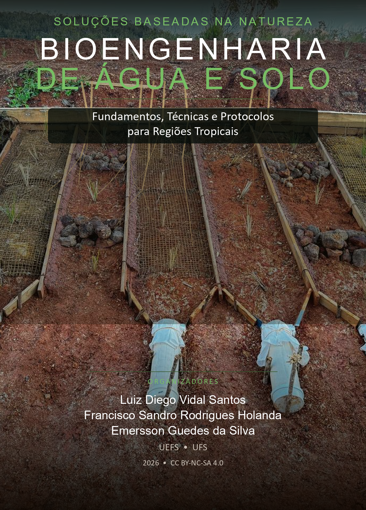

::: {.text-end .mb-3}
[Português](livros.qmd) | **English** | [Español](livros-es.qmd) | [Français](livros-fr.qmd)
:::

My books and ebooks, available in digital format.

## Ebooks

```{=html}
<div class="book-card">
  <div class="book-cover">
    <a href="../books/branding-agro/">
      
    </a>
  </div>
  <div class="book-info">
    <p class="book-author">Luiz Diego Vidal Santos</p>
    <h4 class="book-title">Branding Management in Agribusiness</h4>
    <p class="book-subtitle">Differentiation, Positioning and Brand Building in Agribusiness</p>
    <p class="book-desc">Textbook with 14 chapters organized in 3 parts, covering branding fundamentals, differentiation and positioning applied to agribusiness. Includes portfolio strategy, target audience, B2B branding, brand platform, practical case studies and self-assessment tools.</p>
    <div class="book-meta">
      <span><i class="bi bi-journal-text"></i> 14 chapters</span>
      <span><i class="bi bi-unlock"></i> CC BY-NC-SA 4.0</span>
    </div>
    <div class="book-actions">
      <a href="../books/branding-agro/" class="btn btn-dark btn-sm"><i class="fa-solid fa-book-open"></i> Access the ebook</a>
    </div>
  </div>
</div>

<div class="book-card">
  <div class="book-cover">
    <a href="../books/bioengenharia-solos/">
      
    </a>
  </div>
  <div class="book-info">
    <p class="book-author">Editors: Luiz Diego Vidal Santos, Francisco Sandro Rodrigues Holanda and Emersson Guedes da Silva</p>
    <h4 class="book-title">Nature-based Solutions for Soil and Water Bioengineering</h4>
    <p class="book-subtitle">Fundamentals, Techniques and Protocols for Tropical Regions</p>
    <p class="book-desc">Textbook with 26 chapters organized in 6 parts, from the conceptual framing of nature-based solutions to the fundamentals of soil, water and erosion, stabilization techniques with living materials, biomaterials and catchment-scale design. Includes the hydrogeotechnical design protocol for permeable bamboo check-dams, physicochemical characterization of natural fibers, worked sizing examples, field verification checklists and study questions.</p>
    <div class="book-meta">
      <span><i class="bi bi-journal-text"></i> 26 chapters</span>
      <span><i class="bi bi-unlock"></i> CC BY-NC-SA 4.0</span>
    </div>
    <div class="book-actions">
      <a href="../books/bioengenharia-solos/" class="btn btn-primary btn-sm"><i class="fa-solid fa-book-open"></i> Access the ebook</a>
    </div>
  </div>
</div>

<div class="book-card">
  <div class="book-cover">
    <a href="../books/ciencia-paisagem/">
      
    </a>
  </div>
  <div class="book-info">
    <p class="book-author">Luiz Diego Vidal Santos</p>
    <h4 class="book-title">Landscape Analysis</h4>
    <p class="book-subtitle">Fundamentals, Methods and Territorial Planning</p>
    <p class="book-desc">Textbook with 21 chapters organized in 4 parts, covering landscape ecology fundamentals and spatial metrics to remote sensing, GIS, land use dynamics, ecosystem services, ecological restoration and scenario modeling for sustainable management of tropical landscapes.</p>
    <div class="book-meta">
      <span><i class="bi bi-journal-text"></i> 21 chapters</span>
      <span><i class="bi bi-unlock"></i> CC BY-NC-SA 4.0</span>
    </div>
    <div class="book-actions">
      <a href="../books/ciencia-paisagem/" class="btn btn-success btn-sm"><i class="fa-solid fa-book-open"></i> Access the ebook</a>
    </div>
  </div>
</div>

<div class="book-card">
  <div class="book-cover">
    <a href="../books/pi/">
      
    </a>
  </div>
  <div class="book-info">
    <p class="book-author">Luiz Diego Vidal Santos</p>
    <h4 class="book-title">Intellectual Property and Innovation in Agribusiness</h4>
    <p class="book-subtitle">Fundamentals, Protection and Technology Transfer</p>
    <p class="book-desc">Textbook with 11 chapters organized in 4 parts, covering innovation management, intangible asset protection (patents, plant varieties, geographical indications), IP valuation, technology transfer, agricultural technology entrepreneurship, academic spin-offs and IP in digital agriculture.</p>
    <div class="book-meta">
      <span><i class="bi bi-journal-text"></i> 11 chapters</span>
      <span><i class="bi bi-unlock"></i> CC BY-NC-SA 4.0</span>
    </div>
    <div class="book-actions">
      <a href="../books/pi/" class="btn btn-warning btn-sm"><i class="fa-solid fa-book-open"></i> Access the ebook</a>
    </div>
  </div>
</div>

<div class="book-card">
  <div class="book-cover">
    <a href="../books/geotecnologias-sig/">
      
    </a>
  </div>
  <div class="book-info">
    <p class="book-author">Luiz Diego Vidal Santos</p>
    <h4 class="book-title">Geotechnologies and Geographic Information Systems</h4>
    <p class="book-subtitle">Fundamentals, Spatial Analysis and Environmental Applications</p>
    <p class="book-desc">Textbook with 12 chapters organized in 4 parts, covering spatial data models, map algebra and geostatistics, remote sensing, digital classification and uncertainty, erosion processes and degradation, hydrology and drought management, environmental monitoring of mining, predictive mineral exploration and artificial intelligence applied to geosciences.</p>
    <div class="book-meta">
      <span><i class="bi bi-journal-text"></i> 12 chapters</span>
      <span><i class="bi bi-unlock"></i> CC BY-NC-SA 4.0</span>
    </div>
    <div class="book-actions">
      <a href="../books/geotecnologias-sig/" class="btn btn-info btn-sm"><i class="fa-solid fa-book-open"></i> Access the ebook</a>
    </div>
  </div>
</div>
```
